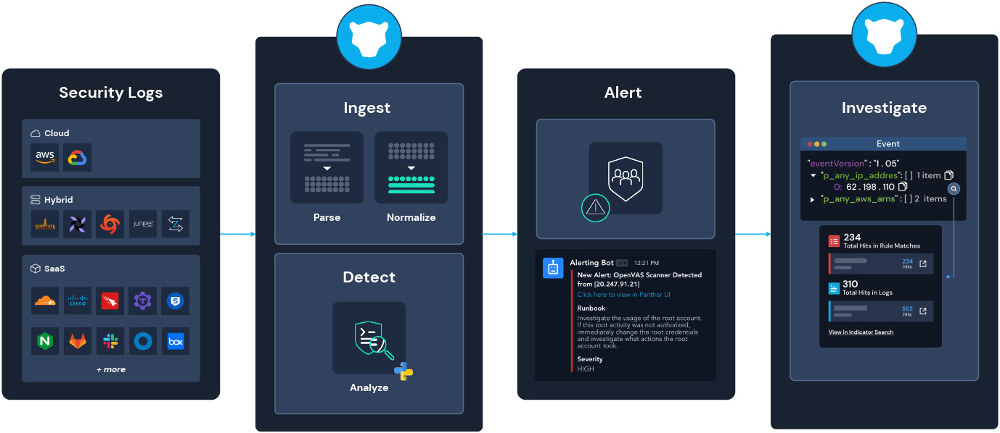

# Overview

Panther is a cloud-native threat detection platform that transforms terabytes of raw logs per day into a structured security data lake to power real-time detection, swift incident response, and thorough investigations.&#x20;

With detection-as-code in Python and out-of-the-box integrations for dozens of critical log sources, Panther solves the challenges of security operations at scale.

It works by normalizing security logs from various places and alerting your team when suspicious activity happens.

## Benefits

* **Focus on security, not ops** with a cloud-native architecture that eliminates the need to manage servers, storage and updates.
* **Detect threats immediately** by analyzing logs _as soon as they are ingested_, giving you the fastest possible time to detection.
* **Answer security questions quickly** with the ability to immediately query months of data in minutes and efficiently search for IoCs across all logs.
* **Reduce false positives** with Python Detection-as-Code, and CI/CD workflows for creating, testing, and deploying detections.
* **Expedite incident response** by adding dynamic context to alerts to power more efficient routing, triage, and automation.
* **Reduce SIEM costs dramatically** while gaining lightning-fast query speeds, with an efficient, highly scalable data lake architecture.

Learn more about the advantages of [running Panther instead of a traditional SIEM](https://panther.com/product/traditional-siem-vs-panther/).

## Key Features

* ****[**Effortless Data Ingestion**](data-onboarding/)**:** Built-in support for common data transports such as S3, SQS, SNS, and out-of-the-box integrations for critical log sources like Okta, Duo, Slack, Google WorkSpaces, and more.
* ****[**Log normalization**](data-analytics/)**:** Logs are parsed and IoC fields like domains and IPs are normalized to support analysis, searches and correlations across all log types.
* ****[**Detection-as-Code**](writing-detections/)**:** Highly customizable [Python-based detections](writing-detections/), a built-in testing framework, and the ability to create detections directly in the Panther Console or with Panther Developer Workflows including the [Panther Analysis Tool](writing-detections/panther-analysis-tool.md) and [CI/CD](guides/ci-cd-onboarding-guide.md).
* ****[**Security data lake**](data-analytics/)**:** Normalized security data is aggregated in a high-performance, scalable, and cost-effective data lake capable of running queries over massive data sets in minutes using our the [Data Explorer](data-analytics/data-explorer.md) or [Scheduled Queries](data-analytics/scheduled-queries.md).
* ****[**Indicator Search**](data-analytics/indicator-search.md)**:** Query petabytes of data and find related activity based on attributes like usernames, emails, IPs, and more to tell the full story during an incident.
* ****[**Detection packs**](writing-detections/detection-packs.md)**:** Built-in detections give customers a starting point to customize as needed. Provided by Panther to analyze key log sources and support common security and compliance needs.
* ****[**Alert routing**](destinations/)**:** Feed alerts into notification systems for triage, and include valuable context to enable hands-off response via automation platforms.

## Getting Started

[Sign up for a demo of Panther](https://panther.com/product/request-a-demo/)!\

Follow the [quick start](quick-start.md) guide to get your new Panther account up and running.
