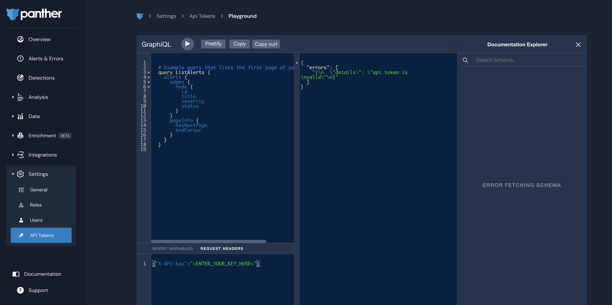
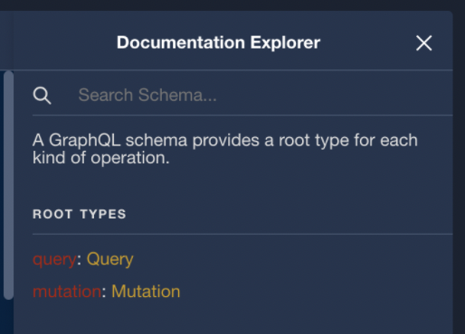

# API Playground

Panther offers an API Playground to try out operations. To access the Playground:

1. Log in to your Panther Console.
2. In the lefthand navigation in your Panther account, click **Settings > API Tokens**.
3. In the **Resources** dropdown, select **API Playground (Dropdown Option)**.&#x20;

When you first access the Playground page, you will see an error message such as `api token is invalid` or `error fetching schema`. This is because value of the `X-API-Key` header under **REQUEST HEADERS** is invalid until you enter a valid API Token. After you enter a valid API Token, click the "play" icon in the upper left corner to force the GraphQL query to run.


Note:

* The autocomplete functionality and the Documentation Explorer (on the right side of the Playground) are enabled after you enter a valid `X-API-Key` request header.
* If you just issued an API Token, please wait between 30 - 60 seconds for the new token to become available to related distributed AWS services
* For security purposes, the API Token will **not** persist in the Playground when you refresh the page or navigate to a different page. You will need to re-enter the API Token each time you use the Playground.




### Documentation Explorer

The **Documentation Explorer** on the right side of the Playground displays the available queries and mutations, along with descriptions and types on every field and entity:



### Writing Your Own Query

The autocomplete functionality and the Documentation Explorer assist with writing your own query. Additionally, there are three utility buttons near the top of the page:&#x20;

* **Prettify** to help you format your query according to the GraphQL standards
* **Copy** to copy your query in order to paste it to the client that's going to issue the request
* **Copy curl** to copy a complete curl operation that you can paste into any UNIX system with the curl command-line tool installed.

An example of the curl command that would be copied from the Panther UI:

```
curl 'PANTHER_GRAPHQL_API_URL' \
-H 'Accept-Encoding: gzip, deflate, br' \
-H 'Content-Type: application/json' \
-H 'Accept: application/json' \
-H 'Connection: keep-alive' \
-H 'DNT: 1' \
-H 'Origin: http://{PANTHER_GRAPHQL_API_URL}/public/graphql' \
-H 'X-API-Key: {FAKE_API_KEY}' \
--data-binary '{"query":"\n # Example query that lists the first page of your alerts\n query ListAlerts {\n alerts {\n edges {\n node {\n id\n title\n severity\n status\n }\n }\n pageInfo {\n hasNextPage\n endCursor\n }\n }\n }\n","variables":{}}' \
--compressed
```

