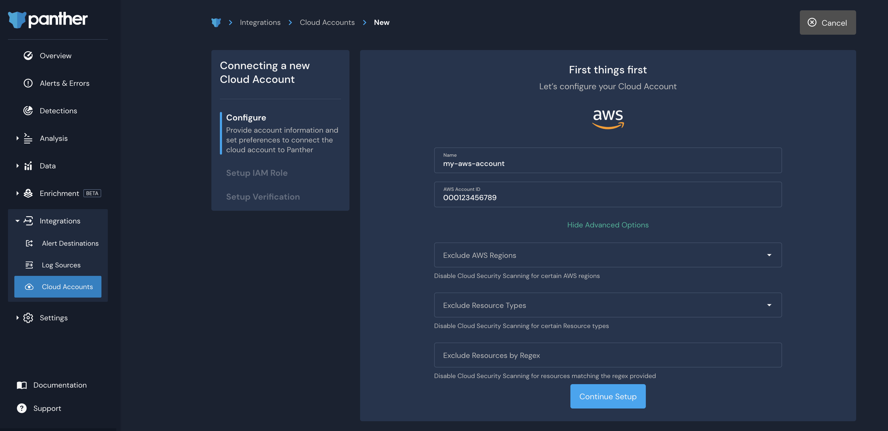
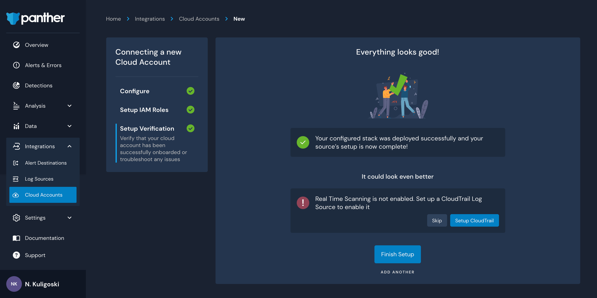

# Onboarding Cloud Accounts

### Configure the Cloud Account in Panther

1. Log in to your Panther Console.
2. In the left sidebar, click **Integrations > Cloud Accounts** then click **Connect an account**.
3. Enter your account `Name` and `AWS Account ID`. You may also expand the `Advanced Options` to indicate which AWS Regions, Resource Types, and Resources by Region you would like to exclude from cloud scanning. This can help prevent too many alerts from being generated by regions and resources known to be misconfigured.\
   
4. Click **Continue Setup**.

### Set up an IAM Role

Panther needs an IAM Role to have the ability to scan resources from your AWS account. You can choose from the following options to set this up:

* [Using the AWS Console UI](onboarding-cloud-accounts.md#creating-an-iam-role-using-the-aws-console-ui): Launch a CloudFormation stack using the AWS console.&#x20;
* [CloudFormation or Terraform Template File](onboarding-cloud-accounts.md#creating-an-iam-role-using-a-cloudformation-or-terraform-template-file): Use Panther's provided CloudFormation template or Terraform template to create an IAM role by downloading the template and deploying on your own.
* [I want to set up everything on my own](onboarding-cloud-accounts.md#creating-an-iam-role-manually-or-with-other-automation): Create the IAM role manually or with other automation.

.png>)

#### Creating an IAM Role using the AWS Console UI

1. On the "Setup an IAM Role" page, click **Select** next to **Using the AWS Console UI**.
2. Click **Launch Console UI.**
   * You will be redirected to the AWS console in a new browser tab, with the template URL pre-filled.&#x20;
   * Check the acknowledgements in the "Capabilities" box, and click **Create Stack.**
3. Navigate back to your Panther Console.
4. Click **Continue Setup** to complete the Cloud Account setup process.

#### Creating an IAM Role using a CloudFormation or Terraform Template File

1. On the "Setup an IAM Role page", click **Select** next to **CloudFormation or Terraform Template File**.
2. Click the template option you want to use, which downloads the template to apply it through your own pipeline.&#x20;
3. Upload the template file in AWS.
4. Once deployed, navigate back to the Panther Console, and click **Continue Setup.**

#### Creating an IAM role manually or with other automation

If you wish to create an IAM role via some other mechanism, ensure it has the naming standard and permissions documented in [Panther’s provided templates](onboarding-cloud-accounts.md#creating-an-iam-role-using-a-cloudformation-or-terraform-template-file).

1. On the "Set Up an IAM role" page, click the link that says **I want to set everything up on my own**.
2. Create the required IAM role. You may create the required IAM role manually or through your own automation.

### Finishing the Cloud Account setup process

The Setup Verification page verifies whether the IAM role has been successfully created.

1. Optionally, you can click **Setup CloudTrail** to enable Real Time Scanning.&#x20;
   * If you have already configured a Log Source containing CloudTrail Logs or if you would like to configure this later, you may skip this step.
2. Click **Finish Setup**.

See the available options for setting up Real-Time monitoring [via CloudTrail](onboarding-cloud-accounts.md#real-time-monitoring-via-cloudtrail-log-source) or [via CloudWatch events](onboarding-cloud-accounts.md#real-time-monitoring-via-cloudwatch-events).


_By default, Panther will perform scans daily._


## Real-Time Monitoring via CloudTrail Log source


If you have already created a Log Source containing CloudTrail logs for the account(s) you are interested in monitoring, you do not need to follow the steps below. If you would like faster than 15-minute results of changes in your environment, see the **Real-Time Monitoring via CloudWatch Events** section.


### Prerequisites

* An S3 bucket is configured to receive CloudTrail events.

### Connecting a New Log Source

Navigate to `Integrations` -> `Log Sources` -> `New Log Source` -> `AWS` -> `S3 Bucket`

Then, enter the `Name`, `AWS Account ID`, and `Bucket Name`. Optionally, enter a `KMS Key`, `Stream Type`, `S3 Prefix filter`, and `S3 Prefix Ignore Filter`. Lastly, choose the three log types outlined below (`AWS.CloudTrail`, `AWS.CloudTrailDigest`, `AWS.CloudTrailInsight`). Click `Continue`.

Next, you will be asked to `Setup an IAM role`. You will see options to:&#x20;

* **Launch Console** - brings you into an AWS Console you may already be signed into. The information filled out on the previous screens will be used in the stack.
* **Get Template** - Download the template to review or run from your own workflow
* Create the role yourself

 (1).png>)

Once the role has been created, grab the RoleArn and paste it into the field. Then, `Continue Setup`.

Before clicking `Finish Setup`, we recommend configuring an alarm that will trigger an alert if this log source does not receive any events within the interval you choose.

## Real-Time Monitoring via CloudWatch Events


Using this method doesn't require a CloudTrail Log Source within Panther. CloudWatch Events enable alerting of changes in your environment as fast as 1 minute.


Within [panther-auxiliary](https://github.com/panther-labs/panther-auxiliary/blob/main/cloudformation/panther-cloudwatch-events.yml), review the `panther-cloudwatch-events.yml` file. This YAML file contains the CloudFormation stack information necessary to configure Panther's real-time CloudWatch Event collection.

It works by creating CloudWatch Event rules which feed to Panther's SQS Queue proxied by a local SNS topic in each region.

### CloudFormation

After [downloading](https://github.com/panther-labs/panther-auxiliary/blob/main/cloudformation/panther-cloudwatch-events.yml) the `panther-cloudwatch-events.yml` file, launch your AWS Console, and navigate to CloudFormation. Then:

* **Create stack** _With new resources (standard)_.
* **Specify template**, tick the _Upload a template file_
* **Choose file** -> `panther-cloudwatch-events.yml` ****&#x20;
* Next

### Specify stack details

* Stack name: panther-real-time-events
* MasterAccountId:&#x20;
* QueueArn: arn:aws:sqs:\<PantherRegion>:\<PantherAccountID>:panther-aws-events-queue
* Next

### Configure stack options

* Next

### Review panther-real-time-events

* Next

This will take a few minutes to complete. Once it is done, you may onboard your Cloud Account!


When you get to the Finish Setup Screen, you may skip configuring a CloudTrail Log source.


****
