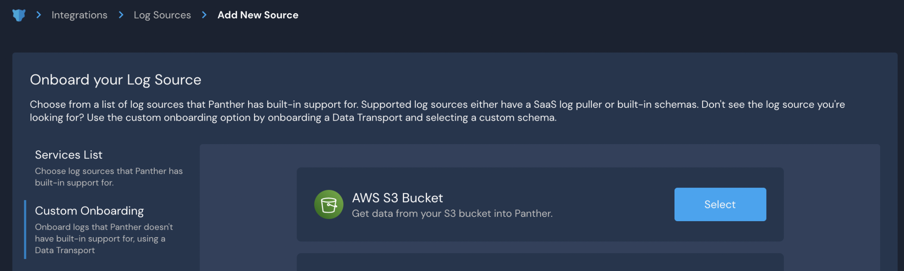

# Onboarding Cloud Accounts

On this page, you will learn how to:

* [Configure a Cloud Account in Panther](onboarding-cloud-accounts.md#configure-the-cloud-account-in-panther)
* [Set up real-time monitoring via CloudTrail log source](onboarding-cloud-accounts.md#real-time-monitoring-via-cloudtrail-log-source)
* [Set up real-time monitoring via CloudWatch events](onboarding-cloud-accounts.md#real-time-monitoring-via-cloudwatch-events)

### Configure the Cloud Account in Panther

1. Log in to your Panther Console.
2. In the left sidebar, click **Integrations > Cloud Accounts** then click **Connect an account**.
3. Enter your account **Name** and **AWS Account ID**.&#x20;
   * You may also expand the **Advanced Options** to indicate which AWS Regions, Resource Types, and Resources by Region you would like to exclude from cloud scanning. This can help prevent too many alerts from being generated by regions and resources known to be misconfigured.\
     
4. Click **Continue Setup**.

### Set up an IAM Role

Panther needs an IAM Role to have the ability to scan resources from your AWS account. You can choose from the following options to set this up:

* [Using the AWS Console UI](onboarding-cloud-accounts.md#creating-an-iam-role-using-the-aws-console-ui): Launch a CloudFormation stack using the AWS console.&#x20;
* [CloudFormation or Terraform Template File](onboarding-cloud-accounts.md#creating-an-iam-role-using-a-cloudformation-or-terraform-template-file): Use Panther's provided CloudFormation template or Terraform template to create an IAM role by downloading the template and deploying on your own.
* [I want to set up everything on my own](onboarding-cloud-accounts.md#creating-an-iam-role-manually-or-with-other-automation): Create the IAM role manually or with other automation.

#### Creating an IAM Role using the AWS Console UI

1. On the "Setup an IAM Role" page, click **Select** next to **Using the AWS Console UI**.
2. Click **Launch Console UI.**
   * You will be redirected to the AWS console in a new browser tab, with the template URL pre-filled.&#x20;
   * Check the acknowledgements in the "Capabilities" box, and click **Create Stack.**
3. Navigate back to your Panther Console.
4. Click **Continue Setup** to complete the Cloud Account setup process.

#### Creating an IAM Role using a CloudFormation or Terraform Template File

1. On the "Setup an IAM Role page", click **Select** next to **CloudFormation or Terraform Template File**.
2. Click the template option you want to use, which downloads the template to apply it through your own pipeline.&#x20;
3. Upload the template file in AWS.
4. Once deployed, navigate back to the Panther Console, and click **Continue Setup.**

#### Creating an IAM role manually or with other automation

If you wish to create an IAM role via some other mechanism, ensure it has the naming standard and permissions documented in [Panther’s provided templates](onboarding-cloud-accounts.md#creating-an-iam-role-using-a-cloudformation-or-terraform-template-file).

1. On the "Set Up an IAM role" page, click the link that says **I want to set everything up on my own**.
2. Create the required IAM role. You may create the required IAM role manually or through your own automation.

### Finishing the Cloud Account setup process

The Setup Verification page verifies whether the IAM role has been successfully created.

1. Optionally, you can click **Setup CloudTrail** to enable Real Time Scanning.&#x20;
   * If you have already configured a Log Source containing CloudTrail Logs or if you would like to configure this later, you may skip this step.
2. Click **Finish Setup**.

See the available options for setting up Real-Time monitoring [via CloudTrail](onboarding-cloud-accounts.md#real-time-monitoring-via-cloudtrail-log-source) or [via CloudWatch events](onboarding-cloud-accounts.md#real-time-monitoring-via-cloudwatch-events).

.png>)


_By default, Panther will perform scans daily._


## Set up Real-Time Monitoring

There are two options for Real-Time Monitoring:

* [CloudTrail log source](onboarding-cloud-accounts.md#real-time-monitoring-via-cloudtrail-log-source)&#x20;
* [CloudWatch events](onboarding-cloud-accounts.md#real-time-monitoring-via-cloudwatch-events)

### Real-Time Monitoring via CloudTrail Log source


If you have already created a Log Source containing CloudTrail logs for the account(s) you are interested in monitoring, you do not need to follow the steps below.&#x20;


#### Prerequisites

* An S3 bucket is configured to receive CloudTrail events.

#### To set up monitoring via a CloudTrail log source:

1. Log in to your Panther Console and click **Integrations** in the left sidebar menu.&#x20;
2. Click **Log Sources** > **Add Source** > **Data Transport.**
3. In the tile for **AWS S3 Bucket**, click Select.\
   
4. Enter the Bucket details:
   * **Name**: Enter a friendly name for the S3 source.
   * **Account ID**: Enter the 12-digit AWS Account ID where the S3 buckets are located.
   * **Bucket Name**: Enter the S3 Bucket ID/name to onboard.
   * **KMS Key (optional)**: If your data is encrypted using KMS-SSE, provide the ARN of the KMS key.
   * **Stream Type**: Events could be in line delimited, JSON Array format or they could be delivered to S3 from CloudWatch Logs. If an incorrect stream type is chosen, Panther will trigger an S3 Get.Object system error alert.
   * **S3 Prefix Filter**: Leave this field blank if you want to allow ingestion of all files.
   * **S3 Exclusion Filter**: Indicate which Prefixes to exclude.
   * **Log Types**: Choose `AWS.CloudTrail`, `AWS.CloudTrailDigest`, and `AWS.CloudTrailInsight`.&#x20;
5. Click **Continue Setup**.
6. [Create the IAM role](onboarding-cloud-accounts.md#set-up-an-iam-role).
7. On the "Setup IAM Role" page, enter the Role ARN.
8. Click **Continue Setup**.
9. On the "Verify Setup" page, you can optionally create an alarm that will trigger an alert if this log source does not receive any events within the interval you choose.
10. Click **Finish Setup**.

The latency between an event occurring in AWS and the event being sent to CloudTrail can be up to 15 minutes, but we commonly see data coming in at an average of 3.5 minutes. For more information, please see Amazon's documentation: [How CloudTrail works](https://docs.aws.amazon.com/awscloudtrail/latest/userguide/how-cloudtrail-works.html).

### Real-Time Monitoring via CloudWatch Events


Using this method doesn't require a CloudTrail Log Source within Panther.&#x20;


Within [panther-auxiliary](https://github.com/panther-labs/panther-auxiliary/blob/main/cloudformation/panther-cloudwatch-events.yml), review the `panther-cloudwatch-events.yml` file. This YAML file contains the CloudFormation stack information necessary to configure Panther's real-time CloudWatch Event collection.

It works by creating CloudWatch Event rules which feed to Panther's SQS Queue proxied by a local SNS topic in each region. Latency between an event occurring in AWS and the event being detected by CloudWatch Event rules is typically 1 minute or less.

#### Configure CloudFormation

1. &#x20;[Download](https://github.com/panther-labs/panther-auxiliary/blob/main/cloudformation/panther-cloudwatch-events.yml) the `panther-cloudwatch-events.yml` file.
2. Launch your AWS console and navigate to the CloudFormation project.
3. Click **Create stack** and choose the option "With new resources."&#x20;
4. In the **Template** section, choose the option _Upload a template file_. Select your `panther-cloudwatch-events.yml` file.
5. Click **Next**.
6. In the **Specify Details** section, fill in the necessary fields, including the following:
   * **Stack name**: `panther-real-time-events`
   * **QueueArn**: `arn:aws:sqs:<PantherRegion>:<PantherAccountID>:panther-aws-events-queue`
7. Click **Next**.
8. On the **Configure stack options** page, click **Next**.
9. On the **Review** page, make sure you have configured your settings correctly. Click **Next**.

This will take a few minutes to complete. Once it is done, you may onboard your Cloud Account!
