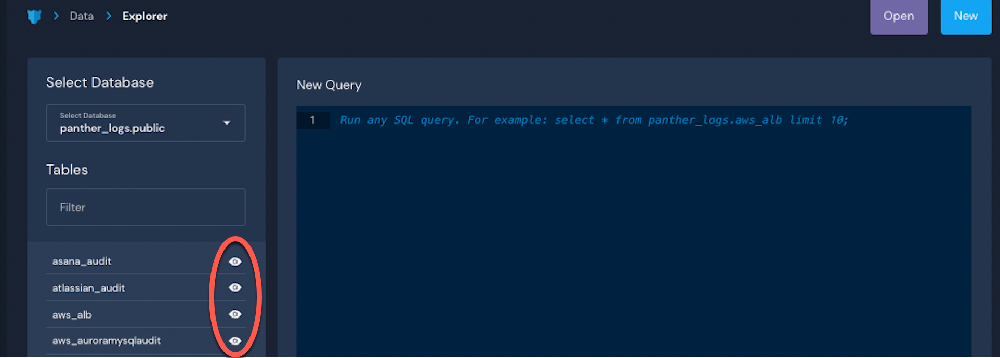

# Data Explorer

The Data Explorer in your Panther Console is where you can view your normalized Panther data and perform SQL queries (with autocompletion).&#x20;

In Data Explorer, you can:

* Browse collected log data, rule matches, and search standard fields across all data
* Save, tag, and load your queries&#x20;
* Create [scheduled queries](scheduled-queries.md) to run through the rule engine
* Share results with your team through a shareable link
* Select entire rows of JSON to use in the rule engine as unit tests
* Download results in a CSV
* Preview table data, filter results, and summarize columns without SQL\


**To access the Data Explorer**:

1. Log in to your Panther Console.
2. In the left sidebar, click **Data > Data Explorer**.


You can limit access to the Data Explorer through [Role-Based Access Control](../system-configuration/rbac.md) (RBAC).

#### Preview Table Data

You can preview example table data without writing SQL. To generate a sample SQL query for that log source, click the eye icon next to the table type:



#### Filter Data Explorer results

As of Panther versions 1.35 and newer, you can filter columns from a Result set in Data Explorer without writing SQL.&#x20;

In the upper right corner of the Results table, click **Filter Columns** to select the columns you would like to display in the Results:


Note: The filters applied through this mechanism do not apply to the SQL select statement in your query.

#### Summarize column data

As of Panther versions 1.38 and newer, you can generate a summary (frequency count) of a column from a Result set in Data Explorer without writing SQL.

On the column that your want to generate a summary for, click the down arrow and then **Summarize** to display summary results in a separate tab.

 (1).png>)

You can also generate a summary for the first time after a query is executed by switching to the **Summarize** tab and selecting a column from the dropdown.

.png>)

The summary results for a selected column are displayed in the Summary tab, with the option to sort results by highest count or lowest count first (default is the highest count first).

 (1).png>)

In addition to the `row_count` value, the summary also displays `first_seen` and `last_seen` values if the result data contains the `p_event_time` [standard field](panther-fields.md).

## Macros

All the tables in our supported backend databases (Athena and Snowflake) are partitioned by event time to allow for better performance when querying using a time filter. However, the partition technologies are different across the backends, and using them efficiently can make for unwieldy SQL code if written by hand. To make things even easier, we have created a number of macros that will be expanded into full expressions when sent to the database, so that you don't have to worry about writing complicated expressions.

**Note**: that the macro expansions will only work from the Panther UI, i.e. will not work if you are using the native Database web UI.

### Time range filter: p\_occurs\_between

`p_occurs_between(startTime, endTime, [tableAlias])`

`startTime - correctly formatted time expression, indicating start of search window`

`endTime - correctly formatted time expression, indicating end of search window`

`tableAlias - optional parameter, allows passing through a table alias to the filter`

**Note**: Please ensure that your time expression can be parsed by the database backend your team is using. Some expressions that work in Snowflake (i.e. `2021-01-21T11:15:54.346Z`) will not be accepted as valid timestamps by Athena. The default safe time format should probably look similar to this `2021-01-02 15:04:05.000` and is assumed to be in the UTC time zone.

The macro `p_occurs_between()` takes a start time, an end time and optionally a table alias (in case you want to use the macro across one or multiple tables in a join) and filters the result set to those events in the time range, using the correct partition (minimizing I/O and speeding up the query).

The following Snowflake command contains a macro:

```sql
select p_db_name, count(*) as freq from panther_views.public.all_databases
where p_occurs_between(current_date - 1, current_timestamp)
group by p_db_name
limit 1000
```

The macro that will be automatically expanded before the query is sent to the database. The form the expansion takes is database specific. In Snowflake, this expansion is pretty straightforward:

```sql
select p_db_name, count(*) as freq from panther_views.public.all_databases
where p_event_time between convert_timezone('UTC',current_date - 1)::timestamp_ntz
    and convert_timezone('UTC',current_timestamp)::timestamp_ntz
group by p_db_name
limit 1000
```

Keep in mind that different database back-ends allow different date formats and operations. Athena does not allow simple arithmetic operations on dates, therefore the care must be taken to use an Athena-friendly time format:

```sql
select p_db_name, count(*) as freq from panther_views.public.all_databases
where p_occurs_between(current_date - interval '1' day, current_timestamp)
group by p_db_name
limit 1000
```

Because of the structure of allowed indexes on partitions in Athena, the expansion looks different:

```sql
select p_db_name, count(*) as freq from panther_views.all_databases
where p_event_time between cast (current_date - interval '1' day as timestamp) and cast (current_timestamp as timestamp)
  and partition_time between to_unixtime(date_trunc('HOUR', (cast (current_date - interval '1' day as timestamp))))
    and to_unixtime(cast (current_timestamp as timestamp))
group by p_db_name
limit 1000
```

### Time offset from present: p\_occurs\_since

`p_occurs_since(offsetFromPresent [, tableAlias])`

`offsetFromPresent - positive integer representing the number of seconds relative to the present to scan back to, or time expression comprising a positive integer and a time part (seconds, minutes, hours, days, weeks)`

`tableAlias - optional parameter, allows passing through a table alias to the filter`

The macro `p_occurs_since()` takes a positive integer number of seconds and optionally a table alias (in case you want to use the macro across one or multiple tables in a join), and filters the result set down to those events from the current time offset by the specified number of seconds, using the correct partition or cluster key (minimizing I/O and speeding up the query).

For convenience, we have added additional time parts that can be used:

* `s, sec, second, seconds` — macro adds specified seconds to offset
* `m, min, minute, minutes` — macro adds specified minutes to offset
* `h, hr, hrs, hour, hours` — macro adds specified hours to offset
* `d, day, days` — macro adds specified days to offset
* `w, wk, week, weeks` — macro adds a specified number of weeks to offset
* if no suffix is detected, the macro will proceed as before and default to seconds

#### Examples:

```sql
p_occurs_since('6 d')
p_occurs_since('2 weeks')
p_occurs_since(900) // assumes seconds
p_occurs_since('96 hrs')
```

**Note**: If this is used in a scheduled query, then rather than using the current time as the reference, the scheduled run time will be used. For example, if a query is scheduled to run at the start of each hour, then the `p_occurs_since('1 hour')` macro will expand using a time range of 1 hour starting at the start of each hour (regardless of when the query is actually executed).

In the following example of a macro with a table alias parameter, we look at Cloudtrail logs to identify S3 buckets created and deleted within one hour of their creation, a potentially suspicious behaviour. To get this information we do a self-join on the `aws_cloudtrail` table in `panther_logs`, and we use a macro expansion to limit this search to the past 24 hours on each of the two elements of the self-join (aliased `ct1` and `ct2` below):

```sql
select 
ct1.p_event_time createTime, ct2.p_event_time deleteTime,
timediff('s',createTime, deleteTime) timeExtant,
ct1.requestparameters:"bucketName"::varchar createdBucket,
ct1.useridentity:"arn"::varchar createArn, deleteArn,
ct1.useragent createUserAgent, deleteUserAgent
from panther_logs.public.aws_cloudtrail ct1
join (
select p_event_time, requestparameters:"bucketName"::varchar deletedBucket, errorcode,
  eventname deleteEvent, useridentity:"arn"::varchar deleteArn, useragent deleteUserAgent  from panther_logs.public.aws_cloudtrail) ct2
on (ct1.requestparameters:"bucketName"::varchar = ct2.DeletedBucket
    and ct2.p_event_time > ct1.p_event_Time
    and timediff('s',ct1.p_event_time, ct2.p_event_time) < 3600)
where ct2.deleteEvent = 'DeleteBucket'
and ct1.eventName = 'CreateBucket'
and ct1.errorCode is null and ct2.errorcode is null
and p_occurs_since('1 day',ct2)  -- apply to ct2
and p_occurs_since('24 hours',ct1)  -- apply to ct1
order by createdBucket, createTime;
```

There are two separate calls to `p_occurs_since` each applied to a different table, as indicated by the table alias used as a second parameter. This is expanded into the following Snowflake query:

```sql
select 
ct1.p_event_time createTime, ct2.p_event_time deleteTime,
timediff('s',createTime, deleteTime) timeExtant,
ct1.requestparameters:"bucketName"::varchar createdBucket,
ct1.useridentity:"arn"::varchar createArn, deleteArn,
ct1.useragent createUserAgent, deleteUserAgent
from panther_logs.public.aws_cloudtrail ct1
join (
select p_event_time, requestparameters:"bucketName"::varchar deletedBucket, errorcode,
  eventname deleteEvent, useridentity:"arn"::varchar deleteArn, useragent deleteUserAgent  from panther_logs.public.aws_cloudtrail) ct2
on (ct1.requestparameters:"bucketName"::varchar = ct2.deletedBucket
    and ct2.p_event_time > ct1.p_event_Time
    and timediff('s',ct1.p_event_time, ct2.p_event_time) < 3600)
where ct2.deleteEvent = 'DeleteBucket'
and ct1.eventName = 'CreateBucket'
and ct1.errorCode is null and ct2.errorcode is null
and ct2.p_event_time >= current_timestamp - interval '86400 second'
and ct1.p_event_time >= current_timestamp - interval '86400 second'
order by createdBucket, createTime;
```
