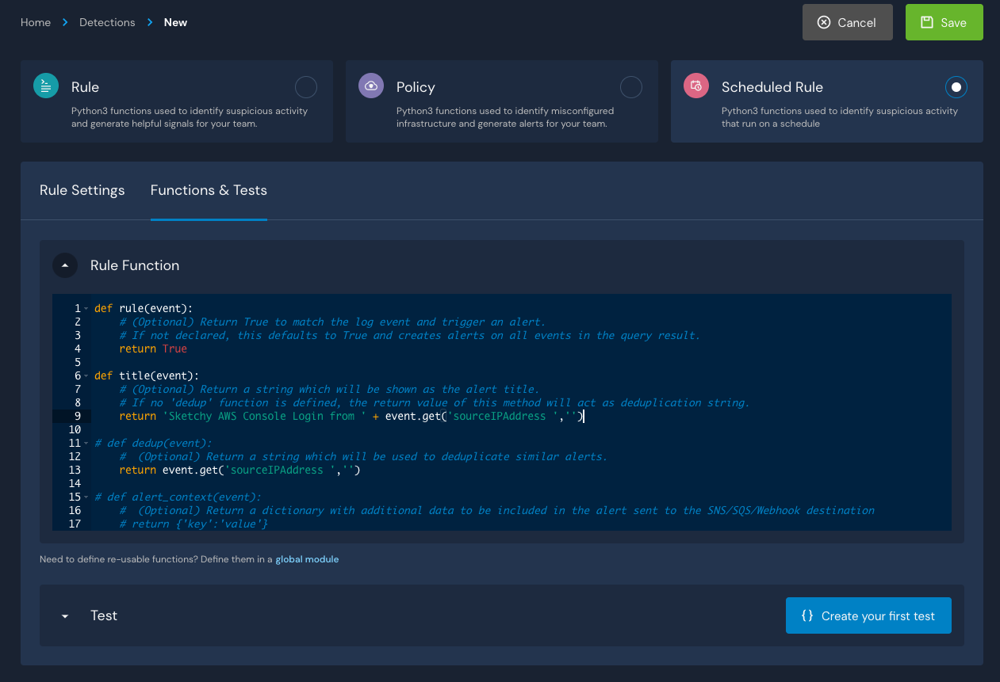
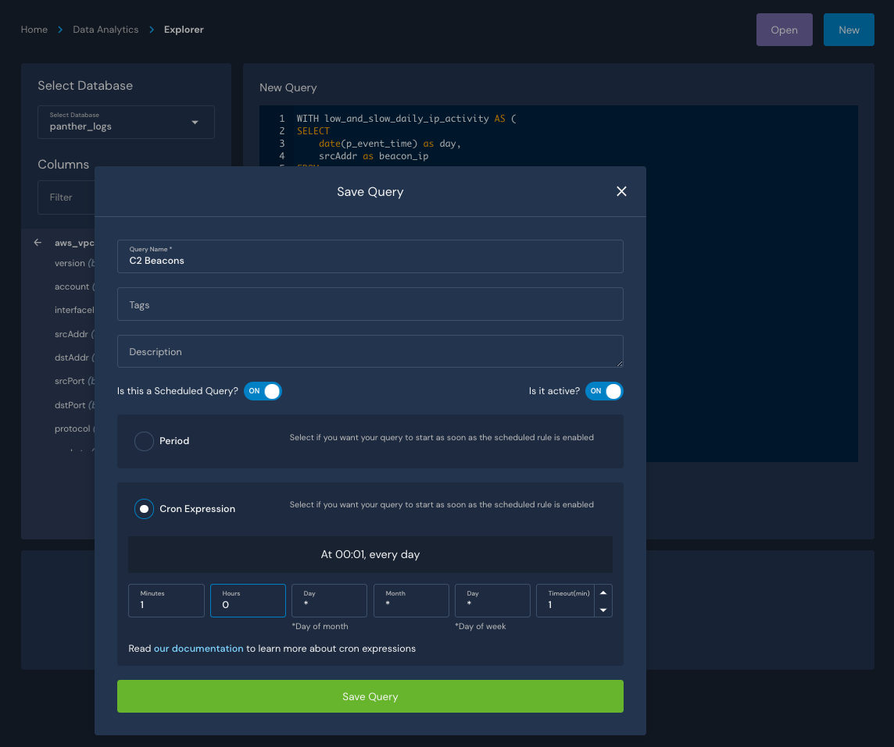
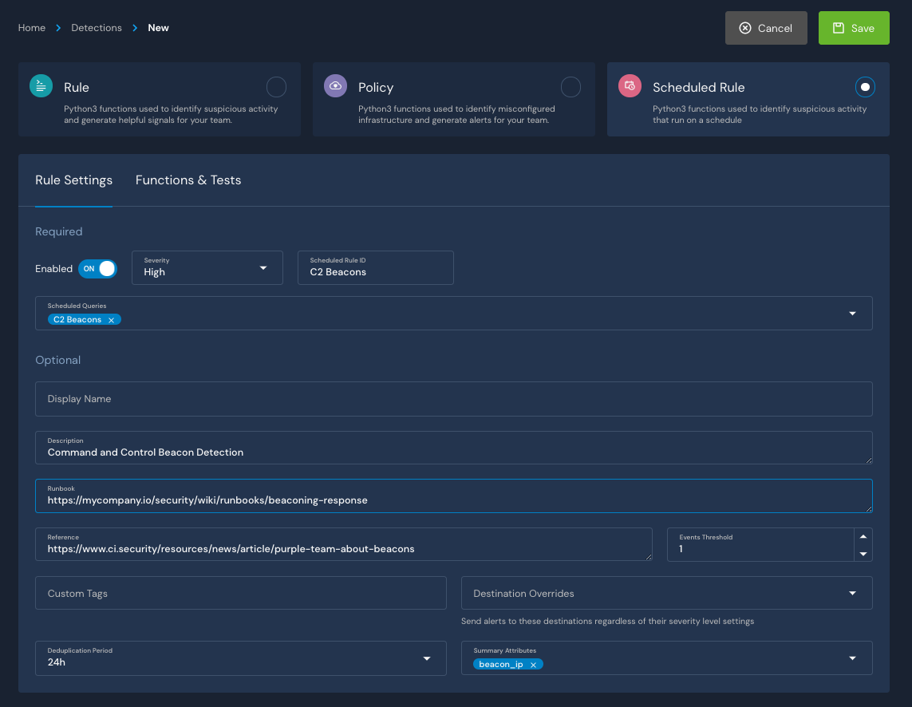
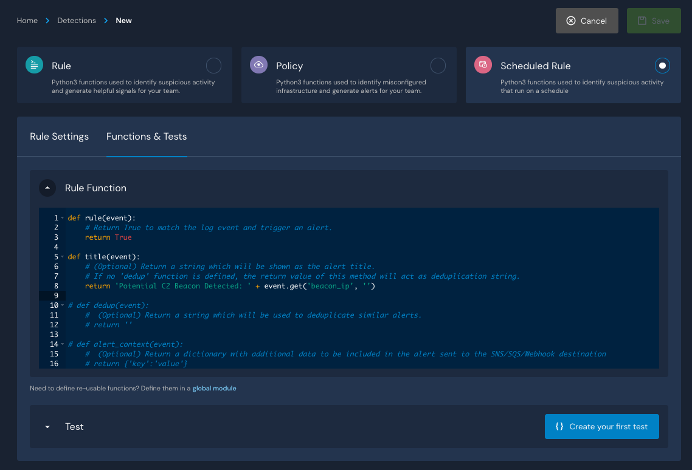
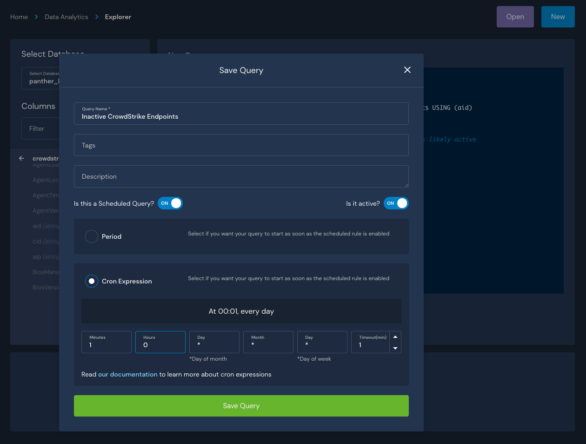

# Example Queries


All queries should control the result size. This can be done with a `LIMIT` or `GROUP BY` clause.



Please note that all **Athena** queries should be qualified with partition columns (year, month, day, hour) for performance reasons.


## Did this IP address have any activity in my network (and in what logs)?

This is often one of the first questions asked in an investigation. Given there is some known bad indicator such as an IP address, then if there is related activity in your network/systems, a detailed investigation will be needed.

Panther makes asking such questions easy using the 'all\_logs' Athena view which will search all data for the indicator of interest. Since most often the answers to these questions are negative, making this a fast and efficient operation reduces investigation time.

In this example the Panther field `p_any_ip_addresses` is used. Panther extracts a number of common indicator fields over all data sources into standard fields (see [Panther Fields](panther-fields.md)).

```sql
-- Athena
SELECT
 p_log_type, count(1) AS row_count
FROM panther_views.all_logs
WHERE p_occurs_between('2021-01-01', '2021-01-02')
     AND contains(p_any_ip_addresses, '1.2.3.4')
GROUP BY p_log_type
LIMIT 100
```

```sql
-- Snowflake
SELECT
 p_log_type, count(1) AS row_count
FROM panther_views.public.all_logs
WHERE p_occurs_between('2021-01-01', '2021-01-02')
     AND array_contains('1.2.3.4'::variant, p_any_ip_addresses)
GROUP BY p_log_type
LIMIT 100
```

## What are the top 10 IPs by row count over all logs?

Ranking activity (top or bottom) is a useful technique to gain visibility into a network. High ranking activity might help locate IP addresses involved in a DDOS attack while low ranking (change ORDER BY to ASC) might highlight sneaky activity.

```sql
-- Athena
SELECT
  ip,
  count(1) as total_rows
FROM panther_views.all_logs
CROSS JOIN UNNEST(p_any_ip_addresses) AS t(ip)
WHERE p_occurs_between('2021-01-01', '2021-01-02')
GROUP BY ip
ORDER BY  total_rows DESC
LIMIT 100
```

```sql
-- Snowflake
SELECT
  ip.value as ip,
  count(1) as total_rows
FROM panther_views.public.all_logs, LATERAL FLATTEN(input => p_any_ip_addresses) ip
WHERE p_occurs_between('2021-01-01', '2021-01-02')
GROUP BY ip.value
ORDER BY  total_rows DESC
LIMIT 100
```

## What are the top 10 IPs by log type over all logs?

This is a variant of the above query where we are ranking the IPs by how many data sources they show activity. This shows the degree of "reach" the IP address has over all your systems.

```sql
-- Athena
SELECT
  ip,
  count(distinct p_log_type) as datasets
FROM
(
SELECT
  p_log_type,
  ip
FROM panther_views.all_logs
CROSS JOIN UNNEST(p_any_ip_addresses) AS t(ip)
WHERE p_occurs_between('2021-01-01', '2021-01-02')
GROUP BY ip, p_log_type
)
GROUP BY ip
ORDER BY  datasets DESC
LIMIT 100
```

```sql
-- Snowflake
SELECT
  ip,
  count(distinct p_log_type) as datasets
FROM
(
SELECT
  p_log_type,
  ip. value as ip
FROM panther_views.public.all_logs, LATERAL FLATTEN(input => p_any_ip_addresses) ip
WHERE p_occurs_between('2021-01-01', '2021-01-02')
GROUP BY ip.value, p_log_type
)
GROUP BY ip
ORDER BY  datasets DESC
LIMIT 100
```

## Show VPC Flowlog activity for SSH and RDP

Remote shells typically have a human at one end. During an investigation, isolating sessions from SSH and RDP is often a standard procedure to identify specific actor activity.

```sql
-- Athena
SELECT
 *
FROM panther_logs.aws_vpcflow
WHERE
  p_occurs_between('2021-01-01', '2021-01-02')
  AND
  (srcport IN (22, 3389) OR dstport IN (22, 3389))
ORDER BY p_event_time ASC
LIMIT 100
```

```sql
-- Snowflake
SELECT
 *
FROM panther_logs.public.aws_vpcflow
WHERE
  p_occurs_between('2021-01-01', '2021-01-02')
  AND
  (srcport IN (22, 3389) OR dstport IN (22, 3389))
ORDER BY p_event_time ASC
LIMIT 100
```

## Show VPC Flowlog activity for an IP address

During an investigation often particular IP addresses are identified as being of interest (e.g, a known command and control node). Once the role of an IP address is identified, isolating and explaining that activity is of interest. This can indicate which resources are likely to be compromised.

```sql
-- Athena
SELECT
 *
FROM panther_logs.aws_vpcflow
WHERE p_occurs_between('2021-01-01', '2021-01-02')
     AND contains(p_any_ip_addresses, '1.2.3.4')
ORDER BY p_event_time ASC
LIMIT 100
```

```sql
-- Snowflake
SELECT
 *
FROM panther_logs.public.aws_vpcflow
WHERE p_occurs_between('2021-01-01', '2021-01-02')
     AND array_contains('1.2.3.4'::variant, p_any_ip_addresses)
ORDER BY p_event_time ASC
LIMIT 100
```

## Show VPC Flowlog Activity Related to CloudTrail sourceIPAddresses Doing Console Signins

If there are concerns of a credential breach, then accounting for all AWS console activity is of critical importance. This query will find all the CloudTrail sourceIPaddresses involved in console signins and then return all the VPC Flow activity related. This will show if there are common IP addresses. Of particular interest are IP addresses **outside of your organization** communicating with the instances as well as logging into the console. This may indicate a compromise where an unauthorized actor is accessing account resources.

```sql
-- Athena
WITH cloudTrailIPs as
(SELECT
  DISTINCT sourceIPAddress AS ip
 FROM panther_logs.aws_cloudtrail
 WHERE
     p_occurs_between('2021-01-01', '2021-01-02')
    AND
    eventtype = 'AwsConsoleSignIn'
)
SELECT
 *
FROM  cloudTrailIPs ips JOIN panther_logs.aws_vpcflow flow ON (ips.ip = flow.srcaddr OR ips.ip = flow.dstaddr)
WHERE
    p_occurs_between('2021-01-01', '2021-01-02')
ORDER BY p_event_time ASC
LIMIT 100
```

```sql
-- Snowflake
WITH cloudTrailIPs as
(SELECT
  DISTINCT sourceIPAddress AS ip
 FROM panther_logs.public.aws_cloudtrail
 WHERE
    p_occurs_between('2021-01-01', '2021-01-02')
    AND
    eventtype = 'AwsConsoleSignIn'
)
SELECT
 *
FROM  cloudTrailIPs ips JOIN panther_logs.public.aws_vpcflow flow ON (ips.ip = flow.srcaddr OR ips.ip = flow.dstaddr)
WHERE
  p_occurs_between('2021-01-01', '2021-01-02')
ORDER BY p_event_time ASC
LIMIT 100
```

## Find all console "root" signins in CloudTrail

The root account should almost never sign into the AWS console; find all such signins.

```sql
-- Athena
SELECT
 *
FROM panther_logs.aws_cloudtrail
WHERE
  p_occurs_between('2021-01-01', '2021-01-02')
  AND
  eventtype = 'AwsConsoleSignIn'
  AND
  useridentity.arn LIKE '%root%'
ORDER BY p_event_time ASC
LIMIT 100
```

```sql
-- Snowflake
SELECT
 *
FROM panther_logs.public.aws_cloudtrail
WHERE
  p_occurs_between('2021-01-01', '2021-01-02')
  AND
  eventtype = 'AwsConsoleSignIn'
  AND
  useridentity:arn LIKE '%root%'
ORDER BY p_event_time ASC
LIMIT 100
```

## Find all the sourceIPAddresses for console logins in CloudTrail and rank

This query is similar to the above query, with the IP addresses ranked for all console logins. This helps identify which IP addresses are signing into the console while ranking the relative activity. This can often highlight anomalous behaviors.

```sql
-- Athena
SELECT
 sourceipaddress,
 count(1) as total_rows
FROM panther_logs.aws_cloudtrail
WHERE
  p_occurs_between('2021-01-01', '2021-01-02')
  AND
  eventtype = 'AwsConsoleSignIn'
GROUP BY sourceipaddress
ORDER BY total_rows DESC
LIMIT 100
```

```sql
-- Snowflake
SELECT
 sourceipaddress,
 count(1) as total_rows
FROM panther_logs.public.aws_cloudtrail
WHERE
  p_occurs_between('2021-01-01', '2021-01-02')
  AND
  eventtype = 'AwsConsoleSignIn'
GROUP BY sourceipaddress
ORDER BY total_rows DESC
LIMIT 100
```

## Show CloudTrail activity related to an AWS instance

During an investigation a particular instance may become the focus. For example, if it is compromised. This query uses the Panther field `p_any_aws_instance_ids` to easily search over all CloudTrail events for any related activity.

```sql
-- Athena
SELECT
 *
FROM panther_logs.aws_cloudtrail
WHERE p_occurs_between('2021-01-01', '2021-02-01')
     AND contains(p_any_aws_instance_ids, 'i-0c4f541ef2f82481c')
ORDER BY p_event_time ASC
LIMIT 100
```

```sql
-- Snowflake
SELECT
 *
FROM panther_logs.public.aws_cloudtrail
WHERE p_occurs_between('2021-01-01', '2021-02-01')
     AND array_contains('i-0c4f541ef2f82481c'::variant, p_any_aws_instance_ids)
ORDER BY p_event_time ASC
LIMIT 100
```

## Show CloudTrail activity related to an AWS role

Similar to the above query, the Panther field `p_any_aws_arns` can be used to quickly and easily find all CloudTrail activity related to an ARN of interest (perhaps an ARN of role known to be compromised).

```sql
-- Athena
SELECT
 *
FROM panther_logs.aws_cloudtrail
WHERE p_occurs_between('2021-01-01', '2021-02-01')
     AND contains(p_any_aws_arns, 'arn:aws:iam::123456789012:role/SomeRole')
ORDER BY p_event_time ASC
LIMIT 100
```

```sql
-- Snowflake
SELECT
 *
FROM panther_logs.public.aws_cloudtrail
WHERE p_occurs_between('2021-01-01', '2021-02-01')
     AND array_contains('arn:aws:iam::123456789012:role/SomeRole'::variant, p_any_aws_arns)
ORDER BY p_event_time ASC
LIMIT 100
```

## Show CloudTrail activity related to an AWS account id

This is another variation of using a Panther field to broadly query. In this case finding all CloudTrail data related to an account of interest using `p_any_aws_account_ids` (perhaps the account is compromised, where the concern is lateral movement).

```sql
-- Athena
SELECT
 *
FROM panther_logs.aws_cloudtrail
WHERE p_occurs_between('2021-01-01', '2021-02-01')
     AND contains(p_any_aws_account_ids, '123456789012')
ORDER BY p_event_time ASC
LIMIT 100
```

```sql
-- Snowflake
SELECT
 *
FROM panther_logs.public.aws_cloudtrail
WHERE p_occurs_between('2021-01-01', '2021-02-01')
     AND array_contains('123456789012'::variant, p_any_aws_account_ids)
ORDER BY p_event_time ASC
LIMIT 100
```

## Show all instance launches in CloudTrail

Often when credentials have been breached, there is concern about an actor creating or modifying infrastructure. The below query finds all RunInstances commands. These should be reviewed for anomalous activity. For example, actors have been known to spin-up large numbers of GPU instances for bitcoin mining in compromised accounts.

```sql
-- Athena
SELECT
 p_event_time,
 p_any_aws_instance_ids
FROM panther_logs.aws_cloudtrail
WHERE p_occurs_between('2021-01-01', '2021-02-01')
     AND eventname = 'RunInstances'
ORDER BY p_event_time ASC
LIMIT 100
```

```sql
-- Snowflake
SELECT
 p_event_time,
 p_any_aws_instance_ids
FROM panther_logs.public.aws_cloudtrail
WHERE p_occurs_between('2021-01-01', '2021-02-01')
     AND eventname = 'RunInstances'
ORDER BY p_event_time ASC
LIMIT 100
```

## Rank all GuardDuty alerts by severity

GuardDuty is a valuable source of visibility into threats against your infrastructure. However, it can produce a large number of findings. This query shows the distribution of findings which be used to assess the posture of an account.

```sql
-- Athena
SELECT
 severity,
 count(1) AS total_rows
FROM panther_logs.aws_guardduty
WHERE p_occurs_between('2021-01-01', '2021-02-01')
GROUP BY severity
ORDER BY total_rows DESC
```

```sql
-- Snowflake
SELECT
 severity,
 count(1) AS total_rows
FROM panther_logs.public.aws_guardduty
WHERE p_occurs_between('2021-01-01', '2021-02-01')
GROUP BY severity
ORDER BY total_rows DESC
```

## Rank all GuardDuty alerts by affected resources

Similar to the above example, but in this example the query characterizes the findings by ranking affected resources.

```sql
-- Athena
SELECT
 json_extract(resource, '$.resourcetype') AS resource_type,
 count(1) AS total_rows
FROM panther_logs.aws_guardduty
WHERE p_occurs_between('2021-01-01', '2021-02-01')
GROUP BY json_extract(resource, '$.resourcetype')
ORDER BY total_rows DESC
```

```sql
-- Snowflake
SELECT
 resource:resourceType AS resource_type,
 count(1) AS total_rows
FROM panther_logs.public.aws_guardduty
WHERE p_occurs_between('2021-01-01', '2021-02-01')
GROUP BY resource:resourceType
ORDER BY total_rows DESC
```

## Find the DISTINCT IP addresses communicating with an S3 bucket and rank

The misconfiguration of S3 buckets is a major threat vector. If an open bucket is detected that was not intended to be world readable, it is of critical importance to understand if there were any inappropriate accesses. This query will collect and rank all IP addresses accessing the bucket of interest. These should be reviewed to determine if any are outside your organization (**if so, you may have had a data leak**).

```sql
-- Athena
SELECT
 remoteip,
 count(1) AS total_rows
FROM panther_logs.aws_s3serveraccess
WHERE
  p_occurs_between('2021-01-01', '2021-02-01')
  AND
  bucket='somebucket'
GROUP BY remoteip
ORDER BY total_rows DESC
```

```sql
-- Snowflake
SELECT
 remoteip,
 count(1) AS total_rows
FROM panther_logs.public.aws_s3serveraccess
WHERE
  p_occurs_between('2021-01-01', '2021-02-01')
  AND
  bucket='somebucket'
GROUP BY remoteip
ORDER BY total_rows DESC
```

## Rank UserAgent strings over all Nginx and ALB logs

This query will characterize activity by UserAgent over ALB and Nginx logs. This can be useful in an investigation, if an actor has a known set of characteristic UserAgents.

```sql
-- Athena
SELECT
 useragent,
 sum(row_count) AS total_rows
FROM (

SELECT
 useragent,
 count(1) AS row_count
FROM panther_logs.aws_alb
WHERE p_occurs_between('2021-01-01', '2021-01-02')
GROUP BY useragent

UNION ALL

SELECT
 httpuseragent AS useragent,
 count(1) AS row_count
FROM panther_logs.nginx_access
WHERE p_occurs_between('2021-01-01', '2021-01-02')
GROUP BY httpuseragent
)
GROUP BY useragent
ORDER BY total_rows DESC
```

```sql
-- Snowflake
SELECT
 useragent,
 sum(row_count) AS total_rows
FROM (

SELECT
 useragent,
 count(1) AS row_count
FROM panther_logs.public.aws_alb
WHERE p_occurs_between('2021-01-01', '2021-01-02')
GROUP BY useragent

UNION ALL

SELECT
 httpuseragent AS useragent,
 count(1) AS row_count
FROM panther_logs.public.nginx_access
WHERE p_occurs_between('2021-01-01', '2021-01-02')
GROUP BY httpuseragent
)
GROUP BY useragent
ORDER BY total_rows DESC
```

## Scheduled Queries and Rules

Panther enables you to [run queries on a schedule](scheduled-queries.md) and, in concert with a Scheduled Rule, allows you to create detections that work over large time spans and aggregate data from multiples sources.

When possible, you should try to implement detections using Streaming Rules. Streaming Rules are low latency and less expensive compared to Scheduled Queries. However, there are cases when more context is required for a detection and then a Scheduled Query is the appropriate solution.

The examples below illustrate the kind of detections requiring a Scheduled Query and are meant as _inspiration_. All will require some customization to the local environment to be effective.


Your company will incur costs on your data platform every time a scheduled query runs. Please make sure that your queries can complete inside the specified timeout period.


All examples in this section use Snowflake style SQL.


Attention Athena Users: Athena (Presto) has issues with returning query results as proper JSON for complex objects. This can lead to unparsable results in Scheduled Rules where the Python rules engine will read the result as a JSON object.

To work around this limitation of Athena you should return scalar objects in your Scheduled Queries NOT complex objects. If multiple elements in a complex object are needed in the result then extract them in the SQL as separate scalar columns.



In order to write effective Scheduled Query detections you need to understand the latency of the data from the time the event is recorded until it reaches Panther. Use this information to adjust the scheduled and window of time used accordingly.

For example, AWS CloudTrail data has a latency of about 10 minutes (not due to Panther, due to AWS). If you want to analyze the last hour of data and be confident that your query is considering most of it, then schedule the query to run 15 minutes past the hour.

This is not a consideration for Panther streaming rules, since they are applied when the data is first processed as it comes into the system. Since Scheduled Queries periodically look back at accumulated data, timing considerations are important.


Let's start with a very simple end to end example to better understand the process of creating a detection using a Scheduled Query and a Scheduled Rule. Let's assume you very carefully restrict access to the AWS console to IP addresses from with company IP space. In order to verify this control you want to check that all AWS console logins have a `sourceIPAddress` from within this IP space. You keep a table of these IP blocks in the datalake. NOTE: this example uses a simple equality join operation and assumes that the table of IP blocks are all /32 addresses. In a realistic implementation the IP block table would have CIDR blocks and the check would be to find those not inside the CIDR blocks. This is left as an exercise for the reader.

Let's assume we schedule a rule to run every 15 minutes, checking the previous 30 minutes (we are using long window handle inherent delay in data associated with CloudTrail).

Full disclosure: you _could_ implement this detection using a Streaming Rule if you managed the IP whitelist table in Dynamodb or S3. For very high volume log sources it will be more efficient to do a periodic batch join as below.

The SQL to detect these events is:

```sql
SELECT
    ct.*
FROM
    panther_logs.public.aws_cloudtrail ct LEFT OUTER JOIN infrastructure.networking.egress_blocks egress
        ON (ct.sourceIPAddress = egress.ip)
WHERE
    p_occurs_since('30 minutes') 
    AND
    ct.eventtype = 'AwsConsoleSignIn'
    AND 
    egress.ip IS NULL -- NOT matching!
LIMIT 1000 -- we don't expect many of these BUT we have this here for safety!
```

Note the `p_occurs_since()` is a Panther [SQL macro](data-explorer.md) to make creating Scheduled Queries easier.


Since the output of a Scheduled Query flows through a Scheduled Rule (in Python) it is important to keep the number of rows returned carefully controlled. It is recommended to _always_ provide a `LIMIT` clause or use `GROUP BY` aggregations that return limited number of rows (less than a few thousand maximum).


To implement this you create a Saved Query with a Schedule, in this case will use a period schedule of every 30 minutes:


Once that is running we now make a Scheduled Rule targeted at the output of the Scheduled Query:




A Scheduled Rule has all the capability of a streaming rule, allowing you to customize alerts and direct the destinations. The deduping in Panther prevents alert storms, in the above rule we use the `sourceIPAddress` dedupe which will only create 1 alert per 30 minutes.

This pattern of joining to a list can also be used for IOC detections (keeping a table of IOCs such as TOR Exit Nodes, malware hashes ,etc).

### Command and Control (C2) Beacon Detection

In this example we will create a very simple but effective behavioral detection that uses aggregation to find C2 beaconing. NOTE: this is an oversimplified detection for illustration purposes only. Using this without refinements such as whitelisting and tuning thresholds can cause excessive false positives (there are many non-malicious processes that "beacon"). That said, on well understood networks and using the appropriate whitelisting, this technique can be very effective.

We will define a C2 beacon as any IP activity that happens AT MOST 5 times day and repeats for more than 3 days. To implement that in SQL:

```sql
WITH low_and_slow_daily_ip_activity AS (
SELECT
    date(p_event_time) as day,
    srcAddr as beacon_ip
FROM
    panther_logs.public.aws_vpcflow
WHERE
    p_occurs_since('1 week')
GROUP BY 1,2
HAVING count(1) <= 5 -- only those will little activity, this requires tuning
)
SELECT
 beacon_ip,
 count(1) as days
FROM
 low_and_slow_daily_ip_activity
GROUP BY 
 1
HAVING days >= 3 -- only those that have activity at least this many days
LIMIT 20 -- avoid alert storms!
```

To implement this you create a Saved Query with a Schedule, in this case will use a cron expression to have this run at 1 minute after midnight every day:



Once that is running we now make a Scheduled Rule targeted at the output of the scheduled query:





### How Well is My Endpoint Monitoring Working?

For this hypothetical example we will assume you are using CrowdStrike as your endpoint monitoring software. Panther is configured to ingest your logs and you have a [CMDB](https://en.wikipedia.org/wiki/Configuration\_management\_database) populated that maps the deployed agents to their internal associated user(s).

There are _many_ interesting questions that can be asked of this data but for this example we will specifically ask the question: "Which endpoints have not reported ANY data in the last 24 hours?"

In CrowdStrike logs the unique id for the deployed agent is called an `aid` . The CMDB has a mapping of `aid` to reference data. For this example we will assume it has the attributes `employee_name`, `employee_group` and `last_seen`. The employee related attributes help identify who currently uses the endpoint and the `last_seen` is a timestamp we assume is updated by a backend process that tracks network activity (e.g, VPN access, DHCP leases, Authentication, liveliness detections, etc).

To answer this question we want to know which agents in the CMDB that DO have network activity in the last 24 hours but do NOT have any CrowdStrike activity, which may indicate the agent is not running or has been disabled (indicating a coverage gap). The query below will compute a report by employee group that includes the specific suspect endpoints:

```sql
WITH active_aids AS (
SELECT
     DISTINCT aid -- just match the unique agent ids
FROM panther_logs.public.crowdstrike_aidmaster
WHERE p_occurs_since('1 day') -- in last 24 hours of log data
)
SELECT
    cmdb.employee_group,
    count(1) AS num_inactive_endpoints,
    ARRAY_AGG(
        DISTINCT cmdb.aid || ' ' || cmdb.employee_name || ' ' || cmdb.employee_group
    ) as endpoints -- here we collect the specific endpoints
FROM 
  infrastructure.inventory.cmdb AS cmdb LEFT OUTER JOIN active_aids cs USING(aid)
WHERE
  cs.aid IS NULL -- NOT matching any log data
AND 
  cmdb.last_seen BETWEEN current_date - 1 AND current_date -- is likely active
GROUP BY 1
ORDER BY 2 desc
```

To implement this you create a Saved Query with a Schedule, in this case will use a cron expression to have this run at 1 minute after midnight every day:



Once that is running we now make a Scheduled Rule targeted at the output of the scheduled query:


The events associated with the alert can be reviewed by an analyst which will be at most one per employee group. The "hits" are accumulated in `endpoints` using the employee info for easy vetting. As with all Panther rules, you have the flexibility to customize destinations of alert. For example, if the `employee_group` is `C-Suite` then perhaps that generates a page to the oncall, while the default alerts simply go to a work queue for vetting the next day.

### Unusual Okta Logins

The [Okta logs](../data-onboarding/supported-logs/okta.md) provide the answers to "who", "with what device" and the "where" questions associated with an event. This information can be used to identify suspicious behavior, for example an attacker using stolen credentials.

The challenge is defining "suspicious". One way to define suspicious is deviation from normal. If we can construct a baseline for each user, then we could alert when there is a significant change.

That sounds good, but now we have to define "significant change" in a way that generates useful security findings (and not many false positives). For this example we will target significant changes to the `client` information that might indicate stolen credentials. NOTE: the Okta data is very rich in context, this is just one simple example of how to make use of this data.

Because of VPNs and proxies, it is often not practical to just use specific IP addresses or related geographic information to identity suspect activity. Similarly, users may change their device because they are using a new one, or they may make use of multiple devices. We expect significant variation between legitimate users. However, for any particular user we expect there to be more consistency over time.

For this example, we will characterize "normal" by computing for each `actor`, for up to 30 days in the past:

* unique auth clients used
* unique os versions used
* unique devices used
* unique locations used (defined as: country, state, city)

We will define events that do NOT match ANY the four dimensions as "suspicious". This means:

* We will not get alerts if they get a new device.
* We will not get alerts when they change location.
*   We _will_ get alerts when all of the attributes change at once,

    and we are assuming this is both anomalous and interesting from the security point of view.

We will also NOT consider actors unless they have at least 5 days of history, to avoid false positives from new employees.

Assume we schedule this to run once a day for the previous day.

This is just an example, and requires tuning like any other heuristic but has the benefit of being self calibrating per actor.

The SQL to compute the above is:

```sql
WITH actor_baseline AS (
  SELECT
    actor:id as actor_id,
    ARRAY_AGG (DISTINCT client:id) as client_id_list,
    ARRAY_AGG (DISTINCT client:userAgent.os)  as client_os_list,
    ARRAY_AGG (DISTINCT client:device) as client_devices_list,
    ARRAY_AGG (DISTINCT 
       client:geographicalContext:country || client:geographicalContext:state || client:geographicalContext:city)
      as client_locations_list
  FROM
    panther_logs.public.okta_systemlog
  WHERE
    p_occurs_since('30 days') 
  GROUP BY 1
  HAVING
    COUNT(DISTINCT date(p_event_time)) > 5 -- at least 5 days of history
)
-- compare current day to baseline, returning events that do not match ANY of the baseline attributes
SELECT
  logs.*
FROM
  panther_logs.public.okta_systemlog logs JOIN actor_baseline bl ON (actor:id = bl.actor_id)
WHERE
  p_occurs_since('1 day') 
  AND
  NOT ARRAY_CONTAINS(logs.client:id::variant, bl.client_id_list)
  AND
  NOT ARRAY_CONTAINS(logs.client:userAgent:os::variant, bl.client_os_list)
  AND
  NOT ARRAY_CONTAINS(logs.client:device::variant, bl.client_devices_list)
  AND
  NOT ARRAY_CONTAINS(
          (client:geographicalContext:country || 
           client:geographicalContext:state || 
           client:geographicalContext:city)::variant, bl.client_locations_list)
```

Recomputing these baselines each time a query is run is not very efficient. In the future Panther will be supporting the ability to create summary tables so that methods such as described above can be made more efficient.

### Detecting Password Spraying

Password spraying is an attack that attempts to access numerous accounts (usernames) with a few commonly used passwords. Traditional brute-force attacks attempt to gain unauthorized access to a single account by guessing the password. This can quickly result in the targeted account getting locked-out, as commonly used account-lockout policies allow for a limited number of failed attempts (typically three to five) during a set period of time. During a password-spray attack (also known as the “low-and-slow” method), the malicious actor attempts a single commonly used password (such as ‘password123’ or ‘winter2017’) against many accounts before moving on to attempt a second password, and so on. This technique allows the actor to remain undetected by avoiding rapid or frequent account lockouts.

The key to detecting this behavior is to aggregate over time and look at the diversity of usernames with failed logins. The example below uses CloudTrail but a similar technique and be used with any authentication log. The thresholds chosen will need to be tuned to the target network.

```sql
SELECT
  -- this information will be in the alert events
  awsRegion as region,
  recipientAccountId as accountid,
  COUNT(DISTINCT useridentity:userName) as distinctUserNames,
  COUNT(1) as failures,
  MIN(p_event_time) as first_attempt,
  MAX(p_event_time) as last_attempt
FROM
  panther_logs.public.aws_cloudtrail
WHERE
  -- this is Panther macro that looks back 3600 seconds (1 hour)
  p_occurs_since('1 hour') 
  AND
  eventtype = 'AwsConsoleSignIn'
  AND
  responseElements:ConsoleLogin = 'Failure'
GROUP BY
  region, accountid
HAVING
  distinctUserNames > 5
   AND
  failures > 10
```

### Detecting DNS Tunnels

Since DNS cannot generally be blocked on most networks, DNS based data exfiltration and C2 can be extremely effective. There are many tools available to create DNS-based tunnels. Not all DNS tunnels are malicious, ironically, many anti-virus tools use DNS tunnels to send telemetry back "home". Most security-minded people find DNS tunnels un-nerving, so detecting them on your network is useful. Simple traffic analysis can easily find these tunnels but because of legitimate tunnels, this below example will require some tuning to the local environment for both thresholds and whitelisting.

We will define a potential DNS tunnel as a DNS server (port 53) that moves enough data to be interesting with an hour's time to only a few UNIQUE domains.

Assume we run this query every hour, looking back 1 hour to identify these tunnels:

```sql
SELECT
  account_id,
  region,
  vpc_id,
  srcAddr, -- outside
  srcIds:instance, -- inside

  COUNT(1) as message_count,
  ARRAY_AGG(DISTINCT query_name) as query_names
FROM
  panther_logs.public.aws_vpcdns
WHERE
  p_occurs_since('1 hour')
  AND
  -- simple whitelisting
  query_name NOT LIKE '%amazonaws.com'
GROUP BY
  1,2,3,4,5
HAVING
  message_count >= 1000   -- decent amount of activity in an hour
   AND
  ARRAY_SIZE(query_names) <= 2 -- only a small number of distinct domains (not likely a real dns server!)
```

### Monthly Reporting of Cloud Infrastructure

Given Panther Cloud Security can report on your AWS infrastructure, you can use the `resource_history` table to compute activity statistics that may be of interest to operations as well a security.

A simple example is the below report that can be scheduled run on the first of the month for the previous month to show the activity in the monitored accounts.

```sql
WITH monthly_report AS (
  SELECT
    accountId,
    changeType,
    ARRAY_AGG(DISTINCT resourceType) as resourceTypes,
    count(1) as objects
  FROM
    panther_cloudsecurity.public.resource_history
  WHERE
      DATE_TRUNC('MONTH', p_event_time) = DATE_TRUNC('MONTH', current_date - 1)  -- all last month cuz we run on the 1st!
    AND
    changeType <> 'SYNC' -- these are not changes but full records
  GROUP BY 1,2
)
-- we want the whole report as a single row of JSON objects we can forward in the Python rule
SELECT
  ARRAY_AGG(OBJECT_CONSTRUCT(*)) as monthly_report
FROM monthly_report
```

Example output:

```javascript
{
    "monthly_report": [
        {
            "ACCOUNTID": "34924069XXXX",
            "CHANGETYPE": "DELETED",
            "OBJECTS": 8,
            "RESOURCETYPES": [
                "AWS.IAM.Role"
            ]
        },
        {
            "ACCOUNTID": "34924069XXXX",
            "CHANGETYPE": "MODIFIED",
            "OBJECTS": 2388,
            "RESOURCETYPES": [
                "AWS.CloudTrail.Meta",
                "AWS.S3.Bucket",
                "AWS.CloudFormation.Stack",
                "AWS.CloudTrail",
                "AWS.IAM.Role"
            ]
        },
        {
            "ACCOUNTID": "34924069XXXX",
            "CHANGETYPE": "CREATED",
            "OBJECTS": 11,
            "RESOURCETYPES": [
                "AWS.IAM.Role",
                "AWS.CloudFormation.Stack",
                "AWS.KMS.Key"
            ]
        }
    ]
}
```

The `resource_history` table has detail down to the specific resource, so there are variations of the above query that can be more detailed if desired.

### Database Monitoring (Snowflake)

Databases holding sensitive data require extensive security monitoring as they are often targets of attack.

These queries require that Panther's read-only role has access to the `snowflake.account_usage` audit database (this may need to be done by the snowflake admins).

```sql
 USE ROLE accountadmin;
 GRANT IMPORTED PRIVILEGES ON DATABASE snowflake TO ROLE panther_readonly_role;
```

This query looks for patterns of failed logins by username and should be run on a regular schedule:

```sql
  --return users with more than 2 failed logins in the previous 24 hours
  --this was adapted from a SnowAlert query
  SELECT 
    user_name,
    reported_client_type,
    ARRAY_AGG(DISTINCT error_code),
    ARRAY_AGG(DISTINCT error_message),
    COUNT(event_id) AS counts
  FROM snowflake.account_usage.login_history
  WHERE 1=1
    AND DATEDIFF(HOUR, event_timestamp, CURRENT_TIMESTAMP) < 24
    AND error_code IS NOT NULL
  GROUP BY reported_client_type, user_name
  HAVING counts >=3;
```

Snowflake failed logins by single IP looks at login attempts by IP over 24 hours and returns IPs with more than 2 failed logins. This could be scheduled to run every 24 hours to highlight potentially suspicious activity. The effectiveness of this approach may depend on how your enterprise handles company-internal IP addresses.

```sql
  --return IPs with more than 2 failed logins in the previous 24 hours
  --this was adapted from a SnowAlert query
  SELECT 
    client_ip,
    MIN(event_timestamp) event_start,
    MAX(event_timestamp) event_end,
    timediff(second, event_start, event_end) as event_duration,
    reported_client_type,
    ARRAY_AGG(DISTINCT error_code),
    ARRAY_AGG(DISTINCT error_message),
    COUNT(event_id) AS counts
  FROM snowflake.account_usage.login_history
  WHERE 1=1
    AND DATEDIFF(HOUR,  event_timestamp, CURRENT_TIMESTAMP) < 24
    AND error_code IS NOT NULL
  GROUP BY client_ip, reported_client_type
  HAVING counts >= 3;
```

Grants of admin rights in snowflake, looking back 7 days. This is not necessarily suspicious, but possibly something the snowflake admins could want to keep track of.

```sql
SELECT
    current_account() AS environment
     , REGEXP_SUBSTR(query_text, '\\s([^\\s]+)\\s+to\\s',1,1,'ie') AS role_granted
     , start_time AS event_time
     , query_text AS event_data
     , user_name AS user_name
     , role_name
     , query_type
     , query_id AS query_id
FROM snowflake.account_usage.query_history
WHERE 1=1
  AND DATEDIFF(DAY,  start_time, CURRENT_TIMESTAMP) <= 7
  AND query_type='GRANT'
  AND execution_status='SUCCESS'
  AND (role_granted ILIKE '%securityadmin%'  OR role_granted ILIKE '%accountadmin%' OR role_granted ILIKE '%admin%')
```
