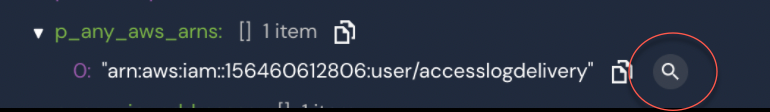
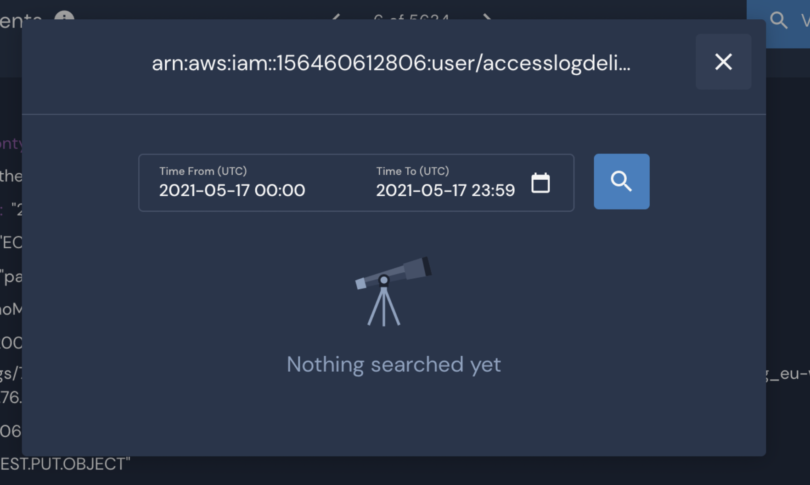

# Indicator Search

Use Indicator Search to run quick investigations on [common indicators](panther-fields.md#indicator-fields) across various data sources. Indicator Search removes the need to write SQL to answer common questions about suspicious activity and presents results in a simple visualization.

The Indicator Search is designed to be easy to use:

* Start your investigation with one or more known indicators.
* Copy & paste the indicator(s) into the search field. The search will find ALL connected events associated with the indicators in the specified time range.
  * You can mix types of indicators (e.g., IP addresses, domain names, ARNs, file hashes).
* A timeline histogram shows the concentration of events over the specified time interval.
* Drill down into specific events by pivoting into the Data Explorer with prebuilt SQL queries.
* Find additional indicators in the Data Explorer and perform another search to gain additional context about the attack.
* Continue to pivot through your data to map the entire attacker footprint.

 (5) (7) (6) (1) (1) (3) (1) (1) (2) (5).png>)

As with all of our features, access to the Indicator Search can be limited through our [Role-Based Access Control](../system-configuration/rbac.md) system.

#### Drill Down

You can use the Indicator Search timeline histogram to switch from a more general view of the results to a more specific one at the click of a mouse. This makes it easy to instantly shift from an overview of events to a more detailed and granular view within the same dataset.\
\
Use Indicator Search to search for an indicator. Click on any of the histogram bars to search for events on a specific period.

.png>)

After clicking on the histogram bar a new Indicator search tab will open containing detailed results for the time period you selected.

.png>)

Click on the histogram bars and drill down until you find the level of detail you require.

#### Pivoting

Indicator Search can also be accessed via the "Events" tab of an alert details page. This makes it easy to quickly pivot off an interesting indicator.&#x20;

To access Indicator Search from the JSON view of an alert details page:

1. Hover over a "p\_any" field in the JSON and click the search icon that appears:\
   
2. Select the date range you would like to search against:\
   
3. The search will return hits of that indicator across different log types. You can investigate these events further by clicking on the tile, which will redirect you to the Data Explorer section in your Panther account.

