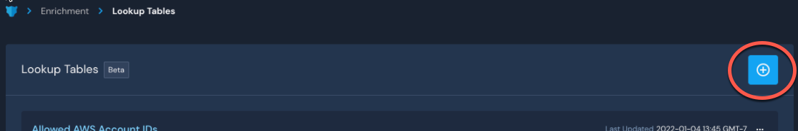
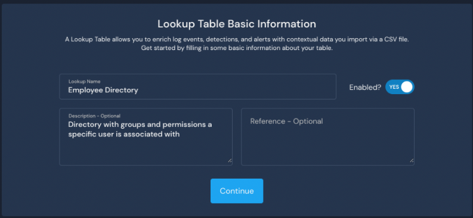
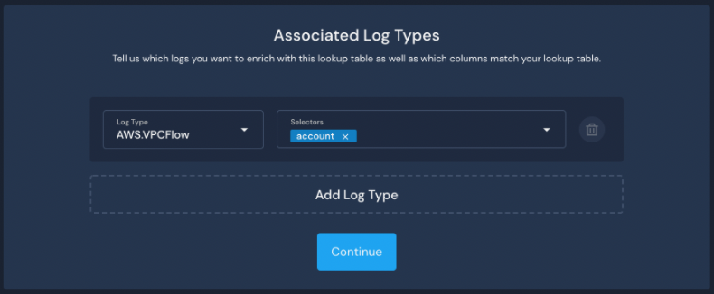
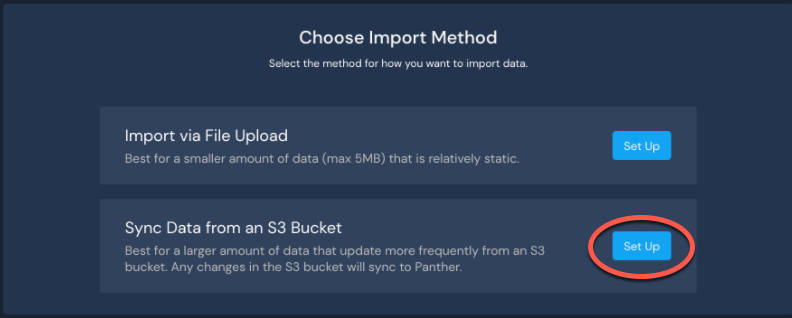
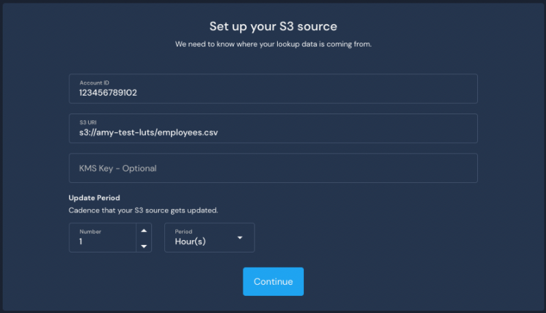

# Sync from S3 Source


This feature is available in version 1.27 and newer.


### Set up a Lookup Table

**Example scenario:** Let's say you want to know what groups and permission levels are associated with the employees at your company. In this scenario, your company has an AWS S3 source with an up-to-date copy of their Active Directory listing that includes groups and permissions information.

**To configure the Lookup Table, follow these steps in the Panther UI:**

1. From the left sidebar, click **Enrichment > Lookup Tables.**
2. In the upper right side of the page, click **+** to add a new Lookup Table.\
   
3.  Configure the Lookup Table Basic Information:

    * Enter a descriptive Lookup Name.&#x20;
    * Enter a Description (optional) and a Reference (optional).&#x20;
      * Description is meant for content about the table, while Reference can be used to hyperlink to an internal resource.
    * Make sure the **Enabled?** toggle is set to **Yes**.
      * Note: This is required to import your data later in this process.&#x20;

    
4. Click **Continue**.
5. Configure the Associated Log Types:
   * Select the **Log Type** from the dropdown. &#x20;
   * Type in the name of the **Selectors**, the foreign key fields from the log type you want enriched with your Lookup Table.&#x20;
     * In the example screen shot below, we selected **AWS.VPCFlow** logs and typed in `account` to represent keys in the VPC Flow logs.
   * Click **Add Log Type** to add another if needed. \
     
6. Click **Continue**.
7. Configure the Table Schema. \
   _Note: If you have not already created a new schema, please see_ [_our documentation on creating schemas_](https://docs.runpanther.io/data-onboarding/custom-log-types/example-csv)_. Once you have created a schema, you will be able to select it from the dropdown on the Table Schema page while configuring a Lookup Table._
   1. Select a **Schema Name** from the dropdown.
   2. Select a **Primary Key Name** from the dropdown. This should be a unique column on the table, such as `accountID`.&#x20;
8. Click **Continue**.
9. On the "Choose Import Method" page, click **Set Up** next to "Sync Data from an S3 Bucket." \
   
10. Set up your S3 source.
    1. Enter the **Account ID**, the 12-digit AWS Account ID where the S3 bucket is located.
    2. Enter the **S3 URI**, the unique path that identifies the specific S3 bucket.
    3. Optionally, enter the **KMS Key** if your data is encrypted using KMS-SSE.
    4. Enter the **Update Period**, the cadence your S3 source gets updated (defaulted to 1 hour).\
       
11. Click **Continue**.
12. Set Up an IAM Role.&#x20;
    * Please see the next section, **Creating an IAM Role**, for instructions on the three options available to do this.
13. After you have set up an IAM role, click **Finish Setup**, and you'll be directed back to the Lookup Tables list page with your new Employee Directory table listed.

Once the process is complete, please note it will take a few minutes for data to be synced from S3.

### Creating an IAM Role

There are three options for creating an IAM Role to use with your Panther Lookup Table using an S3 source:

* [Create an IAM role using AWS Console UI](https://docs.runpanther.io/data-analytics/lookup-tables/s3-source#create-an-iam-role-using-aws-console-ui).
* [Create an IAM role using CloudFormation Template File](https://docs.runpanther.io/data-analytics/lookup-tables/s3-source#create-an-iam-role-using-cloudformation-template-file).
* [Create an IAM role manually](https://docs.runpanther.io/data-analytics/lookup-tables/s3-source#create-an-iam-role-manually).

#### Create an IAM role using AWS Console UI

1. On the "Set Up an IAM role" page, during the process of creating a Lookup Table with an S3 source, locate the tile labeled "Using the AWS Console UI". On the right side of the tile, click **Select**.&#x20;
2. Click **Launch Console UI**.\
   
   * You will be redirected to the AWS console in a new browser tab, with the template URL pre-filled.&#x20;
   * The CloudFormation stack will create an AWS IAM role with the minimum required permissions to read objects from your S3 bucket.&#x20;
   * Click the "Outputs" tab of the CloudFormation stack in AWS, and note the Role ARN.
3. Navigate back to your Panther account.
4. On the "Use AWS UI to set up your role" page, enter the Role ARN.
5. Click **Finish Setup**.

****

**Create an IAM role using CloudFormation Template File**

1. On the "Set Up an IAM role" page, during the process of creating a Lookup Table with an S3 source, locate the tile labeled "CloudFormation Template File". On the right side of the tile, click **Select**.&#x20;
2. Click **CloudFormation template**, which downloads the template to apply it through your own pipeline.
3. Upload the template file in AWS:
   1. Open your AWS console and navigate to the CloudFormation product.
   2. Click **Create stack**.
   3. Click **Upload a template file** and select the CloudFormation template you downloaded.
4. On the "CloudFormation Template" page in Panther, enter the Role ARN.
5. Click **Finish Setup**.

**Create an IAM role manually**

1. On the "Set Up an IAM role" page, during the process of creating a Lookup Table with an S3 source, click the link that says **I want to set everything up on my own**.
2. On the "Setting up role manually" page, enter the Role ARN.&#x20;
   * This can be found in the "Outputs" tab of the CloudFormation stack in your AWS account.
   * Note: The IAM role policy must include at least the statements defined in our [S3 Source Documentation](../../data-onboarding/data-transports/s3.md#creating-an-iam-role-manually-or-with-other-automation).
3. Click **Finish Setup**, and you will be redirected to the Lookup Tables list page with your new Employee Directory table listed.

### View the Lookup Table data with Data Explorer

1. In your Panther account, navigate to **Enrichment > Lookups** to view your Lookup Tables list.
2. Click **...** in the upper right corner of the Lookup Table you wish to view, then click **View In Data Explorer**.\
   

For more information on using Data Explorer, please see the documentation: [Data Explorer](https://docs.runpanther.io/data-analytics/data-explorer).

