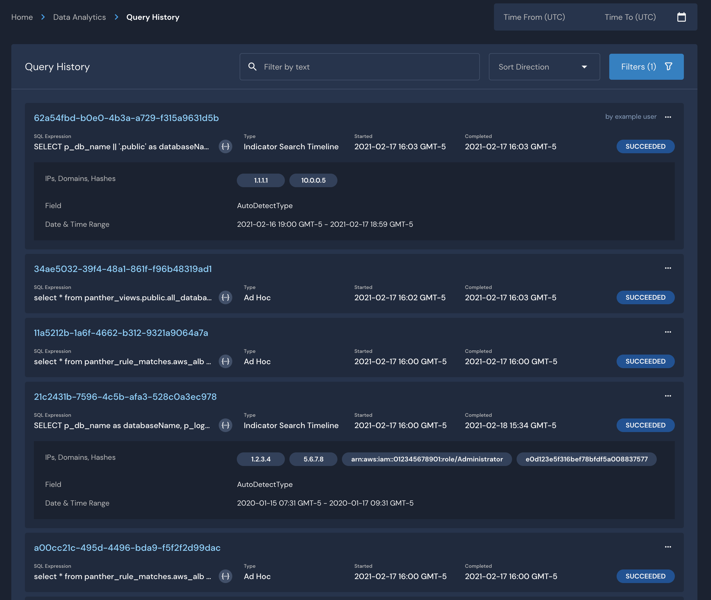

# Query History

The Query History page displays the last 30 days of SQL queries run through the Panther UI. Clicking on the query name will send you to the data explorer where you can see the results and rerun the query. 

In the query history, you'll see the following details:

1. a query name/ID \(a long UUID or the name of a scheduled query\)
2. the SQL expression it ran or attempted to run
3. the query type \(indicating what originated the query\)
   * Ad-hoc \(usually logged whenever a user runs a query in data explorer\)
   * Scheduled \(a scheduled query, usually ran by the database-specific api\)
   * Alert Detail and Alert Summary - populated when a user looks at details and summary pages of an alert
   * Compaction \(a background task, may or may not see this depending on the database backend used by your company\)
   * Indicator Search \(details, timeline, generic - queries run during the use of Panther's indicator search feature\) 
     * For indicator search queries, you have the option of clicking on the ellipsis symbol and navigating to indicator search instead to rerun the query there.
4. times started and stopped 
5. the query status \(success, fail, cancelled or running\)
6. the user or Panther-process running the query

