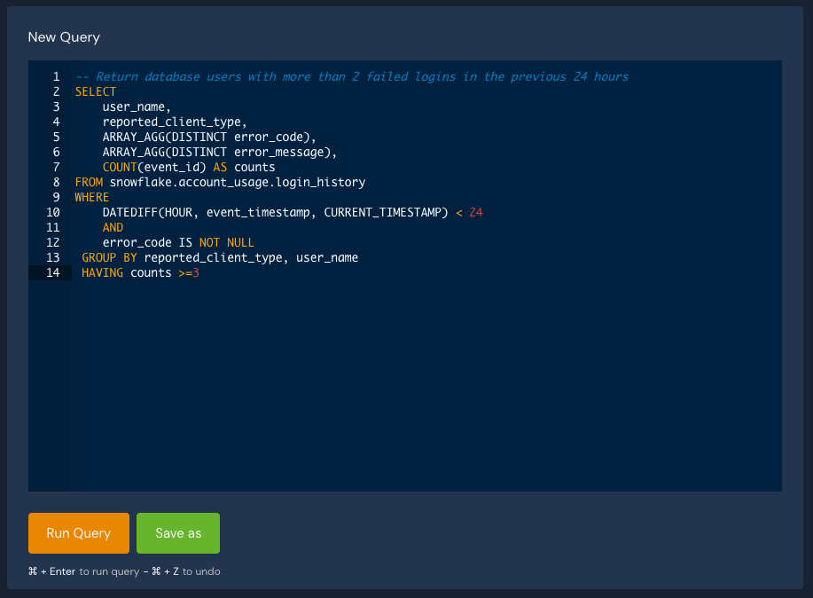
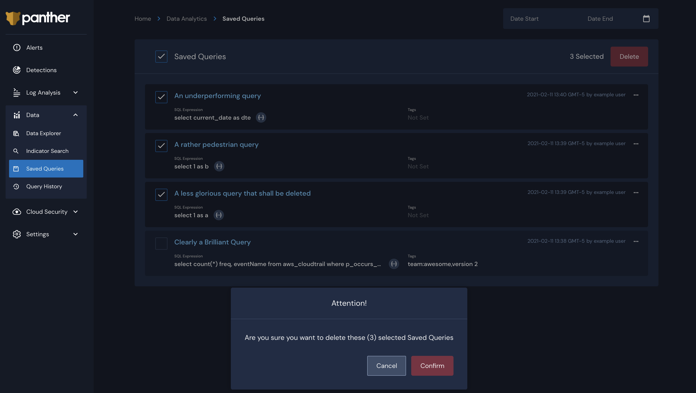

# Scheduled Queries

## Overview


Scheduled queries are currently in Open Beta. Please report any issues you may encounter.


Scheduled queries allow users to use SQL queries instead of streaming data as a feed into Panther's rules engine using Scheduled Rules.

Below is an overview of the scheduled query creation process, detailed steps are described in the following sections:

1. Save a SQL query and enable a schedule, called a `Scheduled Query`.
2. Create a `Scheduled Rule` detection and target the `Scheduled Query` created in above.
3. Every time the `Scheduled Query` runs, that matchin rows will be passed through the rules engine.
4. If the `Scheduled Rule` returns any hits, one or more `Alerts` will be generated from the data and dispatched accordingly.


Please note that at least one Scheduled Rule **must** be associated with the Scheduled Query for the data to be processed by Panther.


Examples can be found [here.](example-queries.md#scheduled-queries-and-rules)

## Creating a Scheduled Query

In `Data -> Data Explorer` create a new query or open a saved query.



Click the `Save as` button which will popup a window. Toggle the `Is this a Scheduled Query?` indicator toggle to `On`.


You will have the option of using a crontab or a simpler period-based frequency scheduler. If using the Period radio option, you can enter the number of days and/or minutes after which the SQL query should be run again. For example: setting a period of 0 days and 30 minutes will mean that the query will run every day, every 30 minutes (give or take a few seconds). You will also be asked to set a timeout period in minutes, with a maximum currently allowed value of 10 minutes. If your query does not complete inside the allowed time window, Panther will automatically cancel it.


Your company will incur costs on your database back end every time a scheduled query runs. Please make sure that your queries can complete inside the specified timeout period.


## How to Use the Scheduled Query Crontab

Panther's Scheduled Query Crontab uses the standard crontab notation consisting of five fields: minutes, hours, day of month, month, day of week. Additionally, you will find a query timeout selector (with a maximum value currently set at 10 minutes). The expression will run on UTC.

The interpreter uses a subset of the standard crontab notation:

```
┌───────── minute (0 - 59)
│ ┌──────── hour (0 - 23)
│ │ ┌────── day of month (1 - 31)
│ │ │ ┌──── month (1 - 12)
│ │ │ │ ┌── day of week (0 - 6 => Sunday - Saturday)
│ │ │ │ │               
↓ ↓ ↓ ↓ ↓
* * * * *
```

If you want to specify day by day, you can separate days with dashes (`1-5` is Monday through Friday) or commas, for example `0,1,4` in the `Day of Week` field will execute the command only on Sundays, Mondays and Thursdays. Currently, we do not support using named days of the week or month names.

Using the crontab can allow a much greater specificity in your schedule than a simple frequency does:


## Create a Scheduled Rule

Setting up a scheduled query simply makes the data available to the rule engine, but in order for Panther to actually use the data, a Scheduled Rule must be set up to use the Scheduled Query.

You can create a new detection by navigating to Detections and pressing the `+` sign to create a new Detection. 

In the new detection menu, choose "Scheduled Rule". Give the rule a severity and a name, then select the previously saved scheduled query for the rule to run on. Under the `Functions and Tests` tab either enter your own custom Python code, or if all your filtering logic is already taken care of in the SQL, you can simply make sure that the event is set to return true for each row.

```python
def rule(event):
    return True
```

After the scheduled query has a chance to run again, if the SQL returned any rows and the python rule conditions were met, you should see rule matches starting to populate:


As soon as you click `Save`, the rule will become active and be run over the SQL at an interval detected by the run frequency of the scheduled query, assuming any rows are returned by the query.



We recommend doing as much of the data processing as possible in SQL. That way you can take advantage of all the database optimizations and improve rule performance. In an ideal case, your rule would be a simple `return true`


## Delete or Deactivate a Scheduled Query

Navigate to `Data -> Saved Queries`. By using the checkbox next to the query name to select multiple queries, you may also delete queries, individually or in bulk. Please note that scheduled queries must be unlinked from their respective rules in order to be deleted. This is to prevent users from accidentally erasing queries used by scheduled rules.



You may also deactivate a scheduled query by updating it and toggling the `Is Active` toggle to off
