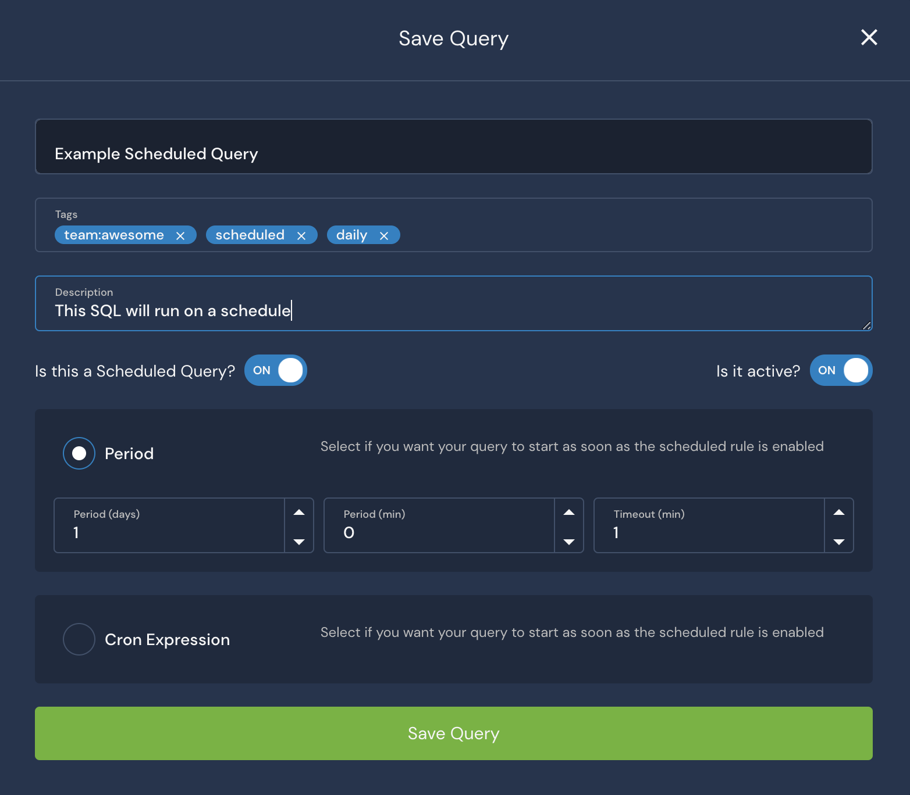
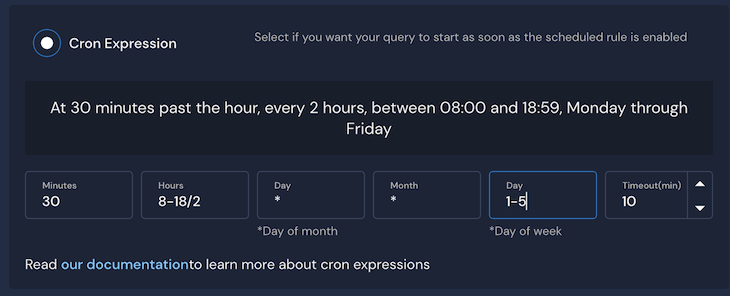
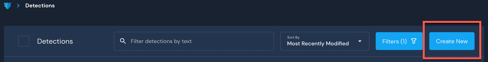
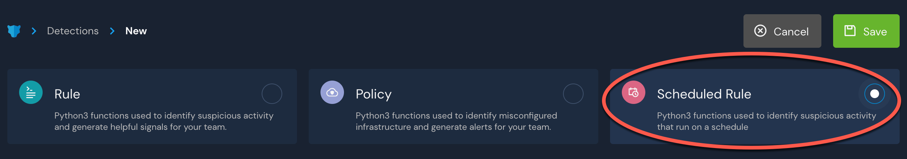
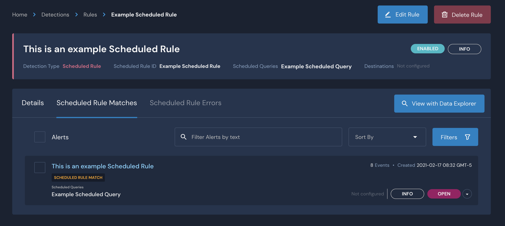
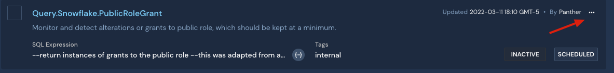
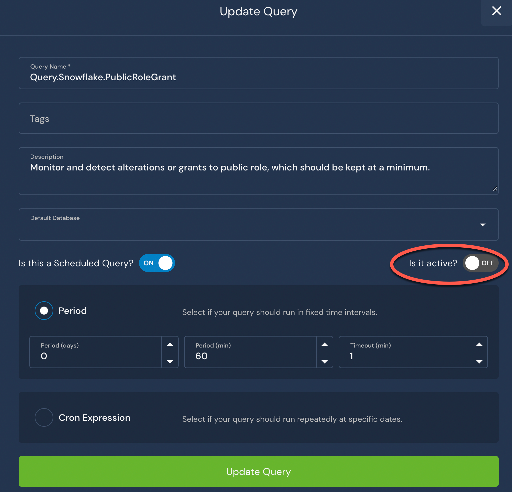

# Scheduled Queries

## Overview

Scheduled Queries allow you to use SQL queries instead of streaming data as a feed into Panther's rules engine using Scheduled Rules.

Below is an overview of the Scheduled Query creation process. The detailed instructions are described in the following sections.

1. Save a SQL query and enable a schedule, called a `Scheduled Query`.
2. Create a `Scheduled Rule` detection and target the `Scheduled Query` created in the first step.
3. Every time the `Scheduled Query` runs, the matching rows will be passed through the rules engine.
4. If the `Scheduled Rule` returns any hits, one or more `Alerts` will be generated from the data and dispatched accordingly.


Please note that at least one Scheduled Rule **must** be associated with the Scheduled Query for the data to be processed by Panther.


By default, new accounts will have a limit of 10 scheduled queries. This limit is only precautionary, and can be increased via a support request. There is no additional cost from Panther for raising this limit, however you may incur extra charges from the database backend depending on the volume of data processed.\
\
For examples of scheduled queries, please see the documentation: [Scheduled Queries and Rules](https://docs.runpanther.io/data-analytics/example-queries#scheduled-queries-and-rules).

## Creating a Scheduled Query

To create a Scheduled Query:

1. Log in to the Panther Console and click **Data > Data Explorer** in the left sidebar.
2. Enter a new query.\
   
3. Click **Save As**.&#x20;
   * In the window that opens, toggle the indicator to **ON** next to **Is this a Scheduled Query?**.\
     
4. Click **Save**.

You will have the option of using a Cron Expression or a period-based frequency scheduler.&#x20;

For the Period radio option, you can enter the number of days and/or minutes after which the SQL query should be run again. For example: setting a period of 0 days and 30 minutes will mean that the query will run every day, every 30 minutes (give or take a few seconds). You will also be asked to set a timeout period in minutes, with a maximum allowed value of 10 minutes. If your query does not complete inside the allowed time window, Panther will automatically cancel it.


Your company will incur costs on your database back end every time a scheduled query runs. Please make sure that your queries can complete inside the specified timeout period.


## How to Use the Scheduled Query Crontab

Panther's Scheduled Query Crontab uses the standard crontab notation consisting of five fields: minutes, hours, day of month, month, day of week. Additionally, you will find a query timeout selector (with a maximum value currently set at 10 minutes). The expression will run on UTC.

The interpreter uses a subset of the standard crontab notation:

```
┌───────── minute (0 - 59)
│ ┌──────── hour (0 - 23)
│ │ ┌────── day of month (1 - 31)
│ │ │ ┌──── month (1 - 12)
│ │ │ │ ┌── day of week (0 - 6 => Sunday - Saturday)
│ │ │ │ │               
↓ ↓ ↓ ↓ ↓
* * * * *
```

If you want to specify day by day, you can separate days with dashes (`1-5` is Monday through Friday) or commas, for example `0,1,4` in the `Day of Week` field will execute the command only on Sundays, Mondays and Thursdays. Currently, we do not support using named days of the week or month names.

Using the crontab allows you to be more specific in your schedule than the Period frequency option:



## Create a Scheduled Rule

Setting up a scheduled query simply makes the data available to the rule engine, but in order for Panther to actually use the data, a Scheduled Rule must be set up to use the Scheduled Query.

To create a scheduled rule:

1. Log in to the Panther Console and click **Detections** in the left sidebar menu.
2. Click **Create New** to create a new Detection. \
   
3. Choose **Scheduled Rule** for the type.\
   
   * Fill out the form to give the rule a Severity and a Unique ID, and optionally a Display Name, Description, Runbook, Reference, Events Threshold, Custom Tags, Destination Overrides, Deduplication Period, and Summary Attributes.&#x20;
4. Click the **Scheduled Queries** dropdown and select the previously saved scheduled query for the rule to run on.&#x20;
5.  Click the **Functions & Tests** tab. Enter your own custom Python code, or if all your filtering logic is already taken care of in the SQL, you can make sure that the event is set to return `true` for each row:

    ```
    def rule(event):  
        return True
    ```
6. [Run tests](https://docs.panther.com/writing-detections/testing) to verify your Scheduled Query.
7. Click **Save** in the upper right side of the page when you are finished.

As soon as you click **Save**, the rule will become active and be run over the SQL at an interval detected by the run frequency of the scheduled query, assuming any rows are returned by the query.

After the scheduled query has a chance to run again, if the SQL returned any rows and the Python rule conditions were met, you should see rule matches starting to populate:



For queries that return multiple rows, each row is treated like a separate event and is processed by the rule. The number of alerts returned depends on the deduplication settings you configured. For example, you might have no deduplication configured and receive one alert for each row, or you can deduplicate by time and receive one alert for all rows combined.


We recommend doing as much of the data processing as possible in SQL. That way you can take advantage of all the database optimizations and improve rule performance. In an ideal case, your rule would be a simple `return true.`


## Delete or Deactivate a Scheduled Query

You can delete queries individually or in bulk. Please note that scheduled queries must be unlinked from their respective rules in order to be deleted. This is to prevent users from accidentally erasing queries used by Scheduled Rules.

#### To delete a Scheduled Query:

1. Log in to the Panther Console, then navigate to **Data > Saved Queries**.&#x20;
2. In the list of Scheduled Queries, check the box next to the queries you want to delete.
3. In the upper right, click the **Mass Action** dropdown and select **Delete**. \
   .png>)
4. In the upper right, click **Apply**.
5. In the popup that appears, click **Confirm**.\
   

#### To deactivate a Scheduled Query:

1. Log in to the Panther Console, then navigate to **Data > Saved Queries**.
2. Click **...** in the upper right corner of the Scheduled Query that you want to deactivate.\
   
3. In the dropdown menu, click **Edit Query Metadata**.
4. In the Update Query form, toggle the setting **Is it active?** to **OFF** to disable the query.\
   
5. Click **Update Query** to save your changes.

