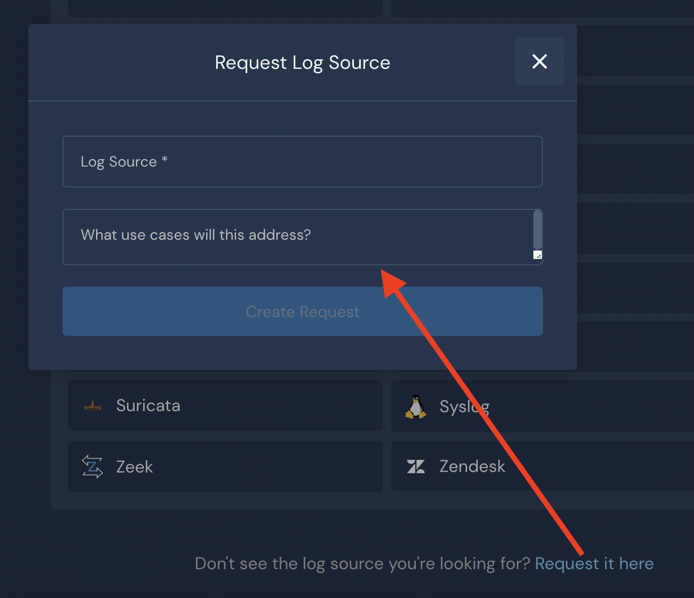

# Data Onboarding

Panther offers several options to onboard data, including SaaS Logs, Data Transports, Cloud Accounts, and Custom Log Types. You can also [request support for a specific log source](https://docs.runpanther.io/data-onboarding#request).&#x20;

### SaaS Logs

Panther leverages two mechanisms to pull logs from SaaS vendors:&#x20;

* Direct integrations (by querying APIs)
* AWS EventBridge

For a list of vendors currently supported, see [SaaS Logs](saas-logs/).

### Data Transports

You may leverage AWS Services in tandem with Panther to get data such as S3 buckets, CloudWatch, SQS, or SNS.

For more information, see [Data Transports](data-transports/).

### Cloud Accounts

Panther may scan your AWS environment to create a model of each AWS resource within. Customers may then compare each model against a policy and Panther can be configured to trigger an alert if the model does not adhere to the policy.

For more information, see [Cloud Accounts](setup-cloud-accounts.md).

### Custom Log Types

Do you have a log type you would like to monitor that Panther does not have [schema built](https://docs.runpanther.io/data-onboarding/supported-logs) for? Panther gives you the ability to generate a custom schema, which informs Panther how to parse events correctly.

For more information, see [Custom Log Types](custom-log-types/).

### Request support for a log source 

If you do not see the log source you want in the list at **Integrations > Log Sources**, you can request support of a new log source:

1. Log in to your Panther Console.
2. Navigate to **Integrations > Log Sources**.
3. Scroll to the bottom of the page and click **Request it here**.
4. Fill in the form then click **Create Request**.

