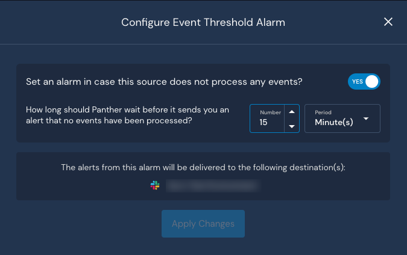

# Data Sources & Transports

## Overview

Panther offers built-in integrations for common data sources and data mapping for custom log sources. This page describes available [data source options](./#data-sources-and-transports), how to [monitor log source health](./#monitoring-log-sources), how to [request support for a new log source](./#request), and how to [configure an Event Threshold alarm](./#configuring-event-threshold-alarms).&#x20;

For information on ingesting Panther Console audit logs, please refer to the related documentation – [Panther Audit Logs](https://docs.panther.com/system-configuration/panther-audit-logs).

## Data Sources & Transports

### Data Transports

You can leverage cloud services to push data to Panther from sources such as S3 buckets, CloudWatch, SQS, SNS, or Google Cloud Storage (GCS). For more information, see [Data Transports](https://docs.panther.com/data-onboarding/data-transports).

### Supported Logs

Panther supports pulling logs from vendors via direct integrations that query the API and via AWS EventBridge. In addition, Panther supports pushing logs to common Data Transport sources to ingest logs into Panther that are not natively supported. For a full list of supported vendors, see the [Supported Logs](https://docs.panther.com/data-onboarding/supported-logs) source page.

#### Cloud Accounts

In addition to onboarding AWS as a log source to configure Detections and receive alerts, we recommend configuring Cloud Security Scanning for your AWS account. Cloud Security Scanning works by scanning AWS accounts, modeling the Resources within them, and using Policies to detect misconfigurations. For more information, see [Cloud Security Scanning](https://docs.panther.com/cloud-scanning).

### Custom Logs

Panther allows you to generate a custom schema if you have a log type that is not yet supported. Panther gives you the ability to build custom schemas, which inform Panther how to parse events correctly. For more information, see [Custom Logs. ](https://docs.panther.com/data-onboarding/custom-log-types)

### Monitoring Log Sources

When your log source is onboarded in Panther, you can monitor its data processing metrics and health within the log source's operations page. You can also attach new schemas and view raw data associated with the log source. For more information, see [Monitoring Log Sources](https://docs.panther.com/data-onboarding/monitoring-log-sources).

## Request support for a log source 

If you do not see the log source you want within the list at **Integrations > Log Sources**, you can request support of a new log source:

1. Log in to your Panther Console.
2. Navigate to **Integrations > Log Sources**.
3. Click **Create New.**
4. Scroll to the bottom of the page and click the **Request it here** hyperlink.
5. Enter the **Log Source** name you want to request and the **use case** it will address.
6. Click **Create Request**.

.png>)

## Configuring event threshold alarms

On the final step of configuring your log source with Panther, you have the option to create an alarm in case the source does not process any events within a configurable period of time. For example, if you configure the threshold to 15 minutes, then you will receive an alert if no events are processed in 15 minutes.


**Note:** The alert is only sent one time; there is no re-notification for event threshold.


To enable the event threshold alarm:

1. From the **Configure Event Threshold Alarm** page, toggle the setting to **YES** next to _Set an alarm in case this source does not process any events?_.
2. Enter your desired time period by filling in the **Number** and **Period** fields next to _How long should Panther wait before it sends you an alert that no events have been processed?_.
3. Click **Apply Changes**.

