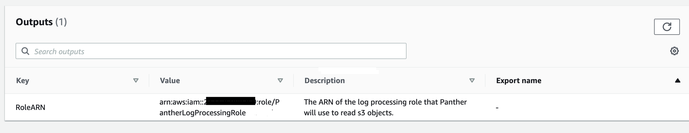

# CloudWatch Logs source


CloudWatch Logs as a Data Transport was introduced in 1.23


## Set Up Permissions to Pull Data

The steps below will enable secure access for Panther to pull security logs from CloudWatch.

From **Integrations**, click **Log Sources** > **Add Source** > **Data Transport** > **CloudWatch Logs**

.png>)

### Step 1: Enter the Bucket Details

|       Field      | Required? | Description                                                                                                                                                              |
| :--------------: | --------- | ------------------------------------------------------------------------------------------------------------------------------------------------------------------------ |
|      `Name`      | `Yes`     | Friendly name of the CloudWatch logs source                                                                                                                              |
| `Log Group Name` | `Yes`     | The unique name of the CloudWatch logs group                                                                                                                             |
| `AWS Account ID` | `Yes`     | The AWS Account ID number that the S3 bucket lives in                                                                                                                    |
| `Pattern Filter` | `No`      | Use this field to filter data log data received from CloudWatch. Read more [here](https://docs.aws.amazon.com/AmazonCloudWatch/latest/logs/FilterAndPatternSyntax.html). |
|    `Log Types`   | `Yes`     | The `Log Types` Panther should use to parse CloudWatch logs. At least one `Log Type` must be selected from the dropdown menu.                                            |

.png>)

Click **Continue**.

### Step 2: Fill in an IAM role ARN

Panther needs an AWS IAM role with permissions to read objects from your CloudWatch log source. You may either use Panther's provided CloudFormation templates to create an IAM role or create the role yourself and fill in the role ARN in to Panther.

#### Creating an IAM role with Panther's CloudFormation template

The CloudFormation stack will create an AWS IAM role with the minimum required permissions to read objects from your CloudWatch log source. To deploy Panther's CloudFormation template, either click the **Launch Console** button, which will redirect you to the AWS console with the template URL pre-filled, or click **Get template file** to download the template and apply it through your own pipeline.


In order to enable [real-time processing of log data](https://docs.aws.amazon.com/AmazonCloudWatch/latest/logs/Subscriptions.html), Panther will create a [Firehose Delivery Stream](https://aws.amazon.com/kinesis/data-firehose) and an S3 Bucket that will be used as the Delivery Stream's destination. A [subscription filter](https://docs.aws.amazon.com/AmazonCloudWatch/latest/logs/CreateSubscriptionFilterFirehose.html) is then configured for the Cloudwatch Logs log group using the Firehose Delivery Stream as its destination. The required read permissions for processing files added by Firehose to the newly created S3 bucket are granted to the IAM role.

More details on this process can be found in the [AWS Cloudwatch Logs documentation for subscriptions](https://docs.aws.amazon.com/AmazonCloudWatch/latest/logs/CrossAccountSubscriptions-Firehose.html).



The "_I want Panther to configure bucket notifications for me_" checkbox enables you to allow Panther configure bucket notifications automatically. Panther uses [S3 Event Notifications](https://docs.aws.amazon.com/AmazonS3/latest/userguide/NotificationHowTo.html) to get notified about new files added to your bucket. If you check the box, the provided CloudFormation template will add extra permissions to the IAM role, and Panther will be able to configure bucket notifications automatically for you (existing configurations will not be removed or overwritten). Otherwise, you will be prompted to configure bucket notifications manually, at a later step.

.png>)


We strongly suggest you allow Panther to configure bucket notifications. This will help in monitoring the health of the CloudWatch logs and surface issues through Panther's system health notifications.


After the CloudFormation stack creation is complete, the role ARN will be visible in the Outputs of the stack.



Fill in the role ARN to Panther and click Continue Setup.

#### Creating an IAM role manually or with other automation

You may create the required IAM role manually or through your own automation, and just fill in the role ARN in Panther. Note, the IAM role policy must include at least the statements defined in the below policy:

```javascript
{
    "Version": "2012-10-17",
    "Statement": [
        {
            "Action": ["s3:GetBucketLocation", "s3:ListBucket"],
            "Resource": "arn:aws:s3:::<bucket-name>",
            "Effect": "Allow"
        },
        {
            "Action": "s3:GetObject",
            "Resource": "arn:aws:s3:::<bucket-name>/*",
            "Effect": "Allow"
        }
    ]
}
```

When the IAM role is ready, fill in the role ARN to Panther and click Continue Setup.

### Step 3: Configure bucket notifications and finish source setup

If you have opted in for Panther-managed notifications in step 2, you are done! Your S3 source is ready to ingest data and a success page is shown:

.png>)


Make sure that you have alarming for log drop-offs set as you verify set-up. This will ensure that a system error notification is fired off in the event that Panther stops receiving data from this source.



That's it! Everything should be set up correctly and Panther can start processing new files arriving from CloudWatch logs.


## Viewing Collected Logs

After log sources are configured, your data can be searched with Data Explorer! Learn more [here](https://app.gitbook.com/@panther-labs/s/documentation/\~/drafts/-Mjpl055436mGBJXxM\_u/data-analytics/data-explorer).
