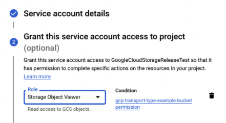

# Google Cloud Storage (GCS) source


This feature is available in versions 1.28 and newer.


After you configure this integration, Panther will pull log data directly from Google Cloud Storage (GCS) buckets. You can then write rules and run queries on the processed data.

## Configuring the Integration in Google Cloud Platform (GCP)&#x20;

Panther requires certain configurations in Google Cloud Platform (GCP) to authenticate and pull logs. A bucket and a subscription for a topic set up with notifications are required. Panther will ingest new files through [Pub/Sub notifications](https://cloud.google.com/pubsub).&#x20;

1. Log in to your Google Cloud console.
2. Determine which bucket Panther will pull logs from.
   * If you have not created a bucket yet, please see [Google's documentation on creating a bucket](https://cloud.google.com/storage/docs/creating-buckets).
3. [Create a topic](https://cloud.google.com/pubsub/docs/admin#creating\_a\_topic) for the notifications.
   * You can create a topic using the `gcloud` CLI tool with the following command format: \
     `gcloud pubsub topics create $TOPIC_ID`
4. [Configure the bucket to send notifications](https://cloud.google.com/storage/docs/reporting-changes) for new files to the topic you created.&#x20;
   * You can create a notification using the `gcloud` CLI tool with the following command format:\
     `gsutil notification create -t $TOPIC_NAME -e OBJECT_FINALIZE -f json gs://$BUCKET_NAME`
   * Note: Panther only requires the `OBJECT_FINALIZE` type.
5. [Create a subscription](https://cloud.google.com/pubsub/docs/admin#pubsub\_create\_pull\_subscription-gcloud) to be used with the topic you created. Note that this subscription should not be used by any service other than Panther.
   * You can create a subscription using the `gcloud` CLI tool with the following command format:\
     `gcloud pubsub subscriptions create $SUBSCRIPTION_ID --topic $TOPIC_ID --topic-project $PROJECT_ID`
6. [Create a new Google Cloud service account](https://cloud.google.com/iam/docs/creating-managing-service-accounts) and take note of the account email address. Panther will use this identity to be able to access the infrastructure created for this integration.&#x20;
   *   The following permissions are required for the project where the Pub/Sub subscription and topic lives:\

       |                             **Permissions required**                            |       **Role**      |      **Scope**      |
       | :-----------------------------------------------------------------------------: | :-----------------: | :-----------------: |
       | 
<code>storage.objects.get</code>

<code>storage.objects.list</code>
 |   `storage/viewer`  |    _bucket-name_    |
       |                          `pubsub.subscriptions.consume`                         | `pubsub/subscriber` | _subscription-name_ |
       |                            `pubsub.subscriptions.get`                           |   `pubsub/viewer`   | _subscription-name_ |
       |                           `monitoring.timeSeries.list`                          | `monitoring/viewer` |       project       |
   * Note: You can set conditions or IAM policies on permissions for specific resources. This can be done either in the IAM page of the service account (as seen in the example screenshot) or in the specific resource's page:\
     
7. [Generate a JSON key file](https://cloud.google.com/iam/docs/creating-managing-service-account-keys) for the service account, which will be used in Panther to authenticate to the GCP infrastructure.&#x20;
   * You can create a JSON key file using the `gcloud` CLI tool with the following command format: \
     `gcloud iam service-accounts keys create $KEYFILE_PATH --iam-account=$SERVICE_ACCOUNT_EMAIL`\

## Set up the GCS source in Panther

1. Log in to your Panther account.
2. On the left sidebar navigation, click **Integrations > Log Sources**.
3. Click **Add New Source**.
4. On the left side, click the **Custom Onboarding** tab, then click **Select** next to Google Cloud Storage.\
   
5. Enter a descriptive name for the source and select the log types you will use, then click **Continue Setup**.\
   
6. On the "Infrastructure & Credentials" page, upload your JSON key file, enter the GCS bucket name and the Pub/Sub subscription ID, then click **Continue Setup**.
   * The subscription ID can be found in the **Subscriptions** section of your Google Cloud account.\
     
7. The message "Everything looks good" will appear at the top of the screen. Click **Finish Setup**.

Panther will now start processing the new files that arrive to your GCS bucket.

## Viewing Collected Logs

After log sources are configured, you can search your data in Data Explorer. For more information and for example queries, please see the [Data Explorer documentation](https://docs.runpanther.io/data-analytics/data-explorer).

