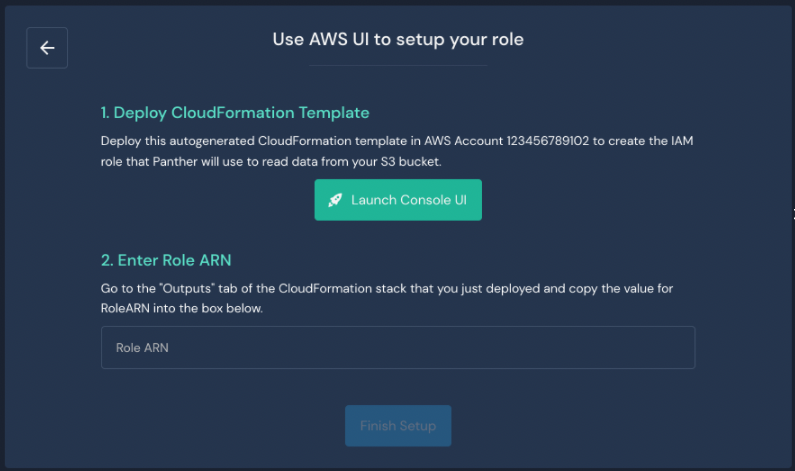
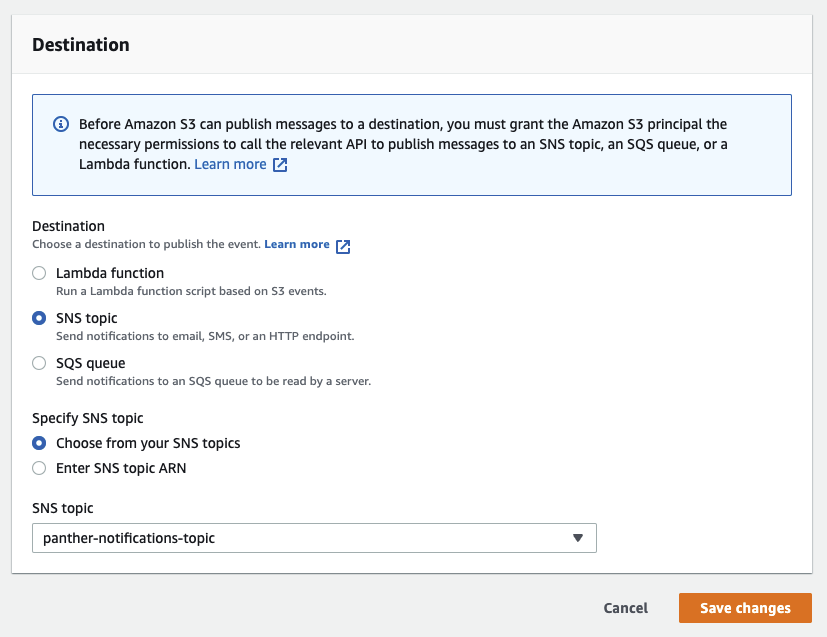

# S3 Source

## Overview

Follow the steps below to enable secure access for Panther to pull security logs from Amazon Web Services (AWS) S3 bucket(s). First you will configure the S3 source in your Panther Console, then you will configure your S3 bucket to send notifications when it receives new data.

## How to pull logs from AWS S3 buckets into Panther

### Configure the Source in Panther

1. Log in to your Panther Console and click **Integrations > Log Sources** in the left sidebar menu.&#x20;
2. In the upper right side of the page, click **Create New**.
3. Click the **AWS** tile.&#x20;
4. Under "Select a Transport Method," click **AWS S3 Bucket**
5. Enter the Bucket details:
   * **Name**: Enter a friendly name for the S3 source.
   * **Account ID**: Enter the 12-digit AWS Account ID where the S3 buckets are located.
   * **Bucket Name**: Enter the S3 Bucket ID/name to onboard.
   * **KMS Key (optional)**: If your data is encrypted using KMS-SSE, provide the ARN of the KMS key.
   * **Stream Type**: Events could be line-delimited, JSON Array format or they could be delivered to S3 from CloudWatch Logs. If an incorrect stream type is chosen, Panther will trigger a system error alert.
   * **S3 Prefix Filter**: Leave this field blank if you want to allow ingestion of all files.
   * **S3 Exclusion Filter**: Indicate which S3 Prefixes to exclude.
   * **Log Types**: The Log Types Panther should use to parse S3 objects matching the S3 Prefix Filter.&#x20;
6. Click **Continue Setup**.


If you set up an S3 log source without a KMS key, you must recreate the log source to include the key.


### Setup an IAM role


Panther needs an AWS IAM role with permissions to read objects from your S3 bucket. You can choose from the following options:

* [**Using the AWS Console UI**](s3.md#using-the-aws-console-ui)****
* [**CloudFormation Template File**](s3.md#cloudformation-template-file)****
* ****[**I want to set up everything on my own**](s3.md#i-want-to-set-everything-up-on-my-own)****

#### Using the AWS Console UI

Launch a CloudFormation stack using the AWS console:

1. On the "Setup an IAM role" page, locate the tile labeled "Using the AWS Console UI". On the right side of the tile, click **Select**.
2. Click **Launch Console UI**.\
   
   * You will be redirected to the AWS console in a new browser tab, with the template URL pre-filled.&#x20;
   * The CloudFormation stack will create an AWS IAM role with the minimum required permissions to read objects from your S3 bucket.
   * Click the "Outputs" tab of the CloudFormation stack in AWS, and note the Role ARN.
3. Navigate back to your Panther account.
4. On the "Use AWS UI to set up your role" page, enter the Role ARN.
5. Click **Finish Setup**.
6. Proceed to the [Finish the Source Setup](s3.md#finish-the-source-setup) section in this documentation.

#### CloudFormation Template file

Use Panther's provided CloudFormation templates to create an IAM role by downloading the CloudFormation template.

1. On the "Set Up an IAM role" page, locate the tile labeled "CloudFormation Template File". On the right side of the tile, click **Select**.&#x20;
2. Click **CloudFormation template**, which downloads the template to apply it through your own pipeline.
3. Upload the template file in AWS:
   1. Open your AWS console and navigate to the CloudFormation product.
   2. Click **Create stack**.
   3. Click **Upload a template file** and select the CloudFormation template you downloaded.
4. On the "CloudFormation Template" page in Panther, enter the Role ARN.
5. Click **Finish Setup**.
6. Proceed to the [Finish the Source Setup](s3.md#finish-the-source-setup) section in this documentation.

#### I want to set everything up on my own

Create the role yourself and fill in the role ARN in Panther. When you set up the IAM role manually, you must also follow the instructions below to configure your S3 buckets to send notifications when new data arrives.

1. On the "Set Up an IAM role" page, click the link that says **I want to set everything up on my own**.
2. Create the required IAM role. You may create the required IAM role manually or through your own automation.
   *   The IAM role policy must include the statements defined below:

       ```
       "Version": "2012-10-17",    
           "Statement": [
               {
                   "Action": "s3:GetBucketLocation",
                   "Resource": "arn:aws:s3:::<bucket-name>",
                   "Effect": "Allow"
               },
               {
                   "Action": "s3:GetObject",
                   "Resource": "arn:aws:s3:::<bucket-name>/<input-file-path>",
                   "Effect": "Allow"
               }
           ]

       ```
   *   If your S3 bucket is configured with server-side encryption using AWS KMS, you must include an additional statement granting the Panther API access to the corresponding KMS key. In this case, the policy will look something like this:

       ```
       Version": "2012-10-17",    
           "Statement": [
               {
                   "Action": "s3:GetBucketLocation",
                   "Resource": "arn:aws:s3:::<bucket-name>",
                   "Effect": "Allow"
               },
               {
                   "Action": "s3:GetObject",
                   "Resource": "arn:aws:s3:::<bucket-name>/<input-file-path>",
                   "Effect": "Allow"
               },
               {
                   "Action": ["kms:Decrypt", "kms:DescribeKey"],
                   "Resource": "arn:aws:kms:<region>:<your-account-id>:key/<kms-key-id>",
                   "Effect": "Allow"
               }
           ]
       ```
3.  Set up the role with the following AssumeRolePolicyDocument so Panther can assume it:

    ```
    {
      "AssumeRolePolicyDocument": {
        "Version": "2012-10-17",
        "Statement": [
          {
            "Effect": "Allow",
            "Principal": {
              "AWS": [
                "arn:<aws-partition>:iam::<panther-master-account-id>:root"
              ]
            },
            "Action": "sts:AssumeRole",
            "Condition": {
              "Bool": {
                "aws:SecureTransport": true
              }
            }
          }
        ]
      }
    }
    ```
4. On the "Setting up role manually" page in Panther, enter the Role ARN.&#x20;
5. Click **Finish Setup.**
6. Proceed to [Manual IAM role creation: Additional Steps](s3.md#manual-iam-role-creation-additional-steps).

### Finish the source setup

Note: If you choose the option **I want to set everything up on my own** to create an IAM role, you must also configure the S3 buckets to send notifications when new data arrives.

After you configure the IAM role in your AWS console, you should be prompted with a success screen.&#x20;

If any permission errors are detected, they will be displayed on this screen and you will be asked to try configuring the IAM role again.&#x20;

#### Log drop-off alarm

Before you finish the setup, we recommend that you create a log drop-off alarm to alert you if data stops flowing from the log source. Be sure to set an appropriate time interval for when you would like Panther to alert you that the log source is not sending data.


**Finish Setup**

Click **Finish Setup** to complete this process in the Panther Console.

## Viewing Collected Logs

After log sources are configured, your data can be searched in Data Explorer. Learn more in the [Data Explorer documentation](https://docs.runpanther.io/data-analytics/data-explorer).

## Data Backup

Once the S3 bucket has been successfully onboarded to Panther and data is flowing, Panther will backup all raw logs for up to 90 days. After that, the logs will be deleted.&#x20;

The raw logs are used for various reasons, for example: To backup dropped logs that may have not been successfully normalized and classified in Panther's data processing pipeline.

## Manual IAM role creation: Additional steps

When you [set up the IAM role manually](s3.md#i-want-to-set-everything-up-on-my-own), you must also follow the instructions below to configure your S3 buckets to send notifications when new data arrives.

### Create SNS Topic

Note: If you already have configured the bucket to send `All object create events` to an SNS topic, proceed to the next section, "Modify an existing SNS topic," and subscribe it to Panther's input data queue.

First you need to create an SNS Topic and SNS Subscription to notify Panther that new data is ready for processing.

1. Log into the AWS Console of the account that owns the S3 bucket.&#x20;
2. Select the AWS Region where your S3 bucket is located and navigate to the **CloudFormation** console.&#x20;
3. Select **Create Stack** (with new resources).\
    (1) (1) (11) (1) (1) (10) (12).png>)\

4.  Under the "Specify template" section, enter the following Amazon S3 URL:\


    ```
    https://panther-public-cloudformation-templates.s3-us-west-2.amazonaws.com/panther-log-processing-notifications/latest/template.yml
    ```

    \
     (1) (1) (11) (1) (1) (10) (12).png>)\

5. Specify the following stack details:
   * **Stack name**: A name of your choice, e.g. `panther-log-processing-notifications-<bucket-label>`
   * **MasterAccountId**: The 12 digit AWS Account ID where Panther is deployed
   * **PantherRegion**: The region where Panther is deployed
   * **SnsTopicName**`:` The name of the SNS topic receiving the notification, by default this is `panther-notifications-topic`
6. Click **Next**, **Next**, and then **Create Stack** to complete the process.&#x20;

Note: This stack has one output named `SnsTopicArn`.


### Modify an existing SNS topic

If you opted to create a new SNS topic in the previous step, skip this step and proceed to the section below, "Configure Event Notifications on the bucket."&#x20;

Follow the steps below if you wish to use an existing topic for sending bucket notifications. Note that the SNS topic must be in the same region as your S3 bucket.

#### Setup Encryption&#x20;

We recommend enabling KMS encryption for the SNS topic:

1. Log in to the AWS console and navigate to KMS.
2. Select the KMS key you want to use for encryption.&#x20;
3. Edit the policy to ensure it has the [appropriate permissions](https://docs.aws.amazon.com/AmazonS3/latest/userguide/grant-destinations-permissions-to-s3.html#key-policy-sns-sqs) to be used with S3 bucket notifications.&#x20;
4. Click the **Encryption** tab under the SNS topic.
5. Click **Enable**, and specify the KMS key you want to use for encryption.&#x20;

#### Modify SNS Access Policy

Create a subscription between your SNS topic and Panther's log processing SQS queue.

1. Log into the AWS Console for the account where your S3 bucket exists
2. Navigate to the [SNS Console](https://us-west-2.console.aws.amazon.com/sns/v3/home#/topics) and select the SNS Topic currently receiving events
3. Note the ARN of this SNS topic
4. Click **Edit** and scroll down to the "Access Policy" card
5.  Add the following statement to the topic's `Access Policy`:

    ```
    {
      "Sid": "CrossAccountSubscription",
      "Effect": "Allow",
      "Principal": {
        "AWS": "arn:aws:iam::<PANTHER-MASTER-ACCOUNT-ID>:root"
      },
      "Action": "sns:Subscribe",
      "Resource": "<SNS-TOPIC-ARN>"
    }
    ```

    * Populate `<PANTHER-MASTER-ACCOUNT-ID>` with the 12-digit account ID where Panther is deployed. This ID can be found in your Panther Console under **Settings > General.**&#x20;
    * Populate `SNS-TOPIC-ARN` with the ARN you noted previously in this documentation.

### Create SNS Subscription

Create the subscription to the Panther Master account's SQS queue.

From the SNS Console, click **Create subscription**:

1. **Fill out the form:**
   * **Protocol**: `Amazon SQS`
   * **Endpoint**: `arn:aws:sqs:<PantherRegion>:<MasterAccountId>:panther-input-data-notifications-queue`
2. **Do not** check the box for the `Enable raw message delivery` setting; `raw message delivery` must be disabled.
3. Click **Create subscription**.

Note: If your subscription is in a "Pending" state and does not get confirmed immediately, you must finish setting up this log source in your Panther Console. Panther confirms the SNS subscription only if a Panther log source exists for the AWS account of the SNS topic.

### Configure Event Notifications on the bucket

With the SNS Topic created, the final step is to enable notifications from the S3 buckets.

1. Navigate to the AWS [S3 Console](https://s3.console.aws.amazon.com/s3/home), select the relevant bucket, and click the **Properties** tab.
2. Locate the Event Notifications card.&#x20;
3. Click **+ Create event notification** and use the following settings:
   * In the "General Configuration" section:&#x20;
     * **Name**: `PantherEventNotifications`
     * **Suffix**: (optional) limits notifications to objects with keys that end in matching characters
     * **Prefix**: (optional) limits notifications to objects with keys that start with matching characters
   * In the "Event Types" card, check the box next to `All object create events`.
   *   In the "Destination" card:

       * Under "Destination," select SNS Topic.
       * For `SNS Topic,` select `panther-notifications-topic` from the drop-down menu.

       
4. Click **Save**.
5. Make sure to [Finish the Source Setup in Panther](s3.md#finish-the-source-setup).

Panther will now start processing new files arriving to your bucket.&#x20;
