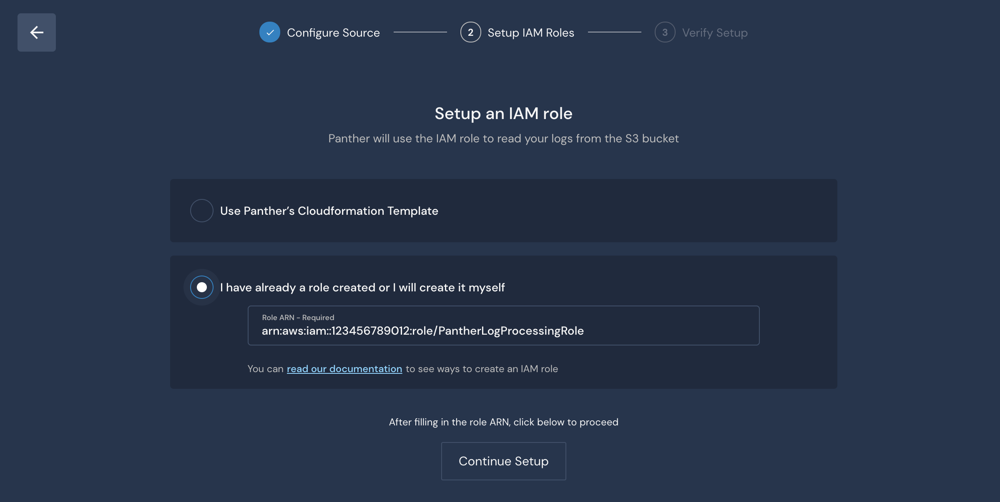
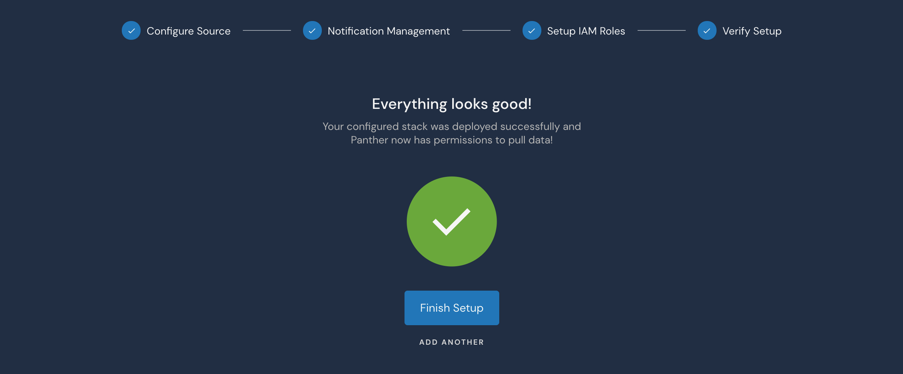

# S3 source


This documentation includes enhancements introduced in version 1.17. If you are using an older version of Panther, please refer to the [older variant](https://docs.runpanther.io/v/release-1.16/data-onboarding/data-transports/s3) of this documentation for support.


## Set Up Permissions to Pull Data

The steps below will enable secure access for Panther to pull security logs from S3 bucket(s).

From **Integrations**, click **Log Sources** > **Add Source** > **Data Transport** > **S3 Bucket**

 (1).png>)

### Step 1: Enter the Bucket Details

|              Field             | Required? | Description                                                                                                                                                                                                                    |
| :----------------------------: | --------- | ------------------------------------------------------------------------------------------------------------------------------------------------------------------------------------------------------------------------------ |
|             `Name`             | `Yes`     | Friendly name of the S3 source                                                                                                                                                                                                 |
|          `Account ID`          | `Yes`     | The 12-digit AWS Account ID where the S3 buckets are located                                                                                                                                                                   |
|          `Bucket Name`         | `Yes`     | The S3 Bucket ID/name to onboard                                                                                                                                                                                               |
|            `KMS Key`           | `No`      | If your data is encrypted using KMS-SSE, provide the ARN of the KMS key                                                                                                                                                        |
|          `Stream Type`         | `Yes`     | Events could be in `line delimited, JSON Array format `or they could be delivered to S3 from `CloudWatch Logs`.                                                                                                                |
| `S3 Prefix Filter & Log Types` | `Yes`     | The `Log Types` Panther should use to parse S3 objects matching the `S3 Prefix Filter`. At least one `Log Type` must be selected from the dropdown menu. `S3 Prefix Filter` may be left blank to allow ingestion of all files. |


Click **Next**.

### Step 2: Fill in an IAM role ARN

Panther needs an AWS IAM role with permissions to read objects from your s3 bucket. You may either use Panther's provided CloudFormation templates to create an IAM role or create the role yourself and fill in the role ARN in to Panther.

#### Creating an IAM role with Panther's CloudFormation template

The CloudFormation stack will create an AWS IAM role with the minimum required permissions to read objects from your S3 bucket. To deploy Panther's CloudFormation template, either click the **Launch Console** button, which will redirect you to the AWS console with the template URL pre-filled, or click **Get template file** to download the template and apply it through your own pipeline.

The "_I want Panther to configure bucket notifications for me_" checkbox enables you to allow Panther configure bucket notifications automatically. Panther uses [S3 Event Notifications](https://docs.aws.amazon.com/AmazonS3/latest/userguide/NotificationHowTo.html) to get notified about new files added to your bucket. If you check the box, the provided CloudFormation template will add extra permissions to the IAM role, and Panther will be able to configure bucket notifications automatically for you (existing configurations will not be removed or overwritten). Otherwise, you will be prompted to configure bucket notifications manually, at a later step.

.png>)

After the CloudFormation stack creation is complete, the role ARN will be visible in the Outputs of the stack.


Fill in the role ARN to Panther and click Continue Setup.

#### Creating an IAM role manually or with other automation



You may create the required IAM role manually or through your own automation, and just fill in the role ARN in Panther. Note, the IAM role policy must include at least the statements defined in the below policy:

```javascript
{
    "Version": "2012-10-17",
    "Statement": [
        {
            "Action": ["s3:GetBucketLocation", "s3:ListBucket"],
            "Resource": "arn:aws:s3:::<bucket-name>",
            "Effect": "Allow"
        },
        {
            "Action": "s3:GetObject",
            "Resource": "arn:aws:s3:::<bucket-name>/*",
            "Effect": "Allow"
        }
    ]
}
```

When the IAM role is ready, fill in the role ARN to Panther and click Continue Setup.

### Step 3: Configure bucket notifications and finish source setup

If you have opted in for Panther-managed notifications in step 2, you are done! Your S3 source is ready to ingest data and a success page is shown:




If you haven't opted in for Panther-managed notifications, follow the steps below to configure notifications for your S3 bucket.


## Set Up Notifications of New Data

Now that Panther has the ability to pull log data, you need to configure your S3 buckets to send [notifications](https://docs.aws.amazon.com/AmazonS3/latest/dev/NotificationHowTo.html) when new data arrives.

We will configure the bucket to send notifications for new files to an SNS topic, which in turn will notify Panther's SQS queue.

### Create SNS Topic


If you already have configured the bucket to send `All object create events` to an SNS topic, proceed to [modify an existing SNS topic](s3.md#modify-an-existing-sns-topic) and subscribe it to Panther's input data queue.


First, create an SNS Topic and SNS Subscription to notify Panther that new data is ready for processing.

Log into the AWS Console of the account that owns the S3 bucket. Select the AWS Region where your S3 bucket is located, navigate to the **CloudFormation** console, and click on **Create Stack** (with new resources).

.png>)

Under the `Specify template` section, enter the following Amazon S3 URL:

```
https://panther-public-cloudformation-templates.s3-us-west-2.amazonaws.com/panther-log-processing-notifications/latest/template.yml
```

.png>)

Specify the stack details below:

|       Field       | Description                                                                                            |
| :---------------: | ------------------------------------------------------------------------------------------------------ |
|    `Stack name`   | A name of your choice, e.g. `panther-log-processing-notifications-<bucket-label>`                      |
| `MasterAccountId` | The 12 digit AWS Account ID where Panther is deployed                                                  |
|  `PantherRegion`  | The region where Panther is deployed                                                                   |
|   `SnsTopicName`  | The name of the SNS topic receiving the notification, by default this is `panther-notifications-topic` |

Click on **Next**, **Next**, and then **Create Stack**.

This stack has one output named `SnsTopicArn`.

### Modify an existing SNS topic


If you opted to create a new SNS topic in the previous step, skip this step and proceed to [configure bucket notifications](s3.md#configure-event-notifications-on-the-bucket) below.


Follow the steps below if you wish to use an existing topic for sending bucket notifications. Note that the SNS topic must be in the same region as your S3 bucket.

#### Modify SNS Access Policy

Create a subscription between your SNS topic and Panther's log processing SQS queue.

1. Log into the AWS Console for the account where your S3 bucket exists
2. Navigate to the [SNS Console](https://us-west-2.console.aws.amazon.com/sns/v3/home#/topics) and select the SNS Topic currently receiving events
3. Note the ARN of this SNS topic
4. Select the `Edit` button and scroll down to the `Access Policy` card
5. Add the statement shown below to the topic's `Access Policy`. Populate `<PANTHER-MASTER-ACCOUNT-ID>` with the 12-digit account ID where Panther is deployed - navigate to your Settings > General page in your Panther UI to obtain this ID. Populate `SNS-TOPIC-ARN` with the ARN you noted on step #3:

```javascript
{
  "Sid": "CrossAccountSubscription",
  "Effect": "Allow",
  "Principal": {
    "AWS": "arn:aws:iam::<MasterAccountId>:root"
  },
  "Action": "sns:Subscribe",
  "Resource": "<SNS-TOPIC-ARN>"
}
```

#### Create SNS Subscription

Finally, create the subscription to the Panther Master account's SQS queue.

From the SNS Console, select the `Create subscription` button:

1. `Protocol`: `Amazon SQS`
2. `Endpoint`: `arn:aws:sqs:<PantherRegion>:<MasterAccountId>:panther-input-data-notifications-queue`
3. Select the `Create subscription` button

### Configure Event Notifications on the bucket

With the SNS Topic created, the final step is to enable notifications from the S3 buckets.

Navigate to the AWS [S3 Console](https://s3.console.aws.amazon.com/s3/home), select the relevant bucket, and click the `Properties` tab.

From there, find the `Event notifications` card. Click `+ Create event notification` and use the following settings:

|   Field   | Value                                                                                    |
| :-------: | ---------------------------------------------------------------------------------------- |
|   `Name`  | `PantherEventNotifications`                                                              |
|  `Events` | `All object create events`                                                               |
| `Send to` | `SNS Topic`                                                                              |
|   `SNS`   | `panther-notifications-topic`                                                            |
|  `Suffix` | (optional) limits notifications to objects with keys that end in matching characters     |
|  `Prefix` | (optional) limits notifications to objects with keys that start with matching characters |

Click `Save`.


That's it! Everything should be set up correctly and Panther can start processing new files arriving to your bucket.


## Viewing Collected Logs

After log sources are configured, your data can be searched in Data Explorer! Learn more [here](https://app.gitbook.com/@panther-labs/s/documentation/\~/drafts/-Mjpl055436mGBJXxM\_u/data-analytics/data-explorer).
