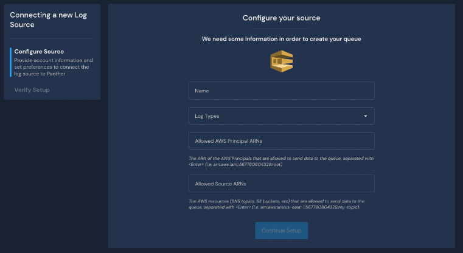

# SQS Source

## Overview

The steps below enable you to set up an Amazon Simple Queue Service (SQS) source and give you permissions to send data to that queue. Panther pulls events from that queue and allows you to write rules and run queries on the processed data.


SQS has a max message size of 256KB and a scalability limit of 10K SQS messages per minute. If you expect to send messages bigger than this, consider using S3 instead.


## How to onboard SQS logs into Panther

1. Log in to your Panther Console and click **Integrations > Log Sources** in the left sidebar menu.
2. Click **Create New.**
3. On the left-hand sidebar, click **Custom Onboarding**.&#x20;
4. On the AWS SQS Queue tile, click **Select**.\
   \
   _In the image above, a blue Select button is circled within the tile labeled AWS SQS Queue._
5. On the "Configure your source" page, fill in the fields as follows:
   * **Name**: Enter a memorable name for your source.
   * **Log Types**: From the drop-down, select all log types that you wish to monitor.
   * **Allowed AWS Principal ARNs**: List all ARNs of the AWS principals that will be allowed to publish messages to your SQS queue.
   * **Allowed Source ARNs:** List all ARNs of the AWS resources (SNS topics, S3 buckets, etc.) that can publish messages to your SQS queue.
     * **Note**: If none of **Allowed AWS Principal ARNs** and **Allowed Source ARNs** properties are set, only Principals of the AWS account where Panther is deployed will be able to publish messages to the queue.\
       
6. Click **Continue Setup**.
7. On the final "Verify Setup" confirmation page, toggle **** the alarm button to **YES** if you would like Panther to send you an alert in case your source does not produce any events.
   * Edit the time period fields "Number" and "Period" to select your alert interval.
   * Note: **** To create new or modify existing alert destinations, see [Destinations](../../../destinations/).
8. To view your newly created source, click **View Log Source**.
   * Manage your AWA SQS source here for data and events processed, overall health, source schemas, alarm configuration, etc.

## View Collected Logs

After SQS log sources are configured, you can search your data in Data Explorer. For more information and for example queries, please see the [Data Explorer documentation](https://docs.runpanther.io/data-analytics/data-explorer).
