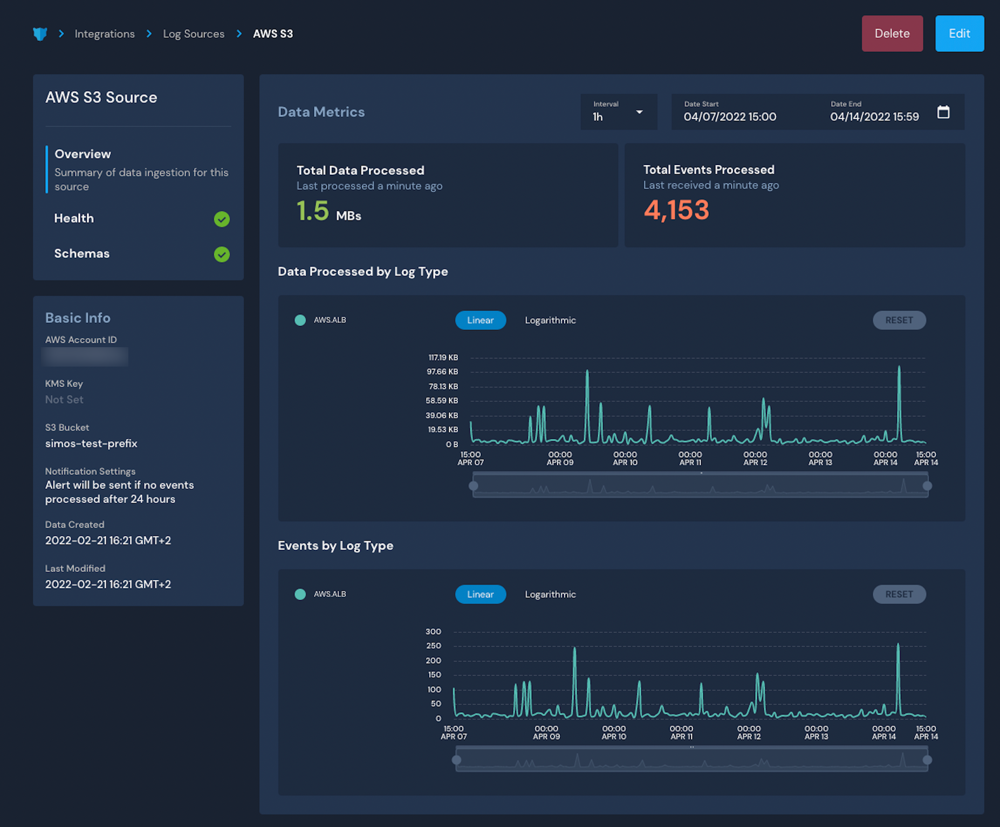
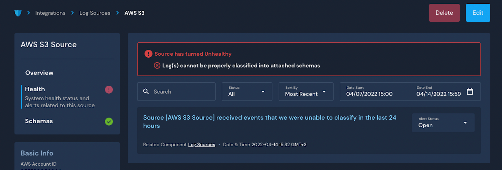

# Monitoring Log Sources

## Overview

Once a log source is onboarded in Panther, you can monitor data processing metrics and the log source's health in the log source's operations page. You can also attach new schemas and view raw data associated with the log source.

## How to monitor log sources

### Finding the log source operations page

1. Log in to your Panther Console.
2. On the left sidebar menu, click **Integrations > Log Sources**.&#x20;
3. Click into any log source in the list to view that log source's operations page.&#x20;

You will see all relevant metadata in the left section of the page and detailed metrics around processed data and health.&#x20;

### Viewing log source data metrics

On the left side of the log source's operations page, click the **Overview** tab to see the Total Data Processed and Total Events Processed.

* **Total Data Processed**: This figure represents the amount of data that has been successfully processed from this source and is now in the data lake.
  * **Data Processed by Log Type Chart:** This chart represents the amount of data processed broken down by the log type (the type of data) that is now in the data lake. There is a corresponding table to each log type in the data lake.
* **Total Events Processed**: This figure represents the number of files that have been successfully processed from this source and are now in the data lake.
  * **Events Processed by Log Type Chart:** This chart represents the number of events processed broken down by the log type (the type of data) that is now in the data lake. There is a corresponding table to each log type in the data lake.

### Viewing log source health

On the left side of the log source's operations page, click the **Health** tab to see all system health alerts related to the health of the log source you are viewing.&#x20;

This page displays errors related to data classification, log drop-off, S3 Get.Object, and permissions.&#x20;

You can learn more about these error types in the documentation: [System Health Notifications](../system-configuration/system-health-notifications/).&#x20;

### Viewing or editing log source schemas

On the left side of the log source's operations page, click the **Schemas** tab to see all schemas that are parsing and normalizing the data coming from this source.&#x20;

If you are looking at a custom log source that uses a Data Transport, you will be able to add or remove schemas here.&#x20;

#### View in Data Explorer&#x20;

On the right side of a schema in the list, click **View Data**. You will be redirected to Data Explorer with a pre-filled SQL snippet that you can run to view data associated with the schema.

.gif>)

### View source raw data


This feature is only available to log sources onboarded with the S3 transport method.



The permission `View Log Source Raw Data` is required. By default, only users with the Admin role have this permission.


When onboarding an S3 log source with or without log types, you get direct access to the log source's raw data that Panther receives.

To access the log source's raw data:

1. Log in to the Panther Console.
2. In the left sidebar menu, click **Integrations > Log Sources**.
3. Click **...** in the upper right side of a source in the list. In the dropdown menu that appears, click **Schema Configuration**.\
   

In the Schema Configuration, you can view events for a specific time range. Optionally, you can limit results by applying filters for the S3 key prefix and a search string to match each event.

