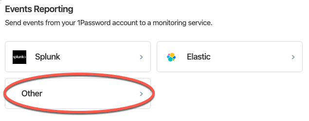

# 1Password

## Overview

Panther has the ability to fetch 1Password event logs by querying the [1Password Events API](https://support.1password.com/events-api-reference/). Panther is specifically monitoring the following 1Password events:

* Sign-in attempts from a user's 1Password account
* Items in shared vaults that have been modified, accessed, or used

In order to set up 1Password as a log source in Panther, you'll need to authorize Panther in 1Password by generating an access token in your 1Password account and then set up 1Password as a log source in Panther.&#x20;

## How to onboard 1Password logs to Panther

### Step 1: Generate an Access Token in 1Password

1. [Sign in](https://start.1password.com/signin) to your 1Password account, then click **Integrations** in the sidebar.
2. Click **Directory** at the top of the page.
3. Scroll down to the "Events Reporting" section then click **Other**. \
   
4. Enter a **System Name** for the integration, then click **Add Integration**.
5. Enter a name for the bearer token and choose token expiration.&#x20;
6. Select the following two event types to which the token has access: `ItemUsage` and `SignInAttempts`**.**
   * For information on issuing or revoking bearer tokens, please see [1Password's documentation](https://support.1password.com/events-reporting/#appendix-issue-or-revoke-bearer-tokens).
7. Click **Issue Token** to generate the access token key.
8. Click **Save in 1Password** and choose which vault to save your token to.
9. Click **View Integration Details** to view the token.&#x20;
   * You will need this token in the next steps.

### Step 2: Create a new 1Password log source in Panther

1. Login to your Panther Console.
2. Go to **Integrations** > **Log** **Sources** from the sidebar menu.
3. In the upper right corner, click **Create New.**
4. Select **1Password** from the list of available log sources.
5. In the Name field, enter in a descriptive name for the source e.g. `My 1Password Event logs` and then click **Continue Setup.**
6. On the Set Credentials page, fill in the form:
   * Paste the **access token key** from your 1Password account into the Access Token field.
   * Select the region & plan of your 1Password account.&#x20;
   * Click **Continue Setup**.
7. You will be directed to a confirmation screen where you can optionally set up a log drop-off alarm, which sends an error message if logs aren't received within a specified time interval. When you are finished, click **Finish Setup**.


**Note:** By default, 1Password logs do not contain human-readable values for objects such as vaults and login credentials. Please [see our guide about using Lookup Tables](https://docs.panther.com/guides/using-lookup-tables-1password-uuids) to translate 1Password's Universally Unique Identifier (UUID) values into human-readable names.


## Supported log types


Required fields in the schemas are listed as **"required: true"**  just below the "name" field.


### OnePassword.ItemUsage

OnePassword item usage.

Reference: [1Password Documentation on API for Item Usage.](https://support.1password.com/events-api-reference/#item-usage)

```yaml
schema: OnePassword.ItemUsage
parser:
    native:
        name: OnePassword.ItemUsage
description: OnePassword Item usage
referenceURL: https://support.1password.com/events-api-reference/#item-usage
version: 0
fields:
    - name: uuid
      required: true
      description: The uuid of the event.
      type: string
    - name: timestamp
      required: true
      description: The date and time of the event.
      type: timestamp
      isEventTime: true
    - name: used_version
      description: The version of the item that was accessed.
      type: bigint
    - name: vault_uuid
      description: The uuid of the vault the item is in.
      type: string
    - name: item_uuid
      description: The uuid of the item that was accessed.
      type: string
    - name: user
      description: The user object that accessed the item.
      type: object
      fields:
        - name: uuid
          description: The uuid of the user that accessed the item or attempted to sign in to the account.
          type: string
        - name: name
          description: The name of the user, hydrated at the time the event was generated.
          type: string
        - name: email
          description: The email address of the user, hydrated at the time the event was generated.
          type: string
          indicators:
            - email
    - name: client
      description: The client object used to accessed the item.
      type: object
      fields:
        - name: app_name
          description: The name of the 1Password app the item was accessed from.
          type: string
        - name: app_version
          description: The version number of the app.
          type: string
        - name: platform_name
          description: The name of the platform the item was accessed from.
          type: string
        - name: platform_version
          description: The version of the browser or computer where 1Password is installed, or the CPU of the machine where the 1Password command-line tool is installed.
          type: string
        - name: os_name
          description: The name of the operating system the item was accessed from.
          type: string
        - name: os_version
          description: The version of the operating system the item was accessed from.
          type: string
        - name: ip_address
          description: The IP address the item was accessed from.
          type: string
          indicators:
            - ip
```

### OnePassword.SignInAttempt

OnePassword Sign-In attempts.

Reference: [1Password Documentation on API for Sign-In Attempts.](https://support.1password.com/events-api-reference/#sign-in-attempts)

```yaml
schema: OnePassword.SignInAttempt
parser:
    native:
        name: OnePassword.SignInAttempt
description: OnePassword SignIn attempts
referenceURL: https://support.1password.com/events-api-reference/#sign-in-attempts
version: 0
fields:
    - name: uuid
      required: true
      description: The uuid of the event.
      type: string
    - name: session_uuid
      description: The uuid of the session that created the event.
      type: string
    - name: timestamp
      required: true
      description: The date and time of the event.
      type: timestamp
      isEventTime: true
    - name: category
      description: The category of the sign-in attempt.
      type: string
    - name: type
      description: The type details of the sign-in attempt.
      type: string
    - name: country
      description: The country code of from where the event happened
      type: string
    - name: details
      description: Additional information about the sign-in attempt, such as any firewall rules that prevent a user from signing in.
      type: object
      fields:
        - name: value
          description: The country, continent, or IP address of the sign-in attempt
          type: string
    - name: target_user
      description: The user object attempted sign-in
      type: object
      fields:
        - name: uuid
          description: The uuid of the user that accessed the item or attempted to sign in to the account.
          type: string
        - name: name
          description: The name of the user, hydrated at the time the event was generated.
          type: string
        - name: email
          description: The email address of the user, hydrated at the time the event was generated.
          type: string
          indicators:
            - email
    - name: client
      description: The client object used fpr sign-in attempt
      type: object
      fields:
        - name: app_name
          description: The name of the 1Password app the item was accessed from.
          type: string
        - name: app_version
          description: The version number of the app.
          type: string
        - name: platform_name
          description: The name of the platform the item was accessed from.
          type: string
        - name: platform_version
          description: The version of the browser or computer where 1Password is installed, or the CPU of the machine where the 1Password command-line tool is installed.
          type: string
        - name: os_name
          description: The name of the operating system the item was accessed from.
          type: string
        - name: os_version
          description: The version of the operating system the item was accessed from.
          type: string
        - name: ip_address
          description: The IP address the item was accessed from.
          type: string
          indicators:
            - ip
```
