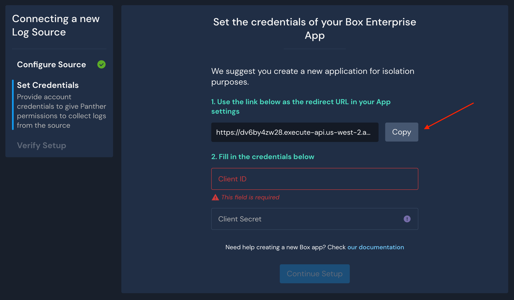
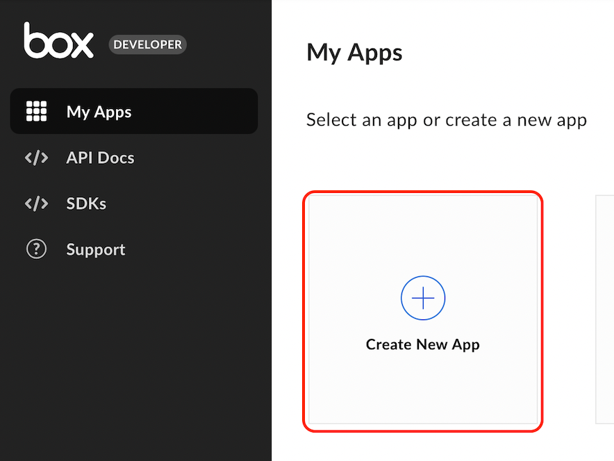
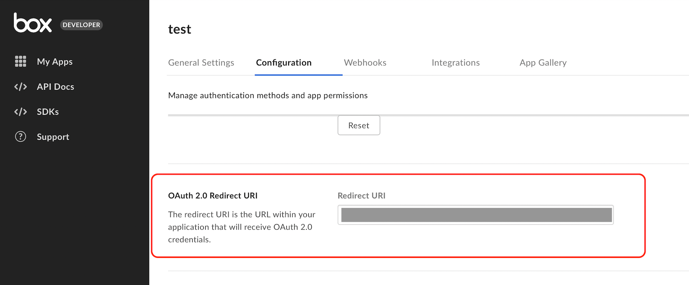
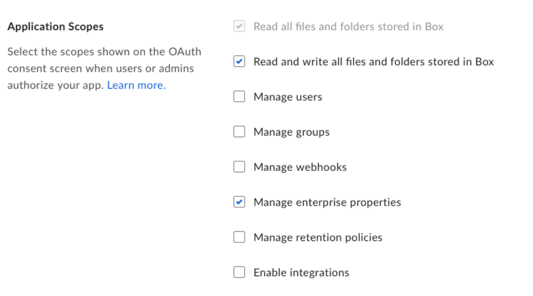

# Box

Panther can pull audit events from the [Box Events API](https://developer.box.com/reference/get-events/) every 60 seconds for real-time detection.

For Panther to access the Box API, you will need to create a new Box App and provide its credentials to Panther.

## Create a New Box Source in Panther

1. Log in to your Panther Console.
2. Go to **Integrations > Log Sources** from the sidebar menu.
3. Click **Add Source.**
4. Select **Box** from the list of available types.
5. Click **Start Source Setup**.
6. Enter a name for the source (e.g. `My Box logs`)
7. Click **Continue Setup**.&#x20;
8. On the "Set Credentials" page, click **Copy** under Step 1 to copy your redirect URL.\
   

Before you continue the setup process in your Panther Console, you must create a new app in your Box Developer Console and retrieve the Client ID and Client Secret.

## Create a New Box App


For security and availability reasons, we recommend creating a new Box App solely for Panther. Make sure to copy the **redirect URL** from this page.



To read events from the entire enterprise account, the Box user performing the following steps _must_ have [full admin priviledges on the account](https://developer.box.com/guides/authentication/user-types/managed-users/#admin--co-admin-roles) (_not_ co-admin).


1. In a separate browser tab or window, log in to the [Box Developer Console](https://app.box.com/developers/console).
2. Click **Create New App.**\
   ********
3. Select **Custom App** for the app type then click **Next.**
4. Select **User Authentication (OAuth 2.0)**, enter a name for your app (e.g. `Panther`), then click **Create App.**\
   ********
5. In your new app's Configuration tab, scroll down to the **OAuth 2.0 Redirect URI** section and paste the redirect URL you copied from your Panther console.\
   
6. On the **Application Scopes** section make sure **Manage enterprise properties** is selected (it is **not** selected by default)\
   
7. Click **Save Changes**.

## Finalize Box Onboarding in Panther

1. In the Box Developer console, navigate to the new app you created for Panther. In the Configuration tab, scroll down to the **OAuth 2.0 Credentials** section.\
   
2. Copy the **Client ID** and **Client Secret** credentials and paste them into the "Set credentials" screen in your Panther Console.
   * The Client Secret will be stored and encrypted in Panther backend.
3. Click **Continue Setup**.&#x20;
4. On the Verify Setup page in Panther, click **Grant Access**.
   * You will be redirected to Box.&#x20;
5. Click **Grant access to Box.**&#x20;
   * You will be redirected back to Panther.

## Panther-Built Detections

The following detections are available for use immediately:&#x20;

* Access Granted
* Anomalous Download
* Brute Force Login
* Event Triggered Externally
* Item Shared Externally
* Malicious Content
* New Login
* Policy Violation
* Suspicious Login or Session
* Untrusted Device
* User Downloads
* User Permission Updates

Please take a look at the code and corresponding metadata in the [box\_rules](https://github.com/panther-labs/panther-analysis/tree/master/box\_rules) repository to see how these are built.&#x20;
