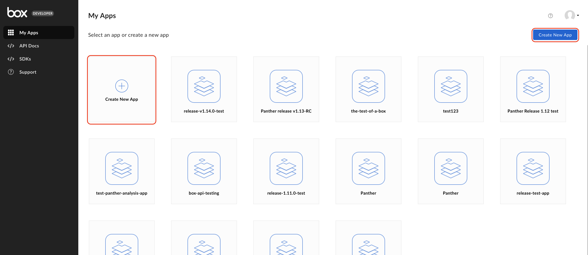
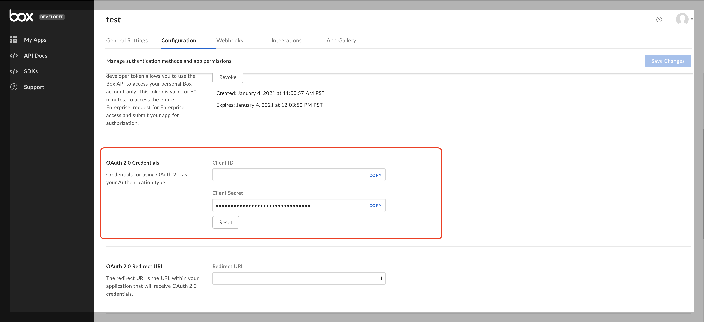
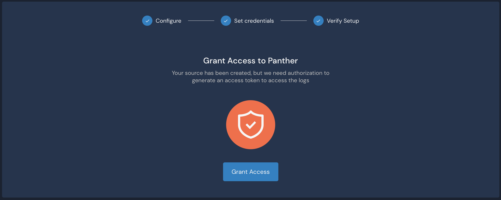

# Box

Panther can pull audit events from the [Box Events API](https://developer.box.com/reference/get-events/) every 1 minute intervals for real-time detection.

In order for Panther to access the API you will need to create a new Box App and provide its credentials to Panther.

## Create a New Box Source in Panther

1. Login to your Panther account
2. Go to **Integrations > Log Sources** from the sidebar menu
3. Click **Add Source**
4. Select **Box** from the list of available types
5. Enter a name for the source (e.g. `My Box logs`), then click **Next**

1. On the next, click the **Copy** link to the redirect URL. You'll need this in the next step.

## Create a New Box App


For security and availability reasons, we recommend creating a new Box App solely for Panther. Make sure to copy the **redirect URL** from this page.



To read events from the entire enterprise account, the Box user performing the following steps _must_ have [full admin priviledges on the account](https://developer.box.com/guides/authentication/user-types/managed-users/#admin--co-admin-roles) (_not_ co-admin).


1. In a new tab, log in to the [Box Developer Console](https://app.box.com/developers/console)
2. Click **Create New App**

1. Select **Custom App** and click **Next**

1. Select **User Authentication (OAuth 2.0)**, enter a name for your app (e.g. `Panther`) and click **Create App**

1. In your new app's Configuration tab, scroll down to the **OAuth 2.0 Redirect URI** section and paste the redirect URL copied from the previous Panther tab

1. On the **Application Scopes** section make sure **Manage enterprise properties** is selected (it is **not** selected by default)

1. Click **Save Changes** to store the app configuration

## Finalize Box Onboarding in Panther

1. Scroll to the **OAuth 2.0 Credentials** section and copy the **Client ID** and **Client Secret** credentials into the Panther onboarding screen.

1. Click **Next**. The **Client Secret** will be stored, encrypted, in Panther backend.
2. Click **Save Source**
3. Click **Authorize** (you will be redirected to Box)
4. Click **Grant access to Box** (you will be redirected back to Panther)

1. Your new Box Source should be healthy and ready to fetch events from Box!
