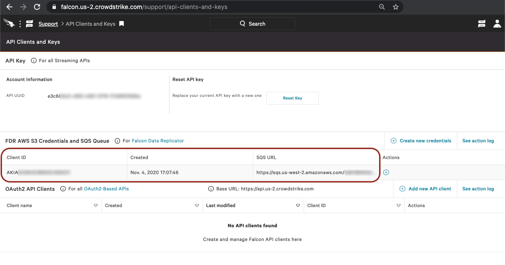

# CrowdStrike

Panther has the ability to fetch CrowdStrike events by integrating with the [CrowdStrike Falcon Data Replicator](https://developer.crowdstrike.com/crowdstrike/docs/falcon-data-replicator-guide).


CrowdStrike customers must have the [Falcon Data Replicator](https://developer.crowdstrike.com/crowdstrike/docs/falcon-data-replicator-guide#section-overview-of-falcon-data-replicator) enabled before setting up this integration.


## Create FDR API Keys

1. Login to your CrowdStrike Falcon console
2. Navigate to the **API Clients and Keys** page
3. Click **Create new credentials** under the **FDR AWS S3 Credentials and SQS Queue** section
4. Copy down the Client ID, Secret ID, and SQS URL for the next steps

## Create a New CrowdStrike Source in Panther

1. Login to your Panther deployment
2. Go to **Integrations > Log Sources** from the sidebar menu
3. Click **Add Source**
4. Select **CrowdStrike** from the list of available types
5. Fill in the fields below:
   1. **Name**: A friendly name for the source e.g. `CrowdStrike Falcon`
   2. **SQS Url**: The URL for the CrowdStrike-managed SQS queue, previously copied
   3. **AWS Access Key**, **AWS Access Secret**: The AWS access key and secret, previously copied.
6. Click on **Next** and then **Save Source**.

You are done! You can now start writing detections and exploring your CrowdStrike data.

