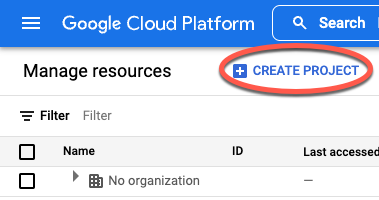
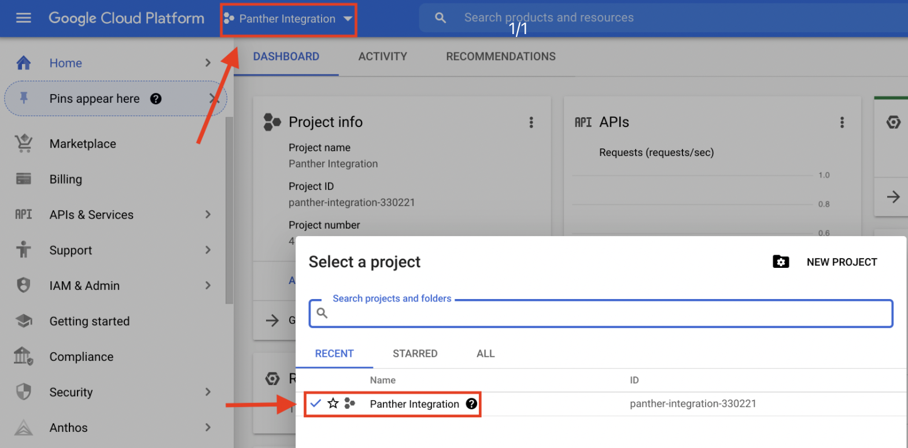
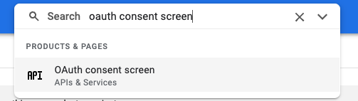
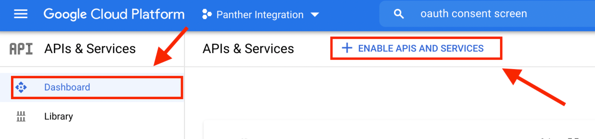
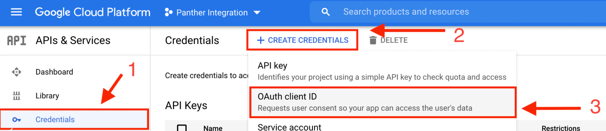

# G Suite

Panther can fetch G Suite (now named Google Workspace) events by querying the [Google Workspace Admin Reports API](https://developers.google.com/admin-sdk/reports/v1/get-start/getting-started). Panther will query the Reports API for new events every 60 seconds.

In order for Panther to access the API, you need to create a new G Suite App and provide the app credentials to Panther.

## Create a new G Suite App


The steps below can only be performed if your G Suite user has permission to see your organization's Reports. If your user does not have permissions, follow the steps [here](https://support.google.com/a/answer/2406043) to create a new role with Reports access and assign the role to your user.


1. Log in to your [Google Cloud Platform console](https://console.developers.google.com/project).&#x20;
2. Click **Create Project.**\
   ********
3. Enter a descriptive project name (e.g. `Panther Integration`) and a location for the parent organization or folder.
4. Click **Create**
   * It will take a few seconds to create the project. Once created, you will see a notification on the page.
5. On the left sidebar menu, click **Home > Dashboard** to navigate back to your Google Cloud Platform Dashboard.&#x20;
6. Click **Select a Project** at the top of the page, then select the project you just created.\
   
7. In the top search bar, search for **OAuth consent screen**, **** then select it.\
   
8. Select **Internal** as **User Type**, then click **Create.**
9. In the next page fill in the following information:
   1. **App Name**: Enter your project name or project ID.
   2. **User support email**: **** Enter your email address.
   3. **Developer contact information**: Enter your email address.
10. Click **Save And Continue.**
11. Click **Add Or Remove Scopes.**
12. In the **Manually add scopes** section, paste `https://www.googleapis.com/auth/admin.reports.audit.readonly`.&#x20;
13. Click **Add to Table** and **Update**.
14. Click **Save and Continue.**
15. Click **Back to Dashboard.**
16. You will be redirected back to the dashboard of your new application. Click **Dashboard** in the top left.
17. Click **Enable APIs and Services.**\
    ********
18. In the search bar in the top of the page, search `Admin SDK API.`
19. Click **Admin SDK API**, then click **Enable**
    * You will be redirected to another screen.&#x20;
20. Click **Credentials** in the left sidebar menu, then click **+Create Credentials** at to the top of the page.
21. Click **OAuth client ID.**
    * You will be redirected to a different page.\
      
22. On the new page, for Application Type, select **Web application** and type in a friendly name e.g. `Panther.`
    * Scroll down to the the section labeled "Authorized redirect URIs." In the **URIs 1** field, paste the redirect URL provided in the source's **Set Credentials** page.\
       (3).png>)
23. Click **Create**
24. A pop up screen will display the Client ID and Client Secret. **Using a secure method, make note of the ClientID and Client Secret**. You will need to provide them in the Panther Console to pull your reports.

## Create a new G Suite source in Panther

1. Log in to your Panther Console
2. Go to **Integrations** > **Log** **Sources** from the sidebar menu
3. Click **Add Source**
4. Select **G Suite** from the list of available types
5. In the next screen enter the following:
   * &#x20;Friendly name for the source e.g. `My GSuite logs`&#x20;
   * Select the GSuite applications you want to monitor
6. Click **Next**.
7. Enter the **App Client ID** and the **Client Secret** that were provided in your Google Cloud Platform console.
8. Click **Next.**
9. Click the **Click here to authorize Panther to collect G Suite logs** link.
   * This will open a new tab, where you to authorize the G Suite App you create earlier to pull G Suite logs from your account.&#x20;
   * Authorize the app and copy the authorization code from the screen.
10. Enter the Authorization code that you copied into your Panther Console.
11. Click **Next** and then **Save source**.

## Panther-Built Detections

The following detections are available for use immediately:&#x20;

* Advanced Protection
* Brute Force Login
* Doc Ownership Transfer
* Drive External Share
* Drive Overly Visible
* Drive Visibility Change
* Drive Visibility Change Deprecated
* External Forwarding
* Google Access
* Gov Attack
* Group Banned User
* High Severity Rule
* Leaked Password
* Login Type
* Low Severity Rule
* Medium Severity Rule
* Mobile Device Compromise
* Move Device Screen Unlock Fail
* Mobile Device Suspicious Activity
* Permissions Delegated
* Suspicious Logins
* Two Step Verification
* User Suspended

Please take a look at the files in the [gsuite\_activityevent\_rules](https://github.com/panther-labs/panther-analysis/tree/master/gsuite\_activityevent\_rules) __ and __ [gsuite\_reports\_rules](https://github.com/panther-labs/panther-analysis/tree/master/gsuite\_reports\_rules) repositories to see how these are built.&#x20;
