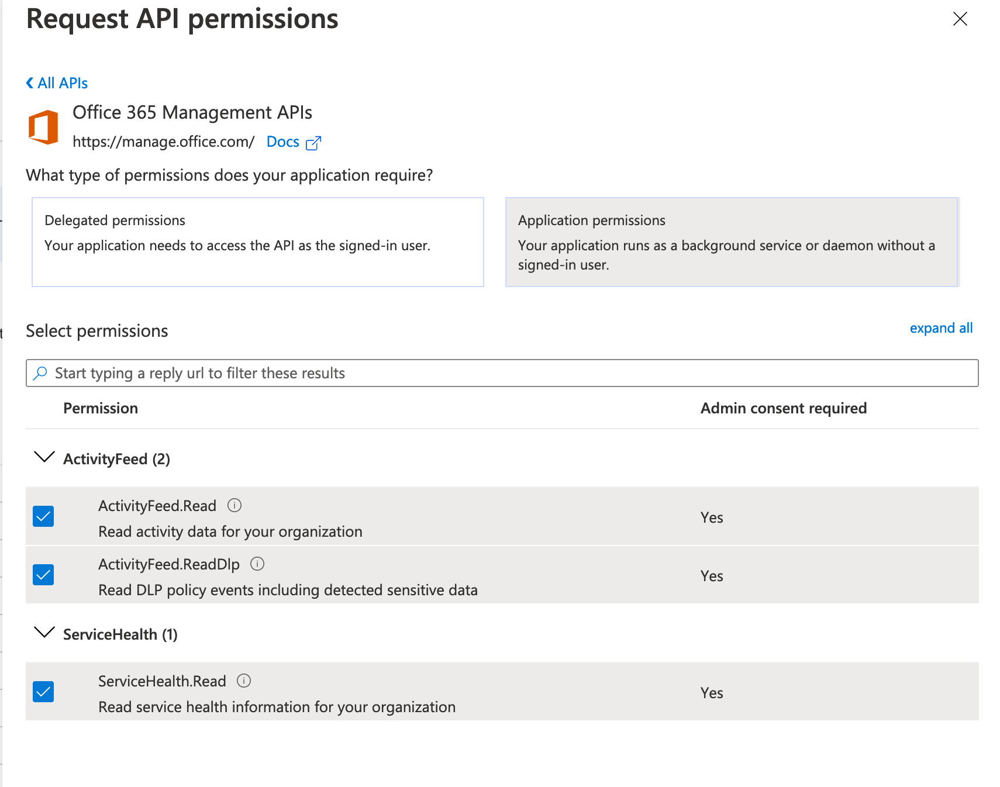
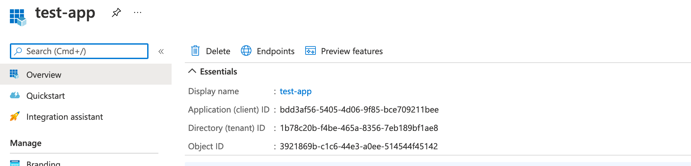
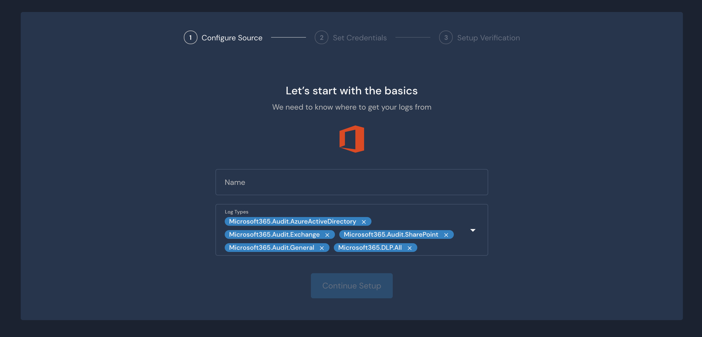

# Microsoft 365


This is feature is available in v1.17+


Panther has the ability to pull logs from Microsoft's [Office 365 Management Activity API](https://docs.microsoft.com/en-us/office/office-365-management-api/office-365-management-activity-api-reference). Panther will query the API every 5 minutes.

## Prerequisites

These are the steps required to enable Panther ingest Office 365 activity logs.

1. Enable [audit log search](https://docs.microsoft.com/en-us/microsoft-365/compliance/turn-audit-log-search-on-or-off?view=o365-worldwide#turn-on-audit-log-search) for your Microsoft365 tenancy, done through the Security and Compliance Center in the Office 365 Admin Portal.

2. Register an application in Azure Active Directory. See below for steps on how to create an application.

3. Create a Microsoft source integration in Panther.

## Registering an application in Azure AD

1. Login to [https://portal.azure.com](https://portal.azure.com) and navigate to the **Azure Active Directory** service.

1. Click **App Registrations** in the left sidebar and then **New Registration**.
2. Enter a friendly name for your application. In the **Supported account types** field, select **Accounts in this organizational directory only**. Then click **Register**.
3. On the left sidebar, click **Certificates and Secrets**. Then click **New Client Secret**. Add a description for the secret \(e.g Panther integration\) and set the **Expires** field to **Never**. Then click **Add**. The client secret will be hidden after you navigate away from this page. Make sure to save it somewhere temporarily, as you will need to provide it to Panther later!
4. On the left sidebar, click **API Permissions** and then **Add a permission**. Find and click the **Office 365 Management APIs**.
5. Click **Delegated permissions** and select all permissions: _ActivityFeed.Read, ActivityFeed.ReadDlp, ServiceHealth.Read_.

1. Click **Application permissions** and select all permissions: _ActivityFeed.Read, ActivityFeed.ReadDlp, ServiceHealth.Read_.

1. Click **Add permissions** at the bottom. Make sure you have added both **Delegated** and **Application** permissions in the previous two steps.
2. Click **Grant admin consent** in the API permissions page.

1. After consent has been granted, click the **Overview** tab in the left sidebar. You will need to provide the **Application \(client\) ID** and

   **Directory \(tenant\) ID** to Panther in the next step.

## Create a new Microsoft Source in Panther

1. Login to your Panther account.
2. Go to **Integrations** &gt; **Log Sources** from the sidebar menu.
3. Click **Add Source**.
4. Select **Microsoft** from the list of available types and then click **Start Source Setup**.

1. Enter a name for the source \(e.g. `Microsoft365 logs`\) and select the log types to ingest. Then click **Next**.

1. The next page asks you to enter the **Tenant Id**, **Client Id** and the **Client Secret**. 

1. Click on **Continue Setup**. 

You are done! You can now start writing detections and exploring your Microsoft365 activity logs.


After the integration is created, it may take up to 12 hours for the Microsoft API to make data available for the first time.


