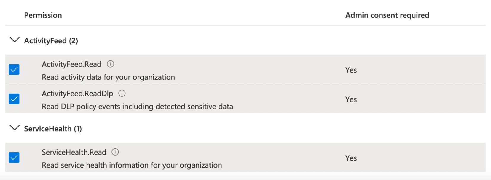

# Microsoft 365

## Overview

Panther can pull logs from Microsoft's [Office 365 Management Activity API](https://docs.microsoft.com/en-us/office/office-365-management-api/office-365-management-activity-api-reference). Panther will query the API every 5 minutes. In this Documentation, you will:

* Enable [audit log search](https://docs.microsoft.com/en-us/microsoft-365/compliance/turn-audit-log-search-on-or-off?view=o365-worldwide#turn-on-audit-log-search) for your Microsoft365 tenancy, done through the Security and Compliance Center in the Office 365 Admin Portal.
* Register an application in Azure Active Directory. See below for steps on how to create an application.
* Create a Microsoft source integration in Panther.

## How to onboard Microsoft 365 logs to Panther

### Step 1: Registering an application in Azure AD

1. Log in to [your Azure portal](https://portal.azure.com) and navigate to the **Azure Active Directory** service.\
   
2. Click **App Registrations** in the left sidebar and then click **New Registration**.
3. Enter a memorable name for your application. In the **Supported account types** field, select `Accounts in this organizational directory only`.&#x20;
4. Click **Register**.
5. On the left sidebar, click **Certificates and Secrets**. Then click **New Client Secret**.&#x20;
   * Add a description for the secret (e.g Panther integration).
   * Set the **Expires** field to `24 Months`.&#x20;
6. Click **Add**.&#x20;
   * The Client Secret will be hidden after you navigate away from this page, so copy down the **Value** field (not **Secret ID** field) before continuing.
7. On the left sidebar, click **API Permissions** and then **Add a permission**. Find and click the **Office 365 Management APIs**.
8. Click **Delegated permissions** and select all permissions: _ActivityFeed.Read, ActivityFeed.ReadDlp, ServiceHealth.Read_.\
   
9. Click **Application permissions** and select all permissions: _ActivityFeed.Read, ActivityFeed.ReadDlp, ServiceHealth.Read_.
10. Click **Add permissions** at the bottom.&#x20;
    * Make sure to add both **Delegated** and **Application** permissions in the previous two steps.
11. Click **Grant admin consent** in the API permissions page.\
    
12. After consent has been granted, click the **Overview** tab in the left sidebar to view your **Application (client) ID** and **Directory (tenant) ID**. You will need to provide these to Panther in the next steps.\
    

### Step 2: Create a new Microsoft Source in Panther

1. Log in to your Panther Console.
2. Go to **Integrations** > **Log Sources** from the sidebar menu.
3. Click **Create New** in the upper right.
4. Click the tile for **Microsoft**.
5. Click **Start Source Setup**.
6. Enter a name for the source (e.g. "Microsoft 365 logs") and select the log types to ingest.&#x20;
7. Click **Continue Setup**.
8. On the Credentials page, enter your Tenant ID, Client ID, and Secret ID Value.&#x20;
9. Click **Continue Setup**.&#x20;
10. Once Panther verifies your access, a confirmation screen appears. Optionally, you can immediately set up a log drop-off alarm to receive alerts if logs aren't received within a specified time interval.
11. Click **Finish Setup**.


After the integration is created, it may take up to 12 hours for the Microsoft API to make data available for the first time.


## Supported log types


Required fields in the schemas are listed as "**required: true**" just below the "name" field.


### Microsoft365.Audit.AzureActiveDirectory

Azure Active Directory audit events.

Reference: [Microsoft Documentation on Management Activity API Schemas.](https://docs.microsoft.com/en-us/office/office-365-management-api/office-365-management-activity-api-schema)

```yaml
schema: Microsoft365.Audit.AzureActiveDirectory
parser:
    native:
        name: Microsoft365.Audit.AzureActiveDirectory
description: Azure Active Directory audit events.
referenceURL: https://docs.microsoft.com/en-us/office/office-365-management-api/office-365-management-activity-api-schema
version: 0
fields:
    - name: Id
      required: true
      description: Unique identifier of an audit record.
      type: string
    - name: RecordType
      required: true
      description: The type of operation indicated by the record. See https://docs.microsoft.com/en-us/office/office-365-management-api/office-365-management-activity-api-schema#auditlogrecordtype for details on the types of audit log records.
      type: int
    - name: CreationTime
      required: true
      description: The date and time in Coordinated Universal Time (UTC) when the user performed the activity.
      type: timestamp
      timeFormat: layout=2006-01-02T15:04:05
      isEventTime: true
    - name: Operation
      required: true
      description: The name of the user or admin activity.
      type: string
    - name: OrganizationId
      required: true
      description: The GUID for your organization's Office 365 tenant. This value will always be the same for your organization, regardless of the Office 365 service in which it occurs.
      type: string
    - name: UserType
      required: true
      description: The type of user that performed the operation. See https://docs.microsoft.com/en-us/office/office-365-management-api/office-365-management-activity-api-schema#user-type for details on the types of users.
      type: int
    - name: UserKey
      required: true
      description: An alternative ID for the user identified in the UserId property. For example, this property is populated with the passport unique ID (PUID) for events performed by users in SharePoint, OneDrive for Business, and Exchange. This property may also specify the same value as the UserID property for events occurring in other services and events performed by system accounts.
      type: string
      indicators:
        - username
    - name: Workload
      description: The Office 365 service where the activity occurred.
      type: string
    - name: ResultStatus
      description: Indicates whether the action (specified in the Operation property) was successful or not. Possible values are Succeeded, PartiallySucceeded, or Failed. For Exchange admin activity, the value is either True or False.
      type: string
    - name: ObjectId
      description: For SharePoint and OneDrive for Business activity, the full path name of the file or folder accessed by the user. For Exchange admin audit logging, the name of the object that was modified by the cmdlet.
      type: string
    - name: UserId
      required: true
      description: The UPN (User Principal Name) of the user who performed the action (specified in the Operation property) that resulted in the record being logged; for example, my_name@my_domain_name. Note that records for activity performed by system accounts (such as SHAREPOINT\system or NT AUTHORITY\SYSTEM) are also included. In SharePoint, another value display in the UserId property is app@sharepoint. This indicates that the "user" who performed the activity was an application that has the necessary permissions in SharePoint to perform organization-wide actions (such as search a SharePoint site or OneDrive account) on behalf of a user, admin, or service.
      type: string
      indicators:
        - username
    - name: ClientIP
      description: The IP address of the device that was used when the activity was logged. The IP address is displayed in either an IPv4 or IPv6 address format. For some services, the value displayed in this property might be the IP address for a trusted application (for example, Office on the web apps) calling into the service on behalf of a user and not the IP address of the device used by person who performed the activity. Also, for Azure Active Directory-related events, the IP address isn't logged and the value for the ClientIP property is null.
      type: string
      indicators:
        - ip
    - name: Scope
      description: Was this event created by a hosted M365 service or an on-premises server? Possible values are online and onprem. Note that SharePoint is the only workload currently sending events from on-premises to M365.
      type: string
    - name: AppAccessContext
      description: The application context for the user or service principal that performed the action.
      type: object
      fields:
        - name: AADSessionId
          description: The Azure Active Directory (AAD) SessionId of the AAD sign-in that was performed by the app on behalf of the user.
          type: string
        - name: APIId
          description: The Id for the API pathway that is used to access the resource; for example access via the Microsoft Graph API.
          type: string
        - name: ClientAppId
          description: The Id of the AAD app that performed the access on behalf of the user.
          type: string
        - name: ClientAppName
          description: The name of the AAD app that performed the access on behalf of the user.
          type: string
        - name: CorrelationId
          description: An identifier that can be used to correlate a specific user's actions across Microsoft 365 services.
          type: string
          indicators:
            - trace_id
    - name: AzureActiveDirectoryEventType
      required: true
      description: The type of Azure AD event.
      type: int
    - name: ExtendedProperties
      description: The extended properties of the Azure AD event.
      type: array
      element:
        type: object
        fields:
            - name: Name
              description: Name field
              type: string
            - name: Value
              description: Value field
              type: string
    - name: ModifiedProperties
      description: This property is included for admin events. The property includes the name of the property that was modified, the new value of the modified property, and the previous value of the modified property.
      type: array
      element:
        type: json
    - name: Application
      description: The application that triggers the account login event, such as Office 15.
      type: string
    - name: Client
      description: Details about the client device, device OS, and device browser that was used for the of the account login event.
      type: string
    - name: LoginStatus
      description: This property is from OrgIdLogon.LoginStatus directly. The mapping of various interesting logon failures could be done by alerting algorithms.
      type: int
    - name: UserDomain
      description: The Tenant Identity Information (TII).
      type: string
    - name: Actor
      description: The user or service principal that performed the action.
      type: array
      element:
        type: object
        fields:
            - name: ID
              description: The value of the identity given the type.
              type: string
              indicators:
                - username
            - name: Type
              description: The type of the identity.
              type: int
    - name: ActorContextId
      description: The GUID of the organization that the actor belongs to.
      type: string
    - name: ActorIpAddress
      description: The actor's IP address in IPV4 or IPV6 address format.
      type: string
      indicators:
        - ip
    - name: InterSystemsId
      description: The GUID that track the actions across components within the Office 365 service.
      type: string
    - name: IntraSystemId
      description: The GUID that's generated by Azure Active Directory to track the action.
      type: string
    - name: SupportTicketId
      description: The customer support ticket ID for the action in "act-on-behalf-of" situations.
      type: string
    - name: Target
      description: The user that the action (identified by the Operation property) was performed on.
      type: array
      element:
        type: object
        fields:
            - name: ID
              description: The value of the identity given the type.
              type: string
              indicators:
                - username
            - name: Type
              description: The type of the identity.
              type: int
    - name: TargetContextId
      description: The GUID of the organization that the targeted user belongs to.
      type: string
    - name: ApplicationId
      description: The GUID that represents the application that is requesting the login. The display name can be looked up via the Azure Active Directory Graph API.
      type: string
    - name: ErrorCode
      description: For failed logins (where the value for the Operation property is UserLoginFailed), this property contains the Azure Active Directory STS (AADSTS) error code. A value of 0 indicates a successful login.
      type: string
    - name: LogonError
      description: For failed logins, this property contains a user-readable description of the reason for the failed login.
      type: string
```

### Microsoft365.Audit.Exchange

Microsoft Exchange audit events.

Reference: [Microsoft Documentation on Management Activity API Schemas.](https://docs.microsoft.com/en-us/office/office-365-management-api/office-365-management-activity-api-schema)

```yaml
schema: Microsoft365.Audit.Exchange
parser:
    native:
        name: Microsoft365.Audit.Exchange
description: Microsoft Exchange audit events.
referenceURL: https://docs.microsoft.com/en-us/office/office-365-management-api/office-365-management-activity-api-schema
version: 0
fields:
    - name: Id
      required: true
      description: Unique identifier of an audit record.
      type: string
    - name: RecordType
      required: true
      description: The type of operation indicated by the record. See https://docs.microsoft.com/en-us/office/office-365-management-api/office-365-management-activity-api-schema#auditlogrecordtype for details on the types of audit log records.
      type: int
    - name: CreationTime
      required: true
      description: The date and time in Coordinated Universal Time (UTC) when the user performed the activity.
      type: timestamp
      timeFormat: layout=2006-01-02T15:04:05
      isEventTime: true
    - name: Operation
      required: true
      description: The name of the user or admin activity.
      type: string
    - name: OrganizationId
      required: true
      description: The GUID for your organization's Office 365 tenant. This value will always be the same for your organization, regardless of the Office 365 service in which it occurs.
      type: string
    - name: UserType
      required: true
      description: The type of user that performed the operation. See https://docs.microsoft.com/en-us/office/office-365-management-api/office-365-management-activity-api-schema#user-type for details on the types of users.
      type: int
    - name: UserKey
      required: true
      description: An alternative ID for the user identified in the UserId property. For example, this property is populated with the passport unique ID (PUID) for events performed by users in SharePoint, OneDrive for Business, and Exchange. This property may also specify the same value as the UserID property for events occurring in other services and events performed by system accounts.
      type: string
      indicators:
        - username
    - name: Workload
      description: The Office 365 service where the activity occurred.
      type: string
    - name: ResultStatus
      description: Indicates whether the action (specified in the Operation property) was successful or not. Possible values are Succeeded, PartiallySucceeded, or Failed. For Exchange admin activity, the value is either True or False.
      type: string
    - name: ObjectId
      description: For SharePoint and OneDrive for Business activity, the full path name of the file or folder accessed by the user. For Exchange admin audit logging, the name of the object that was modified by the cmdlet.
      type: string
    - name: UserId
      required: true
      description: The UPN (User Principal Name) of the user who performed the action (specified in the Operation property) that resulted in the record being logged; for example, my_name@my_domain_name. Note that records for activity performed by system accounts (such as SHAREPOINT\system or NT AUTHORITY\SYSTEM) are also included. In SharePoint, another value display in the UserId property is app@sharepoint. This indicates that the "user" who performed the activity was an application that has the necessary permissions in SharePoint to perform organization-wide actions (such as search a SharePoint site or OneDrive account) on behalf of a user, admin, or service.
      type: string
      indicators:
        - username
    - name: ClientIP
      description: The IP address of the device that was used when the activity was logged. The IP address is displayed in either an IPv4 or IPv6 address format. For some services, the value displayed in this property might be the IP address for a trusted application (for example, Office on the web apps) calling into the service on behalf of a user and not the IP address of the device used by person who performed the activity. Also, for Azure Active Directory-related events, the IP address isn't logged and the value for the ClientIP property is null.
      type: string
      indicators:
        - ip
    - name: Scope
      description: Was this event created by a hosted M365 service or an on-premises server? Possible values are online and onprem. Note that SharePoint is the only workload currently sending events from on-premises to M365.
      type: string
    - name: AppAccessContext
      description: The application context for the user or service principal that performed the action.
      type: object
      fields:
        - name: AADSessionId
          description: The Azure Active Directory (AAD) SessionId of the AAD sign-in that was performed by the app on behalf of the user.
          type: string
        - name: APIId
          description: The Id for the API pathway that is used to access the resource; for example access via the Microsoft Graph API.
          type: string
        - name: ClientAppId
          description: The Id of the AAD app that performed the access on behalf of the user.
          type: string
        - name: ClientAppName
          description: The name of the AAD app that performed the access on behalf of the user.
          type: string
        - name: CorrelationId
          description: An identifier that can be used to correlate a specific user's actions across Microsoft 365 services.
          type: string
          indicators:
            - trace_id
    - name: ModifiedObjectResolvedName
      description: This is the user friendly name of the object that was modified by the cmdlet. This is logged only if the cmdlet modifies the object.
      type: string
    - name: Parameters
      description: The name and value for all parameters that were used with the cmdlet that is identified in the Operations property.
      type: array
      element:
        type: object
        fields:
            - name: Name
              description: Name field
              type: string
            - name: Value
              description: Value field
              type: string
    - name: ModifiedProperties
      description: The property is included for admin events. The property includes the name of the property that was modified, the new value of the modified property, and the previous value of the modified object.
      type: array
      element:
        type: json
    - name: ExternalAccess
      required: true
      description: Specifies whether the cmdlet was run by a user in your organization, by Microsoft datacenter personnel or a datacenter service account, or by a delegated administrator. The value False indicates that the cmdlet was run by someone in your organization. The value True indicates that the cmdlet was run by datacenter personnel, a datacenter service account, or a delegated administrator.
      type: boolean
    - name: OriginatingServer
      description: The name of the server from which the cmdlet was executed.
      type: string
    - name: OrganizationName
      description: The name of the tenant.
      type: string
      indicators:
        - username
    - name: LogonType
      description: Indicates the type of user who accessed the mailbox and performed the operation that was logged.
      type: int
    - name: InternalLogonType
      description: Reserved for internal use.
      type: int
    - name: MailboxGuid
      description: The Exchange GUID of the mailbox that was accessed.
      type: string
    - name: MailboxOwnerUPN
      description: The email address of the person who owns the mailbox that was accessed.
      type: string
      indicators:
        - username
    - name: MailboxOwnerSid
      description: The SID of the mailbox owner.
      type: string
      indicators:
        - username
    - name: MailboxOwnerMasterAccountSid
      description: Mailbox owner account's master account SID.
      type: string
      indicators:
        - username
    - name: LogonUserSid
      description: The SID of the user who performed the operation.
      type: string
      indicators:
        - username
    - name: LogonUserDisplayName
      description: The user-friendly name of the user who performed the operation.
      type: string
    - name: ClientInfoString
      description: Information about the email client that was used to perform the operation, such as a browser version, Outlook version, and mobile device information.
      type: string
    - name: ClientIPAddress
      description: The IP address of the device that was used when the operation was logged. The IP address is displayed in either an IPv4 or IPv6 address format.
      type: string
      indicators:
        - ip
    - name: ClientMachineName
      description: The machine name that hosts the Outlook client.
      type: string
      indicators:
        - hostname
    - name: ClientProcessName
      description: The email client that was used to access the mailbox.
      type: string
    - name: ClientVersion
      description: The version of the email client.
      type: string
    - name: Folder
      description: The folder where a group of items is located.
      type: object
      fields:
        - name: Id
          description: The store ID of the folder object.
          type: string
        - name: Path
          description: The name of the mailbox folder where the message that was accessed is located.
          type: string
        - name: FolderItems
          description: FolderItems field
          type: json
    - name: CrossMailboxOperations
      description: Indicates if the operation involved more than one mailbox.
      type: boolean
    - name: DestMailboxId
      description: Set only if the CrossMailboxOperations parameter is True. Specifies the target mailbox GUID.
      type: string
    - name: DestMailboxOwnerUPN
      description: Set only if the CrossMailboxOperations parameter is True. Specifies the UPN of the owner of the target mailbox.
      type: string
    - name: DestMailboxOwnerSid
      description: Set only if the CrossMailboxOperations parameter is True. Specifies the SID of the target mailbox.
      type: string
    - name: DestMailboxOwnerMasterAccountSid
      description: Set only if the CrossMailboxOperations parameter is True. Specifies the SID for the master account SID of the target mailbox owner.
      type: string
      indicators:
        - username
    - name: DestFolder
      description: The destination folder, for operations such as Move.
      type: object
      fields:
        - name: Id
          description: The store ID of the folder object.
          type: string
        - name: Path
          description: The name of the mailbox folder where the message that was accessed is located.
          type: string
        - name: FolderItems
          description: FolderItems field
          type: json
    - name: Folders
      description: Information about the source folders involved in an operation; for example, if folders are selected and then deleted.
      type: array
      element:
        type: object
        fields:
            - name: Id
              description: The store ID of the folder object.
              type: string
            - name: Path
              description: The name of the mailbox folder where the message that was accessed is located.
              type: string
            - name: FolderItems
              description: FolderItems field
              type: json
    - name: AffectedItems
      description: Information about each item in the group.
      type: array
      element:
        type: object
        fields:
            - name: Id
              description: The store ID.
              type: string
            - name: Subject
              description: The subject line of the message that was accessed.
              type: string
            - name: ParentFolder
              description: The name of the folder where the item is located.
              type: object
              fields:
                - name: Id
                  description: The store ID of the folder object.
                  type: string
                - name: Path
                  description: The name of the mailbox folder where the message that was accessed is located.
                  type: string
                - name: FolderItems
                  description: FolderItems field
                  type: json
            - name: Attachments
              description: A list of the names and file size of all items that are attached to the message.
              type: string
    - name: Item
      description: Represents the item upon which the operation was performed.
      type: object
      fields:
        - name: Id
          description: The store ID.
          type: string
        - name: Subject
          description: The subject line of the message that was accessed.
          type: string
        - name: ParentFolder
          description: The name of the folder where the item is located.
          type: object
          fields:
            - name: Id
              description: The store ID of the folder object.
              type: string
            - name: Path
              description: The name of the mailbox folder where the message that was accessed is located.
              type: string
            - name: FolderItems
              description: FolderItems field
              type: json
        - name: Attachments
          description: A list of the names and file size of all items that are attached to the message.
          type: string
    - name: SendAsUserSmtp
      description: SMTP address of the user who is being impersonated.
      type: string
      indicators:
        - hostname
    - name: SendAsUserMailboxGuid
      description: The Exchange GUID of the mailbox that was accessed to send email as.
      type: string
    - name: SendOnBehalfOfUserSmtp
      description: SMTP address of the user on whose behalf the email is sent.
      type: string
      indicators:
        - hostname
    - name: SendOnBehalfOfUserMailboxGuid
      description: The Exchange GUID of the mailbox that was accessed to send mail on behalf of.
      type: strin
```

### Microsoft365.Audit.General

General audit events not included in the other log types.

Reference: [Microsoft Documentation on Management Activity API Schemas.](https://docs.microsoft.com/en-us/office/office-365-management-api/office-365-management-activity-api-schema)

```yaml
schema: Microsoft365.Audit.General
parser:
    native:
        name: Microsoft365.Audit.General
description: General audit events not included in the other log types.
referenceURL: https://docs.microsoft.com/en-us/office/office-365-management-api/office-365-management-activity-api-schema
version: 0
fields:
    - name: Id
      required: true
      description: Unique identifier of an audit record.
      type: string
    - name: RecordType
      required: true
      description: The type of operation indicated by the record. See https://docs.microsoft.com/en-us/office/office-365-management-api/office-365-management-activity-api-schema#auditlogrecordtype for details on the types of audit log records.
      type: int
    - name: CreationTime
      required: true
      description: The date and time in Coordinated Universal Time (UTC) when the user performed the activity.
      type: timestamp
      timeFormat: layout=2006-01-02T15:04:05
      isEventTime: true
    - name: Operation
      required: true
      description: The name of the user or admin activity.
      type: string
    - name: OrganizationId
      required: true
      description: The GUID for your organization's Office 365 tenant. This value will always be the same for your organization, regardless of the Office 365 service in which it occurs.
      type: string
    - name: UserType
      required: true
      description: The type of user that performed the operation. See https://docs.microsoft.com/en-us/office/office-365-management-api/office-365-management-activity-api-schema#user-type for details on the types of users.
      type: int
    - name: UserKey
      required: true
      description: An alternative ID for the user identified in the UserId property. For example, this property is populated with the passport unique ID (PUID) for events performed by users in SharePoint, OneDrive for Business, and Exchange. This property may also specify the same value as the UserID property for events occurring in other services and events performed by system accounts.
      type: string
      indicators:
        - username
    - name: Workload
      description: The Office 365 service where the activity occurred.
      type: string
    - name: ResultStatus
      description: Indicates whether the action (specified in the Operation property) was successful or not. Possible values are Succeeded, PartiallySucceeded, or Failed. For Exchange admin activity, the value is either True or False.
      type: string
    - name: ObjectId
      description: For SharePoint and OneDrive for Business activity, the full path name of the file or folder accessed by the user. For Exchange admin audit logging, the name of the object that was modified by the cmdlet.
      type: string
    - name: UserId
      required: true
      description: The UPN (User Principal Name) of the user who performed the action (specified in the Operation property) that resulted in the record being logged; for example, my_name@my_domain_name. Note that records for activity performed by system accounts (such as SHAREPOINT\system or NT AUTHORITY\SYSTEM) are also included. In SharePoint, another value display in the UserId property is app@sharepoint. This indicates that the "user" who performed the activity was an application that has the necessary permissions in SharePoint to perform organization-wide actions (such as search a SharePoint site or OneDrive account) on behalf of a user, admin, or service.
      type: string
      indicators:
        - username
    - name: ClientIP
      description: The IP address of the device that was used when the activity was logged. The IP address is displayed in either an IPv4 or IPv6 address format. For some services, the value displayed in this property might be the IP address for a trusted application (for example, Office on the web apps) calling into the service on behalf of a user and not the IP address of the device used by person who performed the activity. Also, for Azure Active Directory-related events, the IP address isn't logged and the value for the ClientIP property is null.
      type: string
      indicators:
        - ip
    - name: Scope
      description: Was this event created by a hosted M365 service or an on-premises server? Possible values are online and onprem. Note that SharePoint is the only workload currently sending events from on-premises to M365.
      type: string
    - name: AppAccessContext
      description: The application context for the user or service principal that performed the action.
      type: object
      fields:
        - name: AADSessionId
          description: The Azure Active Directory (AAD) SessionId of the AAD sign-in that was performed by the app on behalf of the user.
          type: string
        - name: APIId
          description: The Id for the API pathway that is used to access the resource; for example access via the Microsoft Graph API.
          type: string
        - name: ClientAppId
          description: The Id of the AAD app that performed the access on behalf of the user.
          type: string
        - name: ClientAppName
          description: The name of the AAD app that performed the access on behalf of the user.
          type: string
        - name: CorrelationId
          description: An identifier that can be used to correlate a specific user's actions across Microsoft 365 services.
          type: string
          indicators:
            - trace_id
    - name: payload
      description: The full JSON payload of the event.
      type: json
```

### Microsoft365.Audit.SharePoint

Microsoft SharePoint audit events.

Reference: [Microsoft Documentation on Management Activity API Schemas.](https://docs.microsoft.com/en-us/office/office-365-management-api/office-365-management-activity-api-schema)

```yaml
schema: Microsoft365.Audit.SharePoint
parser:
    native:
        name: Microsoft365.Audit.SharePoint
description: Microsoft SharePoint audit events.
referenceURL: https://docs.microsoft.com/en-us/office/office-365-management-api/office-365-management-activity-api-schema
version: 0
fields:
    - name: Id
      required: true
      description: Unique identifier of an audit record.
      type: string
    - name: RecordType
      required: true
      description: The type of operation indicated by the record. See https://docs.microsoft.com/en-us/office/office-365-management-api/office-365-management-activity-api-schema#auditlogrecordtype for details on the types of audit log records.
      type: int
    - name: CreationTime
      required: true
      description: The date and time in Coordinated Universal Time (UTC) when the user performed the activity.
      type: timestamp
      timeFormat: layout=2006-01-02T15:04:05
      isEventTime: true
    - name: Operation
      required: true
      description: The name of the user or admin activity.
      type: string
    - name: OrganizationId
      required: true
      description: The GUID for your organization's Office 365 tenant. This value will always be the same for your organization, regardless of the Office 365 service in which it occurs.
      type: string
    - name: UserType
      required: true
      description: The type of user that performed the operation. See https://docs.microsoft.com/en-us/office/office-365-management-api/office-365-management-activity-api-schema#user-type for details on the types of users.
      type: int
    - name: UserKey
      required: true
      description: An alternative ID for the user identified in the UserId property. For example, this property is populated with the passport unique ID (PUID) for events performed by users in SharePoint, OneDrive for Business, and Exchange. This property may also specify the same value as the UserID property for events occurring in other services and events performed by system accounts.
      type: string
      indicators:
        - username
    - name: Workload
      description: The Office 365 service where the activity occurred.
      type: string
    - name: ResultStatus
      description: Indicates whether the action (specified in the Operation property) was successful or not. Possible values are Succeeded, PartiallySucceeded, or Failed. For Exchange admin activity, the value is either True or False.
      type: string
    - name: ObjectId
      description: For SharePoint and OneDrive for Business activity, the full path name of the file or folder accessed by the user. For Exchange admin audit logging, the name of the object that was modified by the cmdlet.
      type: string
    - name: UserId
      required: true
      description: The UPN (User Principal Name) of the user who performed the action (specified in the Operation property) that resulted in the record being logged; for example, my_name@my_domain_name. Note that records for activity performed by system accounts (such as SHAREPOINT\system or NT AUTHORITY\SYSTEM) are also included. In SharePoint, another value display in the UserId property is app@sharepoint. This indicates that the "user" who performed the activity was an application that has the necessary permissions in SharePoint to perform organization-wide actions (such as search a SharePoint site or OneDrive account) on behalf of a user, admin, or service.
      type: string
      indicators:
        - username
    - name: ClientIP
      description: The IP address of the device that was used when the activity was logged. The IP address is displayed in either an IPv4 or IPv6 address format. For some services, the value displayed in this property might be the IP address for a trusted application (for example, Office on the web apps) calling into the service on behalf of a user and not the IP address of the device used by person who performed the activity. Also, for Azure Active Directory-related events, the IP address isn't logged and the value for the ClientIP property is null.
      type: string
      indicators:
        - ip
    - name: Scope
      description: Was this event created by a hosted M365 service or an on-premises server? Possible values are online and onprem. Note that SharePoint is the only workload currently sending events from on-premises to M365.
      type: string
    - name: AppAccessContext
      description: The application context for the user or service principal that performed the action.
      type: object
      fields:
        - name: AADSessionId
          description: The Azure Active Directory (AAD) SessionId of the AAD sign-in that was performed by the app on behalf of the user.
          type: string
        - name: APIId
          description: The Id for the API pathway that is used to access the resource; for example access via the Microsoft Graph API.
          type: string
        - name: ClientAppId
          description: The Id of the AAD app that performed the access on behalf of the user.
          type: string
        - name: ClientAppName
          description: The name of the AAD app that performed the access on behalf of the user.
          type: string
        - name: CorrelationId
          description: An identifier that can be used to correlate a specific user's actions across Microsoft 365 services.
          type: string
          indicators:
            - trace_id
    - name: Site
      description: The GUID of the site where the file or folder accessed by the user is located.
      type: string
    - name: ItemType
      description: The type of object that was accessed or modified.
      type: string
    - name: EventSource
      description: Identifies that an event occurred in SharePoint. Possible values are SharePoint or ObjectModel.
      type: string
    - name: SourceName
      description: The entity that triggered the audited operation. Possible values are SharePoint or ObjectModel.
      type: string
    - name: UserAgent
      description: Information about the user's client or browser. This information is provided by the client or browser.
      type: string
    - name: MachineDomainInfo
      description: Information about device sync operations. This information is reported only if it's present in the request.
      type: string
    - name: MachineId
      description: Information about device sync operations. This information is reported only if it's present in the request.
      type: string
    - name: SiteUrl
      description: The URL of the site where the file or folder accessed by the user is located.
      type: string
      indicators:
        - url
    - name: SourceRelativeUrl
      description: The URL of the folder that contains the file accessed by the user. The combination of the values for the SiteURL, SourceRelativeURL, and SourceFileName parameters is the same as the value for the ObjectID property, which is the full path name for the file accessed by the user.
      type: string
      indicators:
        - url
    - name: SourceFileName
      description: The name of the file or folder accessed by the user.
      type: string
    - name: SourceFileExtension
      description: The file extension of the file that was accessed by the user. This property is blank if the object that was accessed is a folder.
      type: string
    - name: DestinationRelativeUrl
      description: The URL of the destination folder where a file is copied or moved. The combination of the values for SiteURL, DestinationRelativeURL, and DestinationFileName parameters is the same as the value for the ObjectID property, which is the full path name for the file that was copied. This property is displayed only for FileCopied and FileMoved events.
      type: string
      indicators:
        - url
    - name: DestinationFileName
      description: The name of the file that is copied or moved. This property is displayed only for FileCopied and FileMoved events.
      type: string
    - name: DestinationFileExtension
      description: The file extension of a file that is copied or moved. This property is displayed only for FileCopied and FileMoved events.
      type: string
    - name: UserSharedWith
      description: The user that a resource was shared with.
      type: string
      indicators:
        - username
    - name: SharingType
      description: The type of sharing permissions that were assigned to the user that the resource was shared with. This user is identified by the UserSharedWith parameter.
      type: string
    - name: TargetUserOrGroupName
      description: Stores the UPN or name of the target user or group that a resource was shared with.
      type: string
    - name: TargetUserOrGroupType
      description: Identifies whether the target user or group is a Member, Guest, Group, or Partner.
      type: string
    - name: EventData
      description: Conveys follow-up information about the sharing action that has occurred, such as adding a user to a group or granting edit permissions.
      type: string
    - name: CustomEvent
      description: Optional string for custom events.
      type: string
    - name: ModifiedProperties
      description: The property is included for admin events, such as adding a user as a member of a site or a site collection admin group. The property includes the name of the property that was modified (for example, the Site Admin group), the new value of the modified property (such the user who was added as a site admin), and the previous value of the modified object.
      type: array
      element:
        type: json
```

### Microsoft365.DLP.All

DLP events for all workloads.

Reference: [Microsoft Documentation on DLP Schemas.](https://docs.microsoft.com/en-us/office/office-365-management-api/office-365-management-activity-api-schema#dlp-schema)

```yaml
schema: Microsoft365.DLP.All
parser:
    native:
        name: Microsoft365.DLP.All
description: DLP events for all workloads.
referenceURL: https://docs.microsoft.com/en-us/office/office-365-management-api/office-365-management-activity-api-schema#dlp-schema
version: 0
fields:
    - name: Id
      required: true
      description: Unique identifier of an audit record.
      type: string
    - name: RecordType
      required: true
      description: The type of operation indicated by the record. See https://docs.microsoft.com/en-us/office/office-365-management-api/office-365-management-activity-api-schema#auditlogrecordtype for details on the types of audit log records.
      type: int
    - name: CreationTime
      required: true
      description: The date and time in Coordinated Universal Time (UTC) when the user performed the activity.
      type: timestamp
      timeFormat: layout=2006-01-02T15:04:05
      isEventTime: true
    - name: Operation
      required: true
      description: The name of the user or admin activity.
      type: string
    - name: OrganizationId
      required: true
      description: The GUID for your organization's Office 365 tenant. This value will always be the same for your organization, regardless of the Office 365 service in which it occurs.
      type: string
    - name: UserType
      required: true
      description: The type of user that performed the operation. See https://docs.microsoft.com/en-us/office/office-365-management-api/office-365-management-activity-api-schema#user-type for details on the types of users.
      type: int
    - name: UserKey
      required: true
      description: An alternative ID for the user identified in the UserId property. For example, this property is populated with the passport unique ID (PUID) for events performed by users in SharePoint, OneDrive for Business, and Exchange. This property may also specify the same value as the UserID property for events occurring in other services and events performed by system accounts.
      type: string
      indicators:
        - username
    - name: Workload
      description: The Office 365 service where the activity occurred.
      type: string
    - name: ResultStatus
      description: Indicates whether the action (specified in the Operation property) was successful or not. Possible values are Succeeded, PartiallySucceeded, or Failed. For Exchange admin activity, the value is either True or False.
      type: string
    - name: ObjectId
      description: For SharePoint and OneDrive for Business activity, the full path name of the file or folder accessed by the user. For Exchange admin audit logging, the name of the object that was modified by the cmdlet.
      type: string
    - name: UserId
      required: true
      description: The UPN (User Principal Name) of the user who performed the action (specified in the Operation property) that resulted in the record being logged; for example, my_name@my_domain_name. Note that records for activity performed by system accounts (such as SHAREPOINT\system or NT AUTHORITY\SYSTEM) are also included. In SharePoint, another value display in the UserId property is app@sharepoint. This indicates that the "user" who performed the activity was an application that has the necessary permissions in SharePoint to perform organization-wide actions (such as search a SharePoint site or OneDrive account) on behalf of a user, admin, or service.
      type: string
      indicators:
        - username
    - name: ClientIP
      description: The IP address of the device that was used when the activity was logged. The IP address is displayed in either an IPv4 or IPv6 address format. For some services, the value displayed in this property might be the IP address for a trusted application (for example, Office on the web apps) calling into the service on behalf of a user and not the IP address of the device used by person who performed the activity. Also, for Azure Active Directory-related events, the IP address isn't logged and the value for the ClientIP property is null.
      type: string
      indicators:
        - ip
    - name: Scope
      description: Was this event created by a hosted M365 service or an on-premises server? Possible values are online and onprem. Note that SharePoint is the only workload currently sending events from on-premises to M365.
      type: string
    - name: AppAccessContext
      description: The application context for the user or service principal that performed the action.
      type: object
      fields:
        - name: AADSessionId
          description: The Azure Active Directory (AAD) SessionId of the AAD sign-in that was performed by the app on behalf of the user.
          type: string
        - name: APIId
          description: The Id for the API pathway that is used to access the resource; for example access via the Microsoft Graph API.
          type: string
        - name: ClientAppId
          description: The Id of the AAD app that performed the access on behalf of the user.
          type: string
        - name: ClientAppName
          description: The name of the AAD app that performed the access on behalf of the user.
          type: string
        - name: CorrelationId
          description: An identifier that can be used to correlate a specific user's actions across Microsoft 365 services.
          type: string
          indicators:
            - trace_id
    - name: SharePointMetaData
      description: Describes metadata about the document in SharePoint or OneDrive for Business that contained the sensitive information.
      type: object
      fields:
        - name: From
          description: The user who triggered the event. This will be either the FileOwner, LastModifier, or LastSharer.
          type: string
          indicators:
            - username
        - name: itemCreationTime
          description: Datetimestamp in UTC of when event logged.
          type: timestamp
          timeFormat: layout=2006-01-02T15:04:05
        - name: SiteCollectionGuid
          description: The GUID of the site collection.
          type: string
        - name: SiteCollectionUrl
          description: Name of the SharePoint site.
          type: string
        - name: FileName
          description: Name of the path.
          type: string
        - name: FileOwner
          description: The document owner.
          type: string
          indicators:
            - username
        - name: FilePathUrl
          description: The URL of the document
          type: string
        - name: DocumentLastModifier
          description: The user who last modified the document.
          type: string
          indicators:
            - username
        - name: DocumentSharer
          description: The user who last modified sharing of the document.
          type: string
          indicators:
            - username
        - name: UniqueId
          description: A guid that identifies the file.
          type: string
        - name: LastModifiedTime
          description: Timestamp in UTC for when doc was last modified.
          type: timestamp
          timeFormat: layout=2006-01-02T15:04:05
        - name: IsViewableByExternalUsers
          description: Determines if the file is accessible to any external user.
          type: boolean
    - name: ExchangeMetaData
      description: Describes metadata about the email message that contained the sensitive information.
      type: object
      fields:
        - name: MessageID
          description: The message ID of the email that triggered the event.
          type: string
        - name: From
          description: The user who sent the email.
          type: string
          indicators:
            - username
            - email
        - name: To
          description: A collection of email addresses that were on the To line of the message.
          type: array
          element:
            type: string
            indicators:
                - email
        - name: CC
          description: A collection of email addresses that were on the CC line of the message.
          type: array
          element:
            type: string
            indicators:
                - email
        - name: BCC
          description: A collection of email addresses that were on the BCC line of the message.
          type: array
          element:
            type: string
            indicators:
                - email
        - name: Subject
          description: Subject of the email message.
          type: string
        - name: Sent
          description: The time in UTC of when the email was sent.
          type: timestamp
          timeFormat: layout=2006-01-02T15:04:05
        - name: RecipientCount
          description: The total number of all recipients on the TO, CC, and BCC lines of the message.
          type: int
        - name: UniqueId
          description: A guid that identifies the file.
          type: string
    - name: ExceptionInfo
      description: Identifies reasons why a policy no longer applies and/or any information about false positive and/or override noted by the end user.
      type: string
    - name: PolicyDetails
      required: true
      description: Information about 1 or more policies that triggered the DLP event.
      type: array
      element:
        type: object
        fields:
            - name: PolicyId
              description: The guid of the DLP policy for this event.
              type: string
            - name: PolicyName
              description: The friendly name of the DLP policy for this event.
              type: string
            - name: Rules
              description: Information about the rules within the policy that were matched for this event.
              type: array
              element:
                type: object
                fields:
                    - name: RuleId
                      description: The guid of the DLP rule for this event.
                      type: string
                    - name: RuleName
                      description: The friendly name of the DLP rule for this event.
                      type: string
                    - name: Actions
                      description: A list of actions taken as a result of a DLP RuleMatch event.
                      type: array
                      element:
                        type: string
                    - name: OverriddenActions
                      description: A list of actions previously taken that were now undone as a result of a DLPRuleUndo event.
                      type: array
                      element:
                        type: string
                    - name: Severity
                      description: The severity (Low, Medium and High) of the rule match.
                      type: string
                    - name: RuleMode
                      description: Indicate whether the DLP Rule was set to Enforce, Audit with Notify, or Audit only.
                      type: string
                    - name: ConditionsMatched
                      description: Details about what conditions of the rule were matched for this event.
                      type: object
                      fields:
                        - name: SensitiveInformation
                          description: Information about the type of sensitive information detected.
                          type: array
                          element:
                            type: object
                            fields:
                                - name: Confidence
                                  description: The confidence of pattern that matched the detection.
                                  type: bigint
                                - name: Count
                                  description: The number of sensitive instances detected.
                                  type: bigint
                                - name: Location
                                  description: Location field
                                  type: string
                                - name: SensitiveType
                                  description: A guid that identifies the type of sensitive data detected.
                                  type: string
                                - name: SensitiveInformationDetections
                                  description: An array of objects that contain sensitive information data with the following details – matched value and context of matched value.
                                  type: object
                                  fields:
                                    - name: DetectedValues
                                      description: An array of sensitive information that was detected. Information contains key value pairs with Value = matched value (eg. Value of credit card of SSN) and Context = an excerpt from source content that contains the matched value.
                                      type: array
                                      element:
                                        type: object
                                        fields:
                                            - name: Name
                                              description: Name field
                                              type: string
                                            - name: Value
                                              description: Value field
                                              type: string
                                    - name: ResultsTruncated
                                      description: Indicates if the logs were truncated due to large number of results.
                                      type: boolean
                                - name: SensitiveInformationDetailedClassificationAttributes
                                  description: Information about the count of sensitive information type detected for each of the three confidence levels (High, Medium and Low) and whether it matches the DLP rule or not.
                                  type: array
                                  element:
                                    type: json
                                - name: SensitiveInformationTypeName
                                  description: The name of the sensitive information type.
                                  type: string
                                - name: UniqueCount
                                  description: The unique count of sensitive instances detected.
                                  type: bigint
                        - name: DocumentProperties
                          description: Information about document properties that triggered a rule match.
                          type: array
                          element:
                            type: object
                            fields:
                                - name: Name
                                  description: Name field
                                  type: string
                                - name: Value
                                  description: Value field
                                  type: string
                        - name: OtherConditions
                          description: A list of key value pairs describing any other conditions that were matched.
                          type: array
                          element:
                            type: object
                            fields:
                                - name: Name
                                  description: Name field
                                  type: string
                                - name: Value
                                  description: Value field
                                  type: string
    - name: SensitiveInfoDetectionIsIncluded
      required: true
      description: Indicates whether the event contains the value of the sensitive data type and surrounding context from the source content. Accessing sensitive data requires the "Read DLP policy events including sensitive details" permission in Azure Active Directory.
      type: boolean
```
