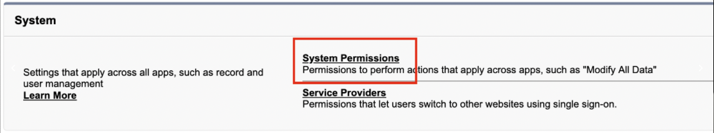

# Salesforce

Panther has the ability to fetch [Salesforce Event Monitoring](https://trailhead.salesforce.com/content/learn/modules/event\_monitoring/event\_monitoring\_intro) logs for the following event types:

* [Login](https://developer.salesforce.com/docs/atlas.en-us.api.meta/api/sforce\_api\_objects\_eventlogfile\_login.htm)
* [LoginAs](https://developer.salesforce.com/docs/atlas.en-us.api.meta/api/sforce\_api\_objects\_eventlogfile\_loginas.htm)
* [Logout](https://developer.salesforce.com/docs/atlas.en-us.api.meta/api/sforce\_api\_objects\_eventlogfile\_logout.htm)
* [URI](https://developer.salesforce.com/docs/atlas.en-us.api.meta/api/sforce\_api\_objects\_eventlogfile\_uri.htm)


Salesforce customers must [enable Event Monitoring](https://help.salesforce.com/articleView?id=000339868\&type=1\&mode=1) first. An additional license may be required for this Salesforce add-on.


### Create an API User


In order to create and add permissions to the new user, the ['Manage Users' permission](https://help.salesforce.com/articleView?id=000324398\&type=1\&mode=1) is required.


Panther requires a user account with API and Event Log File permissions in order to retrieve Event Monitoring logs.

We recommend creating a new, dedicated user with the minimum permissions required by Panther. Salesforce requires each user to have a [unique username](https://help.salesforce.com/articleView?id=sf.basics\_intro\_usernames\_passwords.htm\&type=5), but the same email address can be included in multiple users. Thus, you can create a Panther-only account without having to manage an additional email address in your organization.

**To create a user**:

1. Follow the instructions in the [Salesforce documentation](https://help.salesforce.com/articleView?id=sf.adding\_new\_users.htm\&type=5) to add a new user.&#x20;
   * For User License, select "Salesforce."
   * For Profile, select "Read Only."&#x20;
2. Complete the user registration process by setting a new password through the link sent to your email.

### Retrieve Security Token 

Salesforce API access requires username, password, and a credential called a _security token_.

To request a security token for new Salesforce user account, follow the instructions in this Salesforce documentation: [Reset security token](https://help.salesforce.com/s/articleView?id=sf.user\_security\_token.htm\&type=5). The new security token is sent to the email address in your Salesforce personal settings.

### Create and assign a new Permission Set

To assign permissions to the new user, you must create a new [Permission Set](https://help.salesforce.com/articleView?id=perm\_sets\_overview.htm\&type=5).&#x20;

1. Follow the instructions in Salesforce's [Create Permission Sets documentation](https://help.salesforce.com/s/articleView?id=sf.perm\_sets\_create.htm\&type=5) to add a new permission set that will grant Panther access to the Event Monitoring data via the SOAP/REST API.
2. On your new Permisson Set's page, click **System Permissions:**\
   ********
3. Click **Edit**, then check the boxes to enable the following permissions:
   1. API Enabled
   2. View Event Log Files
4. Assign the Permission Set to the designated user by following the instructions in Salesforce's documentation: [Assign Permission Sets to a Single User](https://developer.salesforce.com/docs/atlas.en-us.securityImplGuide.meta/securityImplGuide/perm\_sets\_assigning.htm).&#x20;

### Create a new Salesforce Source in Panther

1. Login to your Panther Console.
2. Go to **Integrations** > **Log Sources.**
3. Click **+** at the top right of the page to add a new log source.
4. Select **Salesforce** from the list of available sources.
5. Click **Start Source Setup**.
6. Enter a friendly name for the source, e.g. `Salesforce Logs`.
7. Select the time interval (hourly or daily) in which you want files retrieved from Salesforce _(Note: This feature was introduced in version 1.24)_
   * Check with your Salesforce admin to determine how your Salesforce instance is configured and what file interval is supported.
8. Select which log types you would like to monitor.
9. Enter the credentials of the account that Panther will use to connect to the Salesforce API:
   * **Account Username**: e.g. `panther-logs@mycompany.com`
   * **Account Password**: the account password
   * **Security Token**: the Security Token (for instructions on obtaining this value, see [Retrieve Security Token](https://docs.runpanther.io/data-onboarding/saas-logs/salesforce#retrieve-security-token) above.)
10. Click **Continue Setup**.&#x20;
    * At this step the credentials are also verified.

You are done! You can now start writing detections and exploring your Salesforce data.

