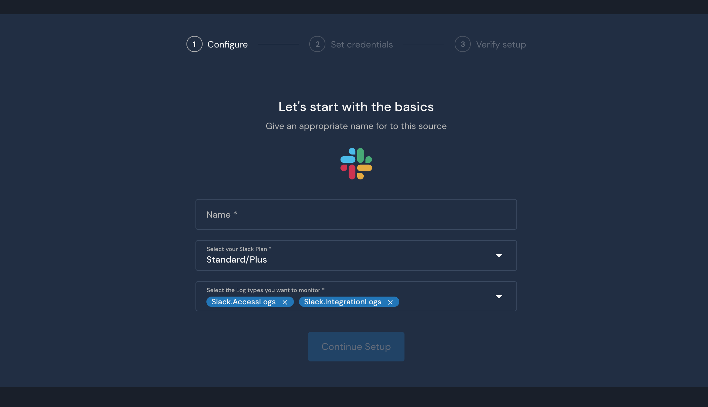
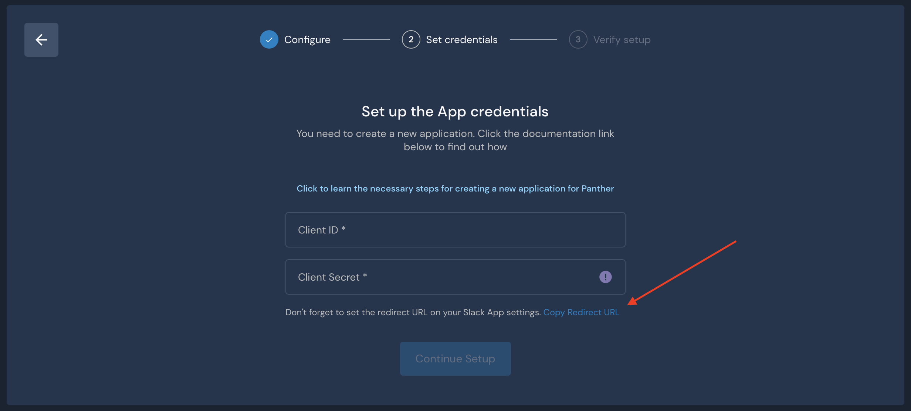
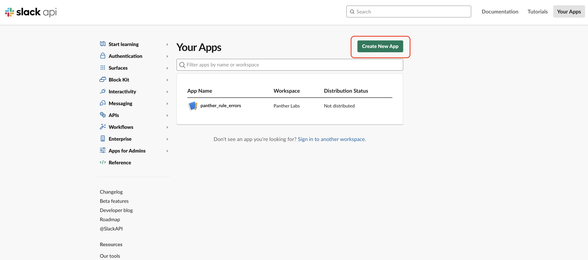
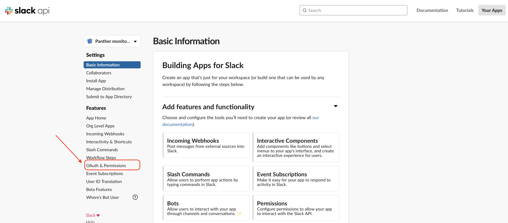

# Slack

Panther has the ability to pull the following logs from Slack:

*   **Audit logs**, by querying the [Audit Logs API](https://api.slack.com/admins/audit-logs). The Audit Logs API is

    available to **Slack Enterprise Grid** customers **only**.
*   **Access logs**, by querying the [team.accessLogs API](https://api.slack.com/methods/team.accessLogs). This API is

    available in all Slack paid plans. Note: Due to Slack's rate limits, Panther pulls only the events where the user or the access location or the access device is new.
*   **Integration logs**, by querying the [team.integrationLogs API](https://api.slack.com/methods/team.integrationLogs). This API is

    available in all Slack paid plans.

Panther will query the api every 1 minute.

In order for Panther to access the Slack API you need to create a new Slack source on Panther as well as create a Slack App and provide the app credentials to Panther.

## Create a new Slack Source in Panther

1. Log in to your Panther Console.
2. Go to **Integrations** > **Log** **Sources** from the sidebar menu.
3. Click **Add Source**.
4. Select **Slack** from the list of available types.
5. Enter a name for the source (e.g. `My Slack logs`) and then select your Slack plan. The available log types for you depend on that plan. Then click **Next**.


To find your Slack plan, click the name of your Slack workspace at the top left of the Slack app




1. The next page asks you to enter the **Client ID** and the **Client Secret** of a Slack App. For now, click on **Copy Redirect URL** and save it somewhere temporarily, as you will need it later.



## Create a new Slack App

In the following steps, you will be creating a Slack app with permissions to pull logs from Slack. For security and availability reasons, we recommend creating a **new** Slack App that will be used only by Panther.

To create an app for pulling **Audit logs**, [click here](slack.md#audit-logs). For **access** or **integration** logs, [click here](slack.md#access-logs).

### Create a Slack App to pull Audit Logs <a href="#audit-logs" id="audit-logs"></a>

1. Go to [Slack workspace sign-in](https://slack.com/workspace-signin).
2. Sign in to a workspace belonging to the Enterprise grid you want to monitor. You must sign-in as an **owner** of the organization!
3. You will be presented with a screen displaying all the workspaces in your Enterprise Grid. Click **Launch in Slack** on a workspace you are interested to monitor. You will be signed-in to _that_ workspace.
4. Go to [Slack apps](https://api.slack.com/apps) and click **Create New App**.



1. Enter an **App Name** e.g. `Panther monitoring`.
2. Select the workspace you signed in earlier. Click on **Create App**.


```
The App will be created in the selected workspace but later you will be able to use it to monitor the entire Enterprise Grid organization.
```

1. Click **OAuth & Permissions** in the left navigation panel



1. Scroll down to the **Redirect URLs** section, click **Add** and put in the `redirect url` that you copied from the Panther wizard in the previous section, then click **Save URLs**.


1. Scroll down to the section titled **Scopes** -> **User Token Scopes**. Add the `auditlogs:read` scope.


1. In the app's settings, select **Manage Distribution** from the left navigation. Under the section titled **Share Your App with Other Workspaces**, select all four options.
2. Click the green **Activate Public Distribution** button.


1. Go to the **Settings** -> **Basic Information** in the left navigation panel.
2. Go to **App Credentials** section. Copy the **Client ID** and **Client Secret**.


1. [Click here](slack.md#finalize) for the steps to complete the source creation in Panther.

### Create a Slack App to pull Access or Integration Logs <a href="#access-logs" id="access-logs"></a>

1. Go to [Slack workspace sign-in](https://slack.com/workspace-signin).
2. Sign in to a workspace you want to monitor. You must sign-in as an **admin** of the workspace!
3. Go to [Slack apps](https://api.slack.com/apps) and click **Create New App**.


1. Enter an **App Name** e.g. `Panther monitoring`.
2. Select the workspace you signed in earlier. Click on **Create App**.


1. Click **OAuth & Permissions** in the left navigation panel.


1. Scroll down to the **Redirect URLs** section, click **Add** and put in the `redirect url` that you copied from the Panther wizard in the previous section, then click **Save URLs**.


1. Scroll down to the section titled **Scopes** -> **User Token Scopes**. Add the `admin` scope.


1. Go to the **Settings** -> **Basic Information** in the left navigation panel.
2. Go to **App Credentials** section. Panther needs the **Client ID** and **Client Secret**.


## Finalize Slack onboarding in Panther <a href="#finalize" id="finalize"></a>

1. Go back to the Slack onboarding wizard in the Panther Console.
2. Paste **Client ID** and **Client Secret** credentials of the Slack App you just created.
3. Click **Next**. The credentials will be stored, encrypted, in the Panther backend.
4. Click **Save Source**.


1.  Click **Authorize**. You will be redirected to a Slack page to install your app.

    For Audit Logs, make sure you install it to the **Enterprise Organization** and **not** to a specific workspace!
2. Click **Allow**
3. Your new Slack Source should be healthy and ready to fetch audit logs from Slack!


Note: The integration will stop working if:

* the account of the user that installed the app to the organization is deactivated
* the app was deleted, the access token was revoked, or the app credentials are rotated

