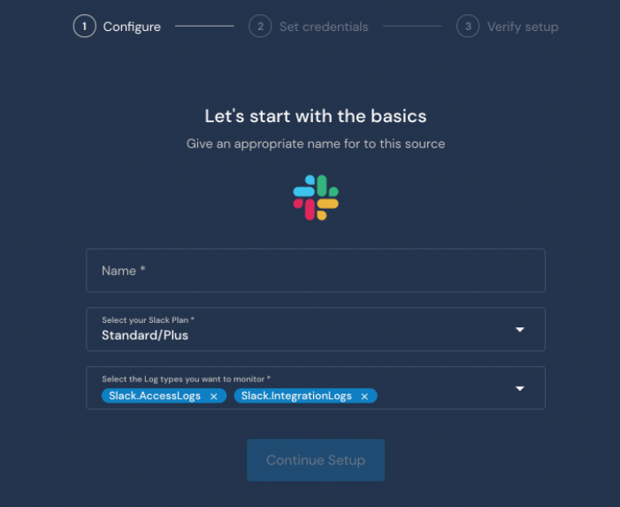
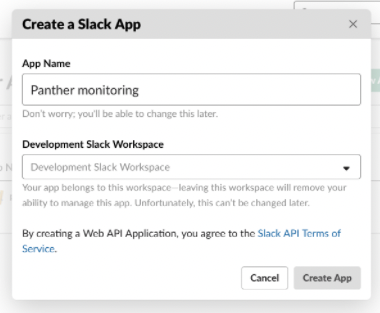
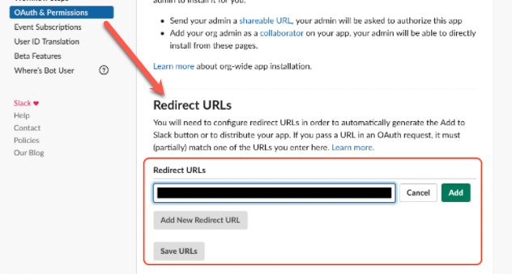
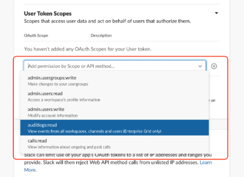
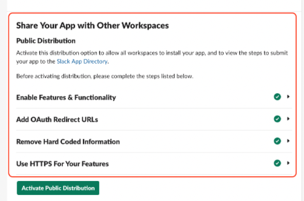
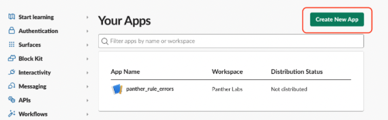

# Slack

## Overview

Panther can pull the following Slack logs:

* **Audit logs**, by querying the [Audit Logs API](https://api.slack.com/admins/audit-logs).&#x20;
  * The Audit Logs API is available to **Slack Enterprise Grid** customers **only**.
* **Access logs**, by querying the [team.accessLogs API](https://api.slack.com/methods/team.accessLogs).&#x20;
  * This API is available in all Slack paid plans.&#x20;
  * Note: Due to Slack's rate limits, Panther pulls only the events where the user or the access location or the access device is new.
* **Integration logs**, by querying the [team.integrationLogs API](https://api.slack.com/methods/team.integrationLogs).&#x20;
  * This API is available in all Slack paid plans.

Panther will query the API every 1 minute. In order for Panther to access the Slack API, you need to create a new Slack source on Panther, create a Slack App, and provide the app credentials to Panther.

## How to onboard Slack logs to Panther

### Create a new Slack Source in Panther

1. Log in to your Panther Console.
2. Go to **Integrations** > **Log** **Sources** from the sidebar menu.
3. Click **Create New.**
4. Select **Slack** from the list of available types.
5. Clock **Start Source Setup**.
6. Enter a name for the source (e.g. `My Slack logs`) and then select your Slack plan. \
   
   * The available log types depend on which plan you are subscribed to. To find your Slack plan, click the name of your Slack workspace at the top left of the Slack app.
7. Click **Continue Setup**.
8. On the Set Credentials page, click **Copy Redirect URL** and save it somewhere temporarily, as you will need it in the next steps. \
   .png>)&#x20;
9. Keep this browser window open while you work through the next steps.

### Create a new Slack App

Create a Slack app with permissions to pull logs from Slack. For security and availability reasons, we recommend creating a **new** Slack App that will be used only with Panther.

You can create an app for:

* [**Audit logs**](https://docs.runpanther.io/data-onboarding/saas-logs/slack#audit-logs)
* [**Access or Integration logs**](https://docs.runpanther.io/data-onboarding/saas-logs/slack#access-logs)

### How to create a Slack App to pull Audit Logs <a href="#audit-logs" id="audit-logs"></a>

1. [Sign in to the Slack workspace](https://slack.com/workspace-signin) belonging to the Enterprise grid you want to monitor.&#x20;
   * You must sign in as an **owner** of the organization.
2. On the screen displaying all the workspaces in your Enterprise Grid, click **Launch in Slack** on the workspace you want to monitor.&#x20;
3.  Go to [Slack apps](https://api.slack.com/apps) and click **Create New App**, then click **from scratch**.\
    .png>)

    * Enter an **App Name** e.g. `Panther monitoring`.
    * Select the workspace where you previously signed in.&#x20;

    
4. Click **Create App**.
   * The App will be created in the selected workspace and later you will be able to monitor the entire Enterprise Grid organization.
5. In the left sidebar menu, click **OAuth & Permissions**.
6. Scroll down to the **Redirect URLs** section.
7. Click **Add** and enter the **Redirect URL** that you copied from the Panther Console in the previous section of this documentation.\
   
8. Click **Save URLs**.
9. Scroll down to the **User Token Scopes** section. Add the `auditlogs:read` scope.\
   
10. In the left sidebar, go to **Settings >** **Manage Distribution.**&#x20;
11. Under the section titled "**Share Your App with Other Workspaces**," enable the following options:
    * **Enable Features & Functionality**
    * **Add OAuth Redirect URLs**
    * **Remove Hard Coded Information**
    * **Use HTTPS For Your Features**
12. Click **Activate Public Distribution**.
    * **Note:** This does not make your Slack App accessible to other organizations. Slack requires this setting to pull [audit logs](https://api.slack.com/admins/audit-logs).\
      
13. In the left sidebar, go to **Settings** > **Basic Information**.
14. In the **App Credentials** section, Copy the **Client ID** and **Client Secret**.
15. Follow the steps under [Finalize Slack Onboarding in Panther](https://docs.runpanther.io/data-onboarding/saas-logs/slack#finalize) to complete this process.


### How to create a Slack App to pull Access or Integration Logs <a href="#access-logs" id="access-logs"></a>

1. [Sign in to the Slack workspace](https://slack.com/workspace-signin) belonging to the Enterprise Grid you want to monitor.&#x20;
   * You must sign in as an **owner** of the organization.
2. On the screen displaying all the workspaces in your Enterprise Grid, click **Launch in Slack** on the workspace you want to monitor.&#x20;
3.  Go to [Slack apps](https://api.slack.com/apps) and click **Create New App**.\
    

    * Enter an **App Name** e.g. `Panther monitoring`.
    * Select the workspace where you previously signed in.

    
4. Click **Create App**.
   * The App will be created in the selected workspace and later you will be able to monitor the entire Enterprise Grid organization.
5. In the left sidebar menu, click **OAuth & Permissions**.
6. Scroll down to the **Redirect URLs** section.
7. Click **Add** and enter the **Redirect URL** that you copied from the Panther Console in the previous section of this documentation.\
   
8. Click **Save URLs**.
9. Scroll down to the section titled **Scopes** > **User Token Scopes**. Add the `admin` scope.
10. In the left sidebar, go to **Settings** > **Basic Information**.
11. In the **App Credentials** section, Copy the **Client ID** and **Client Secret**.\
    &#x20;.png>)
12. Follow the steps under [Finalize Slack Onboarding in Panther](https://docs.runpanther.io/data-onboarding/saas-logs/slack#finalize) to complete this process.

### Finalize Slack onboarding in Panther <a href="#finalize" id="finalize"></a>

1. Navigate back to the Panther Console.
2. On the **App Credentials** page, paste the **Client ID** from Slack into the Client ID field and the **Client Secret** from Slack into the Client Secret field.&#x20;
3. Click **Continue Setup**.&#x20;
   * The credentials will be stored and encrypted in the Panther backend.
4. Click **Save Source**.
5. On the Verify Setup screen, click **Grant Access**.
   * You will be redirected to a Slack page to install your app.
   * For Audit Logs, make sure you install it to the **Enterprise Organization** and **not** to a specific workspace!
6. Click **Allow.**
7. You will be directed to a confirmation screen where you can set up a log drop-off alarm.
   * This feature sends an error message if logs aren't received within a specified time interval.
8. Click **Finish Setup**.


**Note:** The integration will incur limitations if:

* the account of the user that installed the app to the organization is deactivated
* the app was deleted, the access token was revoked, or the app credentials are rotated


## Supported log types


Required fields in the schema are listed as **"required: true"** just below the "name" field.


### Slack.AccessLogs

Access logs for users on a Slack workspace. **Note:** Due to Slack's rate limits, Panther pulls only the events where the user or the access location or the access device is new. Panther will not update the `date_last`, `count` fields of an event.'

Reference: [Slack Documentation on Access Logs.](https://api.slack.com/methods/team.accessLogs)

```yaml
schema: Slack.AccessLogs
parser:
    native:
        name: Slack.AccessLogs
description: 'Access logs for users on a Slack workspace. Note: Due to Slack's rate limits, Panther pulls only the events where the user or the access location or the access device is new. Panther will not update the `date_last`, `count` fields of an event.'
referenceURL: https://api.slack.com/methods/team.accessLogs
version: 0
fields:
    - name: user_id
      required: true
      description: The id of the user accessing Slack.
      type: string
    - name: username
      description: The username of the user accessing Slack.
      type: string
      indicators:
        - username
    - name: date_first
      required: true
      description: Unix timestamp of the first access log entry for this user, IP address, and user agent combination.
      type: timestamp
      timeFormat: unix
    - name: date_last
      required: true
      description: 'Unix timestamp of the most recent access log entry for this user, IP address, and user agent combination. Note: Panther will not update this field even if it is updated in the Slack API.'
      type: timestamp
      timeFormat: unix
      isEventTime: true
    - name: count
      required: true
      description: 'The total number of access log entries for that combination. Note: Panther will not update this field even if it is updated in the Slack API.'
      type: bigint
    - name: ip
      required: true
      description: The IP address of the device used to access Slack.
      type: string
      indicators:
        - ip
    - name: user_agent
      description: The reported user agent string from the browser or client application.
      type: string
    - name: isp
      description: Best guess at the internet service provider owning the IP address.
      type: string
    - name: country
      description: Best guesses on where the access originated, based on the IP address.
      type: string
    - name: region
      description: Best guesses on where the access originated, based on the IP address.
      type: string
```

### Slack.AuditLogs

Slack audit logs provide a view of the actions users perform in an Enterprise Grid organization.

Reference: [Slack Documentation on Audit Logs.](https://api.slack.com/admins/audit-logs)

```yaml
schema: Slack.AuditLogs
parser:
    native:
        name: Slack.AuditLogs
description: Slack audit logs provide a view of the actions users perform in an Enterprise Grid organization.
referenceURL: https://api.slack.com/enterprise/audit-logs
version: 0
fields:
    - name: id
      required: true
      description: The event id
      type: string
    - name: date_create
      required: true
      description: Creation timestamp for the event
      type: timestamp
      timeFormat: unix
      isEventTime: true
    - name: action
      required: true
      description: The action performed. See https://api.slack.com/enterprise/audit-logs#audit_logs_actions
      type: string
    - name: actor
      required: true
      description: An actor will always be a user on a workspace and will be identified by their user ID, such as W123AB456.
      type: object
      fields:
        - name: type
          required: true
          description: The type of actor (always user)
          type: string
        - name: user
          description: Information about the user
          type: object
          fields:
            - name: id
              required: true
              description: The id of the user ('USLACKUSER' if no user performed the action)
              type: string
            - name: name
              description: The user's display name
              type: string
              indicators:
                - username
            - name: email
              description: The user's email
              type: string
              indicators:
                - email
            - name: team
              description: The user's team
              type: string
    - name: entity
      required: true
      description: An entity is the thing that the actor has taken the action upon and it will be the Slack ID of the thing.
      type: object
      fields:
        - name: type
          required: true
          description: The type of item that was affected by the action (user,channel,file,app,workspace,enterprise,message,workflow)
          type: string
        - name: user
          description: Information about the affected user
          type: object
          fields:
            - name: id
              required: true
              description: The id of the user ('USLACKUSER' if no user performed the action)
              type: string
            - name: name
              description: The user's display name
              type: string
              indicators:
                - username
            - name: email
              description: The user's email
              type: string
              indicators:
                - email
            - name: team
              description: The user's team
              type: string
        - name: channel
          description: Information about the affected channel
          type: object
          fields:
            - name: id
              required: true
              description: The id of the channel
              type: string
            - name: name
              description: The name of the channel
              type: string
            - name: privacy
              description: The privacy mode of the channel
              type: string
            - name: is_shared
              description: Whether the channel is shared
              type: boolean
            - name: is_org_shared
              description: Whether the channel is shared in the organisation
              type: boolean
            - name: teams_shared_with
              description: The teams the channel is shared with
              type: array
              element:
                type: string
        - name: file
          description: Information about the affected file
          type: object
          fields:
            - name: id
              required: true
              description: The id of the file
              type: string
            - name: name
              description: The filename
              type: string
            - name: title
              description: The file title
              type: string
            - name: filetype
              description: The filetype
              type: string
        - name: app
          description: Information about the affected app
          type: object
          fields:
            - name: id
              required: true
              description: The id of the app
              type: string
            - name: name
              description: The name of the app
              type: string
            - name: is_distributed
              description: Whether the app is distributed
              type: boolean
            - name: is_directory_approved
              description: Whether the app is in the approved apps directory
              type: boolean
            - name: scopes
              description: The OAuth2 scopes the app requires
              type: array
              element:
                type: string
        - name: workspace
          description: Information about the affected workspace
          type: object
          fields:
            - name: id
              required: true
              description: The id of the workspace
              type: string
            - name: name
              description: The name of the workspace
              type: string
            - name: domain
              description: The workspace domain
              type: string
        - name: enterprise
          description: Information about the affected enterprise
          type: object
          fields:
            - name: id
              required: true
              description: The id of the enterprise
              type: string
            - name: name
              description: The name of the enterprise
              type: string
            - name: domain
              description: The enterprise domain
              type: string
        - name: workflow
          description: Information about the affected workflow
          type: object
          fields:
            - name: id
              required: true
              description: The id of the workflow
              type: string
            - name: name
              description: The name of the workflow
              type: string
        - name: message
          description: Information about the affected message
          type: object
          fields:
            - name: team
              description: The team the message was posted in
              type: string
            - name: channel
              description: The channel the message was posted on
              type: string
            - name: timestamp
              description: The timestamp of the message
              type: string
    - name: context
      required: true
      description: Context is the location that the actor took the action on the entity. It will always be either a Workspace or an Enterprise, with the appropriate ID.
      type: object
      fields:
        - name: ua
          description: The user agent used for the action
          type: string
        - name: ip_address
          description: The ip address the action was performed from
          type: string
          indicators:
            - ip
        - name: location
          description: The location that the actor took the action on the entity.
          type: object
          fields:
            - name: type
              required: true
              description: The location type. It will always be either a Workspace or an Enterprise
              type: string
            - name: id
              required: true
              description: The location id
              type: string
            - name: domain
              description: The location domain
              type: string
            - name: name
              description: The location name
              type: string
    - name: details
      description: Additional details about the audit log event
      type: json
```

### Slack.IntegrationLogs

Integration activity logs for a team, including when integrations are added, modified, and removed.

Reference: [Slack Documentation on Integration Logs.](https://api.slack.com/methods/team.integrationLogs)

```yaml
schema: Slack.IntegrationLogs
parser:
    native:
        name: Slack.IntegrationLogs
description: Integration activity logs for a team, including when integrations are added, modified and removed.
referenceURL: https://api.slack.com/methods/team.integrationLogs
version: 0
fields:
    - name: user_id
      required: true
      description: The id of the user performing the action.
      type: string
    - name: user_name
      description: The username of the user performing the action.
      type: string
      indicators:
        - username
    - name: service_id
      description: The service id for which this log is about.
      type: string
    - name: service_type
      description: The service type for which this log is about.
      type: string
    - name: app_id
      description: The app id for which this log is about.
      type: string
    - name: app_type
      description: The app type for which this log is about.
      type: string
    - name: date
      required: true
      description: The date when the action happened.
      type: timestamp
      timeFormat: unix
      isEventTime: true
    - name: change_type
      required: true
      description: The type of this action (added, removed, enabled, disabled, updated).
      type: string
    - name: scope
      description: The scope used for this action.
      type: string
    - name: channel
      description: The related channel.
      type: string
    - name: reason
      description: The reason of the disable action, populated if this event refers to such an action.
      type: string
    - name: rss_feed
      description: True if this log entry is an RSS feed. If true, more RSS feed related fields will be present.
      type: boolean
    - name: rss_feed_change_type
      description: The change type for the RSS feed.
      type: string
    - name: rss_feed_title
      description: The title of the RSS feed.
      type: string
    - name: rss_feed_url
      description: The url of the RSS feed.
      type: string
```
