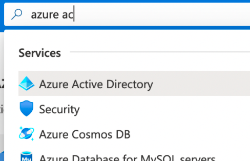
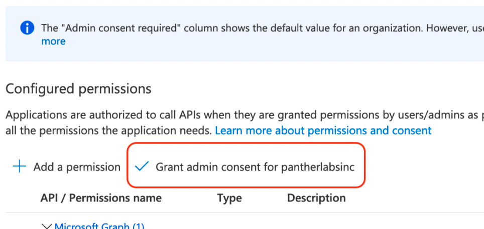
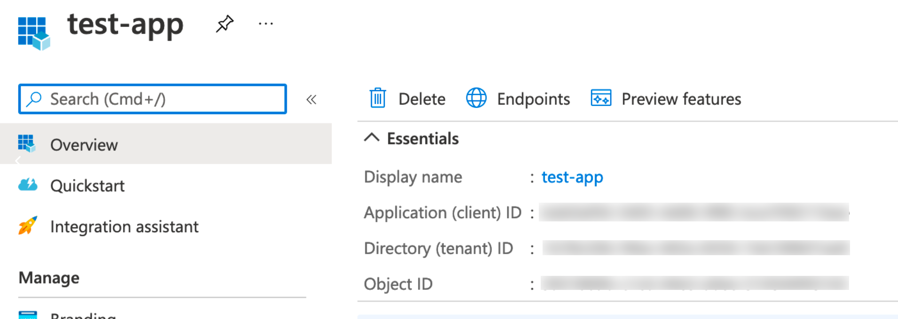

# Microsoft Graph Logs (Beta)


Starting in version 1.39 and newer, this feature is available as an invite-only beta. If you would like to participate in testing, please reach out to [Panther support.](../../help/)


## Overview

Panther has the ability to fetch Microsoft Graph logs by querying the [Microsoft Graph API](https://docs.microsoft.com/en-us/graph/api/resources/security-api-overview?view=graph-rest-1.0). Panther will query security alerts and incidents detected by Microsoft Defender for Cloud.

## How to onboard Microsoft Graph logs to Panther

### Step 1: Create an Azure AD application

1. Log in to [your Azure portal](https://portal.azure.com) and navigate to the **Azure Active Directory** service.\
   
2. Click **App Registrations** in the left sidebar.
3. Click **New Registration**.
4. Fill in the fields:
   * Enter a **memorable name** for your application.&#x20;
   * For **Supported account types**, select `Accounts in this organizational directory only`.&#x20;
5. Click **Register**.
6. On the left sidebar, click **Certificates and Secrets**.&#x20;
7. Click **New Client Secret**.&#x20;
   * Add a **description** for the secret (e.g., Panther integration).
   * Set the **Expires** field to `24 Months`.&#x20;
8. Click **Add**.&#x20;
   * The Client Secret is hidden after you navigate away from this page; copy down the **Value** **field** and store it in a secure place - you will use this as your Secret ID Value in Step 4.
9. On the left sidebar, click **API Permissions** and then **Add a permission**.&#x20;
10. Find and click the **Microsoft Graph APIs**.
11. Click **Delegated permissions** and select the _SecurityEvents.Read.All_ permission.
12. Click **Application permissions** and select the _SecurityEvents.Read.All_ permission.
13. Click **Add permissions** at the bottom of the page.&#x20;
14. Click **Grant admin consent** on the API permissions page.\
    
15. After consent has been granted, click the **Overview** tab in the left sidebar to view your **Application (client) ID** and **Directory (tenant) ID**.&#x20;
    * You will need to provide these to Panther in the next steps.\
      
16. Keep this browser window open as you work through the next steps.

### Step 2: Create a new Microsoft Graph Source in Panther

1. Log in to your Panther Console.
2. In the left sidebar menu, click **Integrations** > **Log** **Sources**.
3. Click **Create New.**
4. Select **Microsoft Graph** from the list of available log sources.&#x20;
5. Click **Start Source Setup**.
6. On the next screen, fill in the fields:
   * **Name**: Enter a memorable name for the source e.g., `My Microsoft Graph logs`.
   * **Tenant ID**: Enter your Tenant ID.
   * **Log Types**: Select at least one log type.&#x20;
7. Click **Continue Setup**.
8. On the "Set Credentials" page, copy the **Redirect URL** and store it in a secure place.&#x20;
   * You will need it in the next step.
9. Keep this browser window open as you work through the next steps.

### Step 3: Configure the Redirect URL

1. Navigate back to the Azure AD application.
2. On the left sidebar, click **Authentication.**
3. Click **Add a platform**.&#x20;
4. Click the **Web.**
5. Enter your **Redirect URL.**
6. Click **Configure.**

### Step 4: Finalize the onboarding in Panther

1. Navigate back to the Panther Console.
2. On the "Set Credentials" **** page, enter your **Client ID** and **Secret ID Value** (the Value field you saved in Step 1).&#x20;
3. Click **Continue Setup**.
4. On the "Verify Setup" screen, click **Grant Access**.
   * You will be redirected to a Microsoft page to authorize your app.
5. You will be directed to a confirmation screen where you can set up a log drop-off alarm.
   * This feature sends an error message if logs aren't received within a specified time interval.
6. Click **View Log Source**.

## Supported log types


Required fields in the schema are listed as "**required: true**" just below the "name" field.


### MicrosoftGraph.SecurityAlert

Represents potential security issues within a customer's tenant that Microsoft or partner security solutions have identified.

Reference: [Microsoft Documentation on Security Alerts](https://docs.microsoft.com/en-us/graph/api/resources/alert?view=graph-rest-1.0).

```yaml
fields:
    - name: activityGroupName
      description: Name or alias of the activity group (attacker) this alert is attributed to
      type: string
    - name: assignedTo
      description: Name or alias of the activity group (attacker) this alert is attributed to
      type: string
    - name: azureSubscriptionId
      description: Azure subscription ID, present if this alert is related to an Azure resource
      type: string
    - name: azureTenantId
      required: true
      description: Azure Active Directory tenant ID
      type: string
    - name: category
      description: Category of the alert (for example, credentialTheft, ransomware, etc)
      type: string
    - name: closedDateTime
      description: Time at which the alert was closed (UTC)
      type: timestamp
      timeFormat: rfc3339
    - name: cloudAppStates
      description: Security-related stateful information generated by the provider about the cloud application/s related to this alert
      type: array
      element:
        type: object
        fields:
            - name: destinationServiceIp
              description: Destination IP Address of the connection to the cloud application/service
              type: string
              indicators:
                - ip
            - name: destinationServiceName
              description: Cloud application/service name (for example 'Salesforce', 'DropBox', etc.)
              type: string
            - name: riskScore
              description: Provider-generated/calculated risk score of the Cloud Application/Service. Recommended value range of 0-1, which equates to a percentage
              type: string
    - name: comments
      description: Customer-provided comments on alert (for customer alert management)
      type: array
      element:
        type: string
    - name: confidence
      description: Confidence of the detection logic (percentage between 1-100)
      type: int
    - name: createdDateTime
      required: true
      description: Time at which the alert was created by the alert provider (UTC)
      type: timestamp
      timeFormat: rfc3339
    - name: description
      description: Alert description
      type: string
    - name: detectionIds
      description: Set of alerts related to this alert entity (each alert is pushed to the SIEM as a separate record)
      type: array
      element:
        type: string
    - name: eventDateTime
      required: true
      description: Time at which the event(s) that served as the trigger(s) to generate the alert occurred (UTC)
      type: timestamp
      timeFormat: rfc3339
      isEventTime: true
    - name: feedback
      description: 'Analyst feedback on the alert. Possible values are: unknown, truePositive, falsePositive, benignPositive'
      type: string
    - name: fileStates
      description: Security-related stateful information generated by the provider about the file(s) related to this alert
      type: array
      element:
        type: object
        fields:
            - name: fileHash
              description: Complex type containing file hashes (cryptographic and location-sensitive)
              type: object
              fields:
                - name: hashType
                  description: 'File hash type. Possible values are: unknown, sha1, sha256, md5, authenticodeHash256, lsHash, ctph, peSha1, peSha256'
                  type: string
                - name: hashValue
                  description: Value of the file hash
                  type: string
                  indicators:
                    - md5
                    - sha1
                    - sha256
            - name: name
              description: File name (without path)
              type: string
            - name: path
              description: Full file path of the file/imageFile
              type: string
            - name: riskScore
              description: Provider generated/calculated risk score of the alert file. Recommended value range of 0-1, which equates to a percentage
              type: string
    - name: hostStates
      description: Security-related stateful information generated by the provider about the host(s) related to this alert
      type: array
      element:
        type: object
        fields:
            - name: fqdn
              description: Host FQDN (Fully Qualified Domain Name) (for example, machine.company.com)
              type: string
              indicators:
                - hostname
            - name: isAzureAdJoined
              description: True if the host is domain joined to Azure Active Directory Domain Services
              type: boolean
            - name: isAzureAdRegistered
              description: True if the host registered with Azure Active Directory Device Registration (BYOD devices - that is, not fully managed by enterprise)
              type: boolean
            - name: isHybridAzureDomainJoined
              description: True if the host is domain joined to an on-premises Active Directory domain
              type: boolean
            - name: netBiosName
              description: The local host name, without the DNS domain name
              type: string
              indicators:
                - hostname
            - name: os
              description: Host Operating System. (For example, Windows10, MacOS, RHEL, etc.)
              type: string
            - name: privateIpAddress
              description: Private (not routable) IPv4 or IPv6 address (see RFC 1918) at the time of the alert
              type: string
              indicators:
                - ip
            - name: publicIpAddress
              description: Publicly routable IPv4 or IPv6 address (see RFC 1918) at time of the alert
              type: string
              indicators:
                - ip
            - name: riskScore
              description: Provider-generated/calculated risk score of the host. Recommended value range of 0-1, which equates to a percentage
              type: string
    - name: id
      required: true
      description: Provider-generated GUID/unique identifier
      type: string
    - name: incidentIds
      description: IDs of incidents related to current alert
      type: array
      element:
        type: string
    - name: lastModifiedDateTime
      description: Time at which the alert entity was last modified (UTC)
      type: timestamp
      timeFormat: rfc3339
    - name: malwareStates
      description: Threat Intelligence pertaining to malware related to this alert
      type: array
      element:
        type: object
        fields:
            - name: category
              description: Provider-generated malware category (for example, trojan, ransomware, etc.)
              type: string
            - name: family
              description: Provider-generated malware family (for example, 'wannacry', 'notpetya', etc.)
              type: string
            - name: name
              description: Provider-generated malware variant name (for example, Trojan:Win32/Powessere.H)
              type: string
            - name: severity
              description: Provider-determined severity of this malware
              type: string
            - name: wasRunning
              description: Indicates whether the detected file (malware/vulnerability) was running at the time of detection or was detected at rest on the disk
              type: boolean
    - name: networkConnections
      description: Security-related stateful information generated by the provider about the network connection(s) related to this alert
      type: array
      element:
        type: object
        fields:
            - name: applicationName
              description: Name of the application managing the network connection (for example, Facebook or SMTP)
              type: string
            - name: destinationAddress
              description: Destination IP address (of the network connection)
              type: string
              indicators:
                - ip
            - name: destinationLocation
              description: Location (by IP address mapping) associated with the destination of a network connection
              type: string
            - name: destinationDomain
              description: Destination domain portion of the destination URL. (for example 'www.contoso.com')
              type: string
              indicators:
                - domain
            - name: destinationPort
              description: Destination port (of the network connection)
              type: string
            - name: destinationUrl
              description: Network connection URL/URI string - excluding parameters. (for example 'www.contoso.com/products/default.html')
              type: string
              indicators:
                - url
            - name: direction
              description: 'Network connection direction. Possible values are: unknown, inbound, outbound'
              type: string
            - name: domainRegisteredDateTime
              description: Date when the destination domain was registered (UTC)
              type: timestamp
              timeFormat: rfc3339
            - name: localDnsName
              description: The local DNS name resolution as it appears in the host's local DNS cache (for example, in case the 'hosts' file was tampered with)
              type: string
            - name: natDestinationAddress
              description: Network Address Translation destination IP address
              type: string
              indicators:
                - ip
            - name: natDestinationPort
              description: Network Address Translation destination port
              type: string
            - name: natSourceAddress
              description: Network Address Translation source IP address
              type: string
              indicators:
                - ip
            - name: natSourcePort
              description: Network Address Translation source port
              type: string
            - name: protocol
              description: 'Network protocol. Possible values are: unknown, ip, icmp, igmp, ggp, ipv4, tcp, pup, udp, idp, ipv6, ipv6RoutingHeader, ipv6FragmentHeader, ipSecEncapsulatingSecurityPayload, ipSecAuthenticationHeader, icmpV6, ipv6NoNextHeader, ipv6DestinationOptions, nd, raw, ipx, spx, spxII'
              type: string
            - name: riskScore
              description: Provider generated/calculated risk score of the network connection. Recommended value range of 0-1, which equates to a percentage
              type: string
            - name: sourceAddress
              description: Source (i.e. origin) IP address (of the network connection)
              type: string
              indicators:
                - ip
            - name: sourceLocation
              description: Location (by IP address mapping) associated with the source of a network connection
              type: string
            - name: sourcePort
              description: Source (i.e. origin) IP port (of the network connection)
              type: string
            - name: status
              description: 'Network connection status. Possible values are: unknown, attempted, succeeded, blocked, failed'
              type: string
            - name: urlParameters
              description: Parameters (suffix) of the destination URL
              type: string
              indicators:
                - url
    - name: processes
      description: Security-related stateful information generated by the provider about the process or processes related to this alert
      type: array
      element:
        type: object
        fields:
            - name: accountName
              description: User account identifier (user account context the process ran under) for example, AccountName, SID, and so on
              type: string
              indicators:
                - username
            - name: commandLine
              description: The full process invocation commandline including all parameters
              type: string
            - name: createdDateTime
              description: Time at which the process was started (UTC)
              type: timestamp
              timeFormat: rfc3339
            - name: fileHash
              description: Complex type containing file hashes (cryptographic and location-sensitive)
              type: object
              fields:
                - name: hashType
                  description: 'File hash type. Possible values are: unknown, sha1, sha256, md5, authenticodeHash256, lsHash, ctph, peSha1, peSha256'
                  type: string
                - name: hashValue
                  description: Value of the file hash
                  type: string
                  indicators:
                    - md5
                    - sha1
                    - sha256
            - name: integrityLevel
              description: 'The integrity level of the process. Possible values are: unknown, untrusted, low, medium, high, system'
              type: string
            - name: isElevated
              description: True if the process is elevated
              type: boolean
            - name: name
              description: The name of the process' Image file
              type: string
            - name: parentProcessCreatedDateTime
              description: DateTime at which the parent process was started (UTC)
              type: timestamp
              timeFormat: rfc3339
            - name: parentProcessId
              description: The Process ID (PID) of the parent process
              type: bigint
            - name: parentProcessName
              description: The name of the image file of the parent process
              type: string
            - name: path
              description: Full path, including filename
              type: string
            - name: processId
              description: The Process ID (PID) of the process
              type: bigint
    - name: recommendedActions
      description: Vendor/provider recommended action(s) to take as a result of the alert (for example, isolate machine, enforce2FA, reimage host)
      type: array
      element:
        type: string
    - name: registryKeyStates
      description: Security-related stateful information generated by the provider about the registry keys related to this alert
      type: array
      element:
        type: object
        fields:
            - name: hive
              description: 'A Windows registry hive. Possible values are: unknown, currentConfig, currentUser, localMachineSam, localMachineSecurity, localMachineSoftware, localMachineSystem, usersDefault'
              type: string
            - name: key
              description: Current (i.e. changed) registry key (excludes HIVE)
              type: string
            - name: oldKey
              description: Previous (i.e. before changed) registry key (excludes HIVE)
              type: string
            - name: oldValueData
              description: Previous (i.e. before changed) registry key value data (contents)
              type: string
            - name: oldValueName
              description: Previous (i.e. before changed) registry key value name
              type: string
            - name: operation
              description: 'Operation that changed the registry key name and/or value. Possible values are: unknown, create, modify, delete'
              type: string
            - name: processId
              description: Process ID (PID) of the process that modified the registry key (process details will appear in the alert 'processes' collection)
              type: bigint
            - name: valueData
              description: Current (i.e. changed) registry key value data (contents)
              type: string
            - name: valueName
              description: Current (i.e. changed) registry key value name
              type: string
            - name: valueType
              description: 'Registry key value type. Possible values are: unknown, binary, dword, dwordLittleEndian, dwordBigEndian, expandSz, link, multiSz, none, qword, qwordlittleEndian, sz'
              type: string
    - name: securityResources
      description: Resources related to current alert. For example, for some alerts this can have the Azure Resource value
      type: array
      element:
        type: object
        fields:
            - name: resource
              description: Name of the resource that is related to current alert
              type: string
            - name: resourceType
              description: 'Represents type of security resources related to an alert. Possible values are: attacked, related'
              type: string
    - name: severity
      required: true
      description: 'Alert severity - set by vendor/provider. Possible values are: unknown, informational, low, medium, high'
      type: string
    - name: sourceMaterials
      description: Hyperlinks (URIs) to the source material related to the alert, for example, provider's user interface for alerts or log search, etc
      type: array
      element:
        type: string
        indicators:
            - url
    - name: status
      required: true
      description: 'Alert lifecycle status (stage). Possible values are: unknown, newAlert, inProgress, resolved'
      type: string
    - name: tags
      description: User-definable labels that can be applied to an alert and can serve as filter conditions (for example 'HVA', 'SAW', etc.)
      type: array
      element:
        type: string
    - name: title
      required: true
      description: Alert title
      type: string
    - name: triggers
      description: Security-related information about the specific properties that triggered the alert (properties appearing in the alert). Alerts might contain information about multiple users, hosts, files, ip addresses. This field indicates which properties triggered the alert generation
      type: array
      element:
        type: object
        fields:
            - name: name
              description: Name of the property serving as a detection trigger
              type: string
            - name: type
              description: Type of the property in the key:value pair for interpretation. For example, String, Boolean etc
              type: string
            - name: value
              description: Value of the property serving as a detection trigger
              type: string
    - name: userStates
      description: Security-related stateful information generated by the provider about the user accounts related to this alert
      type: array
      element:
        type: object
        fields:
            - name: aadUserId
              description: AAD User object identifier (GUID) - represents the physical/multi-account user entity
              type: string
              indicators:
                - username
            - name: accountName
              description: Account name of user account (without Active Directory domain or DNS domain) - (also called mailNickName)
              type: string
              indicators:
                - username
            - name: domainName
              description: "NetBIOS/Active Directory domain of user account (that is, domain\account format)"
              type: string
              indicators:
                - domain
            - name: emailRole
              description: 'For email-related alerts - user account''s email ''role''. Possible values are: unknown, sender, recipient'
              type: string
            - name: isVpn
              description: Indicates whether the user logged on through a VPN
              type: boolean
            - name: logonDateTime
              description: Time at which the sign-in occurred (UTC)
              type: timestamp
              timeFormat: rfc3339
            - name: logonId
              description: User sign-in ID
              type: string
              indicators:
                - username
            - name: logonIp
              description: IP Address the sign-in request originated from
              type: string
              indicators:
                - ip
            - name: logonLocation
              description: Location (by IP address mapping) associated with a user sign-in event by this user
              type: string
            - name: logonType
              description: 'Method of user sign in. Possible values are: unknown, interactive, remoteInteractive, network, batch, service'
              type: string
            - name: onPremisesSecurityIdentifier
              description: Active Directory (on-premises) Security Identifier (SID) of the user
              type: string
              indicators:
                - username
            - name: riskScore
              description: Provider-generated/calculated risk score of the user account. Recommended value range of 0-1, which equates to a percentage
              type: string
            - name: userAccountType
              description: 'User account type (group membership), per Windows definition. Possible values are: unknown, standard, power, administrator'
              type: string
            - name: userPrincipalName
              description: 'User sign-in name - internet format: (user account name)@(user account DNS domain name)'
              type: string
              indicators:
                - username
    - name: vendorInformation
      required: true
      description: Complex type containing details about the security product/service vendor, provider, and subprovider (for example, vendor=Microsoft; provider=Windows Defender ATP; subProvider=AppLocker)
      type: object
      fields:
        - name: provider
          description: Specific provider (product/service - not vendor company); for example, WindowsDefenderATP
          type: string
        - name: providerVersion
          description: Version of the provider or subprovider, if it exists, that generated the alert
          type: string
        - name: subProvider
          description: Specific subprovider (under aggregating provider); for example, WindowsDefenderATP.SmartScreen
          type: string
        - name: vendor
          description: Name of the alert vendor (for example, Microsoft, Dell, FireEye)
          type: string
    - name: vulnerabilityStates
      description: Threat intelligence pertaining to one or more vulnerabilities related to this alert
      type: array
      element:
        type: object
        fields:
            - name: cve
              description: Common Vulnerabilities and Exposures (CVE) for the vulnerability
              type: string
            - name: severity
              description: Base Common Vulnerability Scoring System (CVSS) severity score for this vulnerability
              type: string
            - name: wasRunning
              description: Indicates whether the detected vulnerability (file) was running at the time of detection or was the file detected at rest on the disk
              type: boolean

```
