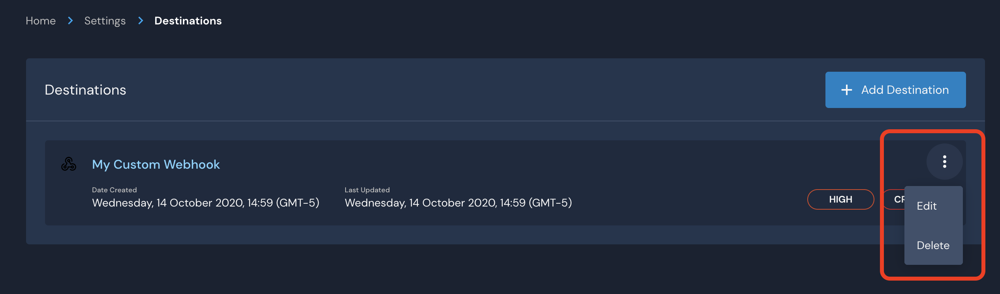

# Destinations

Destinations are integrations that receive alerts from rules and policies.

Alerts are routed based on severity (by default) and can dispatch to multiple destinations simultaneously, such as creating a Jira ticket, sending an email, and creating a PagerDuty Incident.

Destinations can be overridden on a per-rule or per-policy basis by using the detection metadata or overrides.


AWS destinations require IAM configurations to grant permissions for Panther to publish notifications


## Supported Destinations

|       Name      | Homepage                                                                                                                                       |
| :-------------: | ---------------------------------------------------------------------------------------------------------------------------------------------- |
|    Amazon SNS   | [https://aws.amazon.com/sns/](https://aws.amazon.com/sns/)                                                                                     |
|    Amazon SQS   | [https://aws.amazon.com/sqs/](https://aws.amazon.com/sqs/)                                                                                     |
|      Asana      | [https://developers.asana.com/docs](https://developers.asana.com/docs)                                                                         |
|  Custom Webhook | [https://docs.runpanther.io](custom\_webhook.md)                                                                                               |
|      Github     | [https://github.com/](https://github.com)                                                                                                      |
|       Jira      | [https://www.atlassian.com/software/jira](https://www.atlassian.com/software/jira)                                                             |
| Microsoft Teams | [https://products.office.com/en-us/microsoft-teams/group-chat-software](https://products.office.com/en-us/microsoft-teams/group-chat-software) |
|     OpsGenie    | [https://www.atlassian.com/software/opsgenie/what-is-opsgenie](https://www.atlassian.com/software/opsgenie/what-is-opsgenie)                   |
|    PagerDuty    | [https://www.pagerduty.com/](https://www.pagerduty.com)                                                                                        |
|      Slack      | [https://slack.com/](https://slack.com)                                                                                                        |

## Routing Order Precedence

Alert routing is based on the following order of precedence, from lowest precedence to highest:

1. **Static Severity** - Default alert routing based on the severity metadata field set for the detection.
2. **Generated Severity** - Destinations associated with the returned `severity` function defined in the Python body.
3. **Static Destination List** - Destinations based on the Destination Override metadata field set for the detection.
4. **Generated Destination List** - Destinations returned by the `destinations` function defined in the Python body.

## Creating a New Destination

To create a destination, log in to your Panther Console and navigate to `Integrations` > `Alert Destinations.` Select `Add Destination`.


You will then be prompted to select a destination type.

Multiple destinations of the same type may be configured, such as several Slack channels or email addresses. This allows for fine-grained control of destination routing.

 (2) (9).png>)

Next, add a `Display Name` to distinguish the destination from others in the Panther UI and optionally select the associated severities for this destination.

Each destination type will have specific configuration options based on the system's API. See the destination-specific setup instructions in the following pages for more details.

 (2) (9).png>)

Finally, click the `Add Destination` button to save the configuration. You will be prompted to optionally send a test alert to check if everything was set up correctly.

 (3) (5) (6) (4).png>)

Let's send a test to make sure everything is working as expected.


If successful, click `Finish Setup`. You are now ready to receive alerts!

## Modifying or Deleting Destinations

An existing destination may be modified or deleted by selecting the triple-dot button. From here, you can modify the display name, the severities, and the specific configurations. Alternatively, you can also delete the destination.



## Workflow Automation

You may use any of the above destinations for many existing workflows. However, our [Custom Webhook](custom\_webhook.md) is available to provide additional flexibility for any workflow.

### Alert Schema

A Custom Webhook will deliver an alert with the following schema:

```typescript
{
   "id": string,
   "createdAt": AWSDateTime,
   "severity": string,
   "type": string,
   "link": string,
   "title": string,
   "name": string,
   "alertId": string,
   "description": string,
   "runbook": string,
   "tags": [string],
   "version": string
}
```


The [AWSDateTime](https://docs.aws.amazon.com/appsync/latest/devguide/scalars.html) scalar type represents a valid extended ISO 8601 DateTime string. In other words, this scalar type accepts datetime strings of the form YYYY-MM-DDThh:mm:ss.sssZ. The field after the seconds field is a nanoseconds field. It can accept between 1 and 9 digits. The seconds and nanoseconds fields are optional (the seconds field must be specified if the nanoseconds field is to be used). The time zone offset is compulsory for this scalar. The time zone offset must either be Z (representing the UTC time zone) or be in the format ±hh:mm:ss. The seconds field in the timezone offset will be considered valid even though it is not part of the ISO 8601 standard.


### Example JSON payload:

```javascript
{
  "id": "AllLogs.IPMonitoring",
  "createdAt": "2020-10-13T03:35:24Z",
  "severity": "INFO",
  "type": "RULE",
  "link": "https://runpanther.io/alerts/b90c19e66e160e194a5b3b94ec27fb7c",
  "title": "New Alert: Suspicious traffic detected from [123.123.123.123]",
  "name": "Monitor Suspicious IPs",
  "alertId": "b90c19e66e160e194a5b3b94ec27fb7c",
  "description": "This rule alerts on any activity outside of our IP address whitelist",
  "runbook": "",
  "tags": [
    "Network Monitoring",
    "Threat Intel"
  ],
  "version": "CJm9PiaXV0q8U0JhoFmE6L21ou7e5Ek0"
}
```
