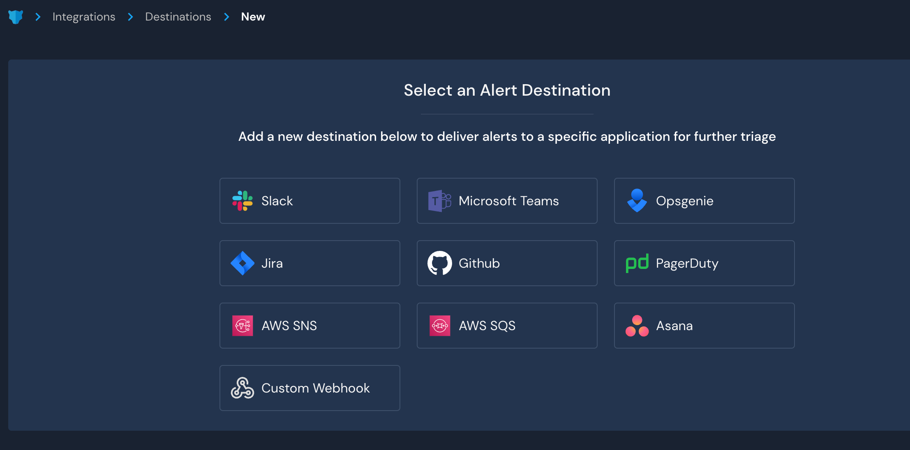

# Destinations

## Overview

Destinations are integrations that receive alerts from rules and policies.

By default, alerts are routed based on severity and can dispatch to multiple destinations simultaneously. For example, a single alert might create a Jira ticket, send an email, and create a PagerDuty Incident.

Destinations can be overridden on a per-rule or per-policy basis by using the detection metadata or overrides.


AWS destinations require IAM configurations to grant permissions for Panther to publish notifications


### Supported Destinations

Panther has supported integrations for the following destinations:&#x20;

* [Amazon SNS](sns.md)
* [Amazon SQS](sqs.md)
* [Asana](asana.md)
* [Custom Webhook](custom\_webhook.md)
  * This destination type is designed to allow Panther to communicate with other third-party integrations, such as Tines, TheHive, or SOCless.
* [Github](https://docs.panther.com/destinations/github)
* [Jira](https://docs.panther.com/destinations/jira)
* [Microsoft Teams](https://docs.panther.com/destinations/microsoft-teams)
* [OpsGenie](https://docs.panther.com/destinations/opsgenie)
* [PagerDuty](https://docs.panther.com/destinations/pagerduty)
* [ServiceNow (via Custom Webhook)](servicenow-destination-custom-webhook.md#overview)
* [Slack](https://docs.panther.com/destinations/slack)

### Routing Order Precedence

Alerts are routed based on the following, from highest precedence to lowest:

1. **Generated Destination List** - Destinations returned by the `destinations` function defined in the Python body.
2. **Static Destination List** - Destinations based on the Destination Override metadata field set for the detection.
3. **Generated Severity** - Destinations associated with the returned `severity` function defined in the Python body.
4. **Static Severity** - Default alert routing based on the severity metadata field set for the detection.

## How to configure Destinations

### Creating a new Destination

1. Log in to your Panther Console.
2. In the left sidebar click **Integrations > Alert Destinations**.
3. Click **+Add your first Destination**.
4. Click on the service provider you want to configure as an Alert Destination.\
   
   * Multiple destinations of the same type may be configured, such as several Slack channels or email addresses. This allows for fine-grained control of destination routing.
5. Add a **Display Name** to distinguish the destination from others in your Panther Console, and optionally select the associated severities for this destination.
   * Each destination type will have specific configuration options based on the system's API. See the destination-specific setup instructions in the following pages for more details.
6. Click **Add Destination** to save the configuration.&#x20;
   * You can optionally click **Send test alert** to verify that your destination was configured correctly.
7. Click **Finish Setup**.

 (3) (5) (6) (1) (1) (3) (1) (1) (3).png>)

You are now ready to receive alerts!

### Modifying or deleting Destinations

1. Log in to the Panther Console.
2. In the left sidebar menu, click **Integrations > Alert Destinations**.&#x20;
3. Click the triple dot icon on the right side of the Destination.
   * In the dropdown menu that appears, click **Delete** to delete the Destination.
   * Click **Edit** to modify the display name, the severity level, and other configurations.&#x20;


## Destination Example

The following example demonstrates how to receive an alert to a Destination based on a user's multiple failed login attempts to Okta.

You have configured the following:&#x20;

* Destinations:&#x20;
  * [Slack](slack.md), configured to receive an alert for rule matches.
  * Tines (set up via [Custom Webhook](custom\_webhook.md)), configured to receive an alert for rule matches.
* Log source:&#x20;
  * Your Panther instance is ingesting [Okta](../data-onboarding/supported-logs/okta.md) logs.
* Detection:&#x20;
  *   You created a rule called “Okta User Locked Out,” to alert you when a user is locked out of Okta due to too many failed login attempts:

      ```
      from panther_base_helpers import deep_get
      def rule(event):
          return deep_get(event, 'outcome', 'reason') == 'LOCKED OUT'

      def title(event):
          return f"{deep_get(event, 'actor', 'alternateId')} is locked out."

      def destinations(event):
          if deep_get(event, 'actor', 'alternateId') == "username@example.com":
              return ['dev-alert-destinations', 'tines-okta-user-lock-out']
          return ['dev-general'] 

      def alert_context(event):
          return {
              "actor": deep_get(event, "actor", "displayName"),
              "id": deep_get(event, "actor", "id")
          }
      ```
  * The `alert_context()` contains the username and the user's Okta ID value.

#### 1. An event occurs

One of your users unsuccessfully attempts to log in to Okta multiple times. Eventually their account is locked out.&#x20;

#### 2. Panther ingests logs and detects an event that matches the rule you configured

As the Okta audit logs stream through your Panther instance, your “Okta User Locked Out” rule detects that a user is locked out. \


#### 3. The rule match triggers an alert

The detected rule match triggers an alert to your Slack destination and to your Tines destination.

Within a few minutes of the event occurring, the alert appears in the Slack channel you configured as a Destination:&#x20;


The alert is also sent to Tines via a Custom Webhook you configured as a Destination. Tines receives the values from the `alert_context()` function, and it is set up to automatically unlock the user's Okta account then send a confirmation message in Slack.


## Destination schema&#x20;

### Workflow automation

The alert payload generally takes the following form. For custom webhooks, SNS, SQS, or other workflow automation-heavy Destinations, this is important for defining how you process the alert.

For native integrations such as Jira or Slack, this is processed automatically into a form that the Destination can understand.

```typescript
{
   "id": string,
   "createdAt": AWSDateTime,
   "severity": string,
   "type": string,
   "link": string,
   "title": string,
   "name": string,
   "alertId": string,
   "description": string,
   "runbook": string,
   "tags": [string],
   "version": string
}
```

The [AWSDateTime](https://docs.aws.amazon.com/appsync/latest/devguide/scalars.html) scalar type represents a valid extended ISO 8601 DateTime string. It accepts datetime strings of the form `YYYY-MM-DDThh:mm:ss.sssZ`. The field after the seconds field is a nanoseconds field. It can accept between 1 and 9 digits. The seconds and nanoseconds fields are optional. The time zone offset is compulsory for this scalar. The time zone offset must either be `Z` (representing the UTC time zone) or be in the format `±hh:mm:ss`. The seconds field in the timezone offset will be considered valid even though it is not part of the ISO 8601 standard.

### Example JSON payload:

```javascript
{
  "id": "AllLogs.IPMonitoring",
  "createdAt": "2020-10-13T03:35:24Z",
  "severity": "INFO",
  "type": "RULE",
  "link": "https://runpanther.io/alerts/b90c19e66e160e194a5b3b94ec27fb7c",
  "title": "New Alert: Suspicious traffic detected from [123.123.123.123]",
  "name": "Monitor Suspicious IPs",
  "alertId": "b90c19e66e160e194a5b3b94ec27fb7c",
  "description": "This rule alerts on any activity outside of our IP address whitelist",
  "runbook": "",
  "tags": [
    "Network Monitoring",
    "Threat Intel"
  ],
  "version": "CJm9PiaXV0q8U0JhoFmE6L21ou7e5Ek0"
}
```

