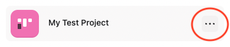
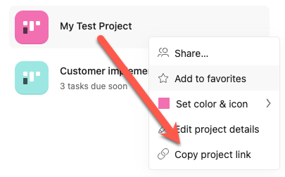
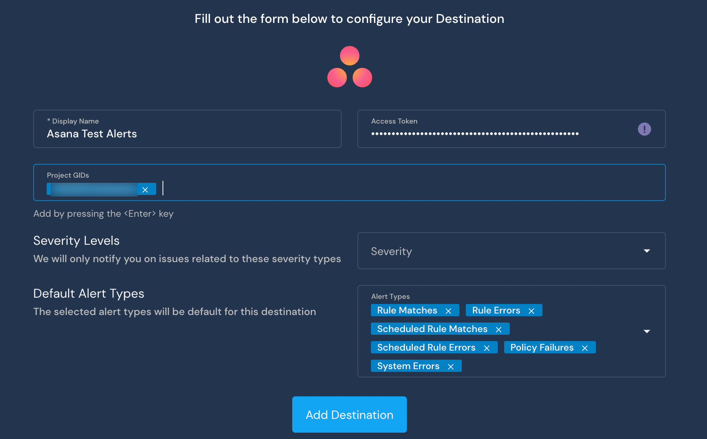

# Asana

This page will walk you through configuring [Asana](https://asana.com) as a destination for your Panther alerts. When an alert is forwarded to an Asana destination, a new task is created in the configured Asana project(s).

The Asana destination requires a **Service Account Token** for Asana Enterprise customers (or a **Personal Access Token** for a basic Asana account)  and one or more **Project GID**.&#x20;

### Asana Prerequisites

1. Determine which Asana user you will use to be the reporter of issues.
   * To ensure continuity, we recommend creating a [service account](https://asana.com/guide/help/premium/service-accounts) specifically for this purpose.
2. Copy your Asana project's **Project GID** and store it a secure location. You will need this in the next steps. \
   To find the Project GID:
   1. In Asana, click **Home** in the left sidebar.
   2. Scroll down to the Projects section. Hover over the project you want to use, then click **…** on the right side of the project name.\
      
   3. In the dropdown menu that appears, click **Copy project link:**\
      
   4. The copied link should look like `https://app.asana.com/0/xxxxxxxxxxxxxxxx/board`. The `Project GID` is the 16-digit number in the URL.
3. Copy your Asana user's **Service Account Token** (or **Access Token** if you are using a basic Asana account) and store it in a secure location. You will need this in the next steps.&#x20;
   * **Asana Enterprise**: When you create or edit an existing Service Account, you can view its token. See [Asana's service account documentation](https://asana.com/guide/help/premium/service-accounts) for more information.
   * **Asana Basic**: Follow [Asana's instructions for getting a Personal Access Token](https://developers.asana.com/docs/authentication-quick-start).

Note: This token should be treated as sensitively as a password, and you will not be able to access it again in the future.

### Setting up the Destination in Panther

1. Log in to your Panther Console and navigate to **Integrations > Alert Destinations**.&#x20;
2. Click **+Add your first Destination**.
   * If you have already created Destinations, click **+** in the upper right side of the page to add a new Destination.
3. Click **Asana** from the list of options.
4.  Fill in the form to configure the Asana Destination.

    * **Display Name**: Enter a descriptive name.
    * **Access Token**: Paste in the Access Token you created for your user in Asana.
    * **Project GIDs**: Paste in your Asana project(s) GID then hit the `Return` key.
    * Adjust the **Severity** and **Default Alert Types**.

    
5. Click **Add Destination**.
6. Click **Finish Setup** to complete your setup, or click **Send Test Alert** to test your setup.
