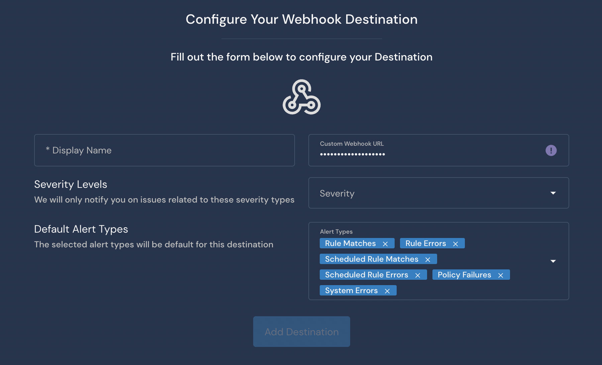

# Custom Webhook Destination

## Overview

Destinations are integrations that receive alerts from rules, policies, system health notifications, and rule errors. Panther supports configuring a Custom Webhook as the destination where you will receive alerts.&#x20;

A Custom Webhook Destination requires only a `URL` to the service which can accept an HTTP `POST` request containing a `JSON` payload. This destination type is designed to allow Panther to communicate with other third-party integrations.

## How to set up a Custom Webhook alert destination in Panther

### Delivery and Ack

The webhook must accept and acknowledge Panther's `POST` request with an HTTP status code in the `2XX` range. If there were any network failures or non `2XX` codes, Panther will attempt to retry the request up to ten (10) times before permanent failure.

The webhook response body will be stored in the delivery status which can be viewed in the Alert Details page.

In the event of a permanent delivery failure, Panther logs and provides workflow continuity by allowing the alert to be manually re-sent by visiting the Alert Details page and viewing the Delivery Status section.

### Set up a custom webhook in Panther

1. Log in to the Panther Console.
2. On the left sidebar click **Integrations > Alert Destinations**.&#x20;
3. Click **Create New**.
4. Click **Custom Webhook**.
5. &#x20;Fill out the form:
   * **Display Name**: Add a friendly name to identify your destination.&#x20;
   * **Custom Webhook URL**: Enter your Custom Webhook forwarding URL.
     * If you followed the ngrok example earlier in this documentation, you would enter the `http` or `https` forwarding URL from the `ngrok` output.
   * **Severity**: Select the severity level of alerts to send to this Destination.
   * **Alert Types**: Select the alert types to send to this Destination.\
     
6. Click **Add Destination**.
7. On the final page, optionally click **Send Test Alert** to test the integration using a test payload. When you are finished, click **Finish Setup**.


### Custom Webhook Alert Schema

A Custom Webhook will deliver an alert with the following schema:

```typescript
{
   "id": string,
   "createdAt": AWSDateTime,
   "severity": string,
   "type": string,
   "link": string,
   "title": string,
   "name": string,
   "alertId": string,
   "description": string,
   "runbook": string,
   "tags": [string],
   "version": string
}
```

The [AWSDateTime](https://docs.aws.amazon.com/appsync/latest/devguide/scalars.html) scalar type represents a valid extended ISO 8601 DateTime string. In other words, this scalar type accepts datetime strings of the form YYYY-MM-DDThh:mm:ss.sssZ. The field after the seconds field is a nanoseconds field. It can accept between 1 and 9 digits. The seconds and nanoseconds fields are optional (the seconds field must be specified if the nanoseconds field is to be used). The time zone offset is compulsory for this scalar. The time zone offset must either be Z (representing the UTC time zone) or be in the format ±hh:mm:ss. The seconds field in the timezone offset will be considered valid even though it is not part of the ISO 8601 standard.

#### Example JSON payload:

```javascript
{
  "id": "AllLogs.IPMonitoring",
  "createdAt": "2020-10-13T03:35:24Z",
  "severity": "INFO",
  "type": "RULE",
  "link": "https://runpanther.io/alerts/b90c19e66e160e194a5b3b94ec27fb7c",
  "title": "New Alert: Suspicious traffic detected from [123.123.123.123]",
  "name": "Monitor Suspicious IPs",
  "alertId": "b90c19e66e160e194a5b3b94ec27fb7c",
  "description": "This rule alerts on any activity outside of our IP address whitelist",
  "runbook": "",
  "tags": [
    "Network Monitoring",
    "Threat Intel"
  ],
  "version": "CJm9PiaXV0q8U0JhoFmE6L21ou7e5Ek0"
}
```

## Custom Webhook example&#x20;

The following example demonstrates sending Panther alerts to a custom webhook which forwards the payload to a simple [Node.js](https://nodejs.org/en/) server proxied via [Ngrok](https://ngrok.com/).

1. Open Command Line.&#x20;
2. Create an ngrok account, install, and and start the service on port `8081`.
3.  Install Node.js and paste the following snippet into `webhook.js`:

    ```javascript
    const http = require('http')
    const util = require('util')
    const port = 8081

    const requestHandler = (req, res) => {

      if (req.method === 'POST') {
        let body = '';
        req.on('data', chunk => {
          body += chunk.toString();
        });
        req.on('end', () => {
          console.log(util.inspect(JSON.parse(body), false, null, true));
          res.statusCode = 200; // Must ack the request
          res.end("success"); // (Optional) response body
        });
      }
    }

    const server = http.createServer(requestHandler)

    server.listen(port, (err) => {
      if (err) {
        return console.log('something bad happened', err)
      }

      console.log(`server is listening on ${port}`)
    })
    ```
4.  Open another terminal and start the Node.js server:

    ```bash
    > node webhook.js
    server is listening on 8081
    ```

## Additional Information on Destinations

For more information on alert routing order, modifying or deleting destinations, and workflow automation, please see the Panther docs: [Destinations](https://docs.panther.com/destinations).
