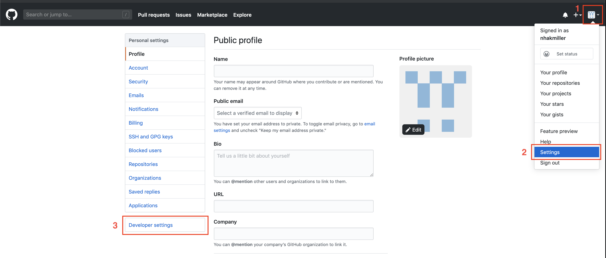
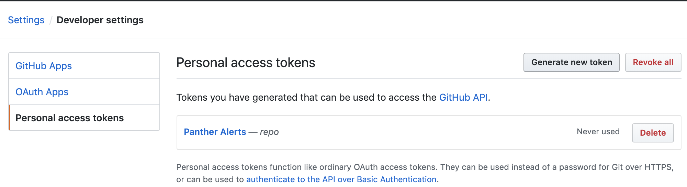
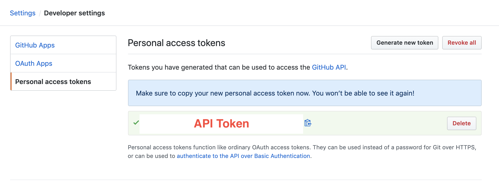
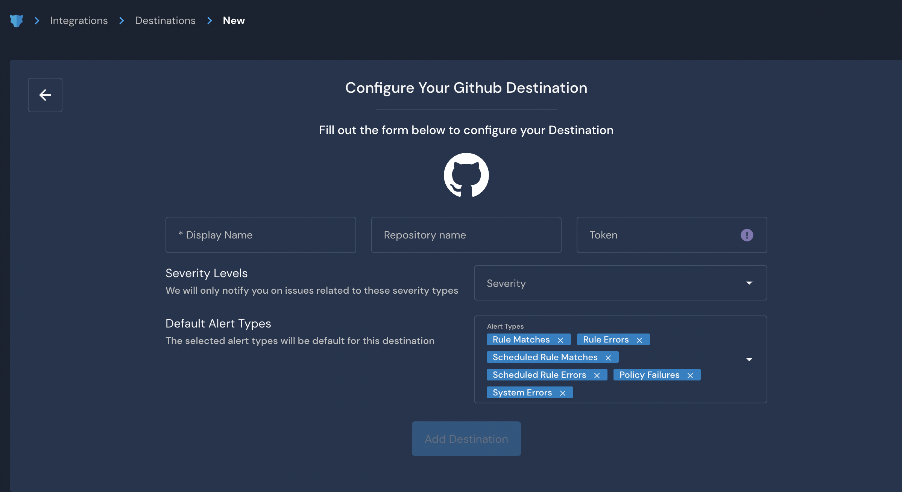

# GitHub

## Overview

Destinations are integrations that receive alerts from rules, policies, system health notifications, and rule errors. Panther supports configuring Github as the destination where you will receive alerts.

The GitHub Destination requires a `Repository name` and an API `Token`.

When an alert is forwarded to a GitHub Destination, it creates an Issue in the repository. The repository must have Issues enabled.

The integration is most useful when infrastructure is defined in code such as with AWS CloudFormation or with Terraform.

## How to set up Github alert destinations in Panther

### Prerequisites

We recommend creating a dedicated Panther Alerts service account in Github.

### Generating an API Token in Github

Follow GitHub's documentation on [generating a Personal Access Token](https://docs.github.com/en/authentication/keeping-your-account-and-data-secure/creating-a-personal-access-token).&#x20;

1. Log in to your Github account using your service account (or any developer service account that has access to the repo)
2. Navigate to **Settings > Developer settings**:\
   
3. On the Developer Settings page, Click **Personal access tokens** on the left. Click **Generate new token**.\
   
4. Fill out the form to configure your token. Select the `repo` permissions checkbox.&#x20;
   * Note: GitHub does not support granular permissions for creating Issues. If this level of access is a concern, consider [creating a dedicated Issue tracking repository](https://docs.github.com/en/repositories/creating-and-managing-repositories/creating-an-issues-only-repository).
5. Click **Generate Token**. Copy the token and store it in a secure location, as you will need it in the next steps.
   * Note: GitHub does not allow you to view the token again. If you lose access to this token, you will need to generate a new one.\
     

### Configure the Github Destination in Panther

1. Log in to the Panther Console.
2. In the left sidebar, click **Integrations > Destinations**. Click **Create New** in the upper right.
3. Click **Github**.
4. Fill out the form to configure the Destination:
   * **Display Name**: Enter a descriptive name.
   * **Repository Name**: Enter the Github repository name. This will be in the format `owner/repo_name`.
   * **Token**: Enter the token you generated in Github during the previous steps of this documentation.
   * **Severity**: Select the severity level of alerts to send to this Destination.
   * **Alert Types**: Select the alert types to send to this Destination.\
     
5. Click **Add Destination**.
6. On the final page, optionally click **Send Test Alert** to test the integration. When you are finished, click **Finish Setup**.

## Additional Information on Destinations

For more information on alert routing order, modifying or deleting destinations, and workflow automation, please see the Panther docs: [Destinations](https://docs.panther.com/destinations).
