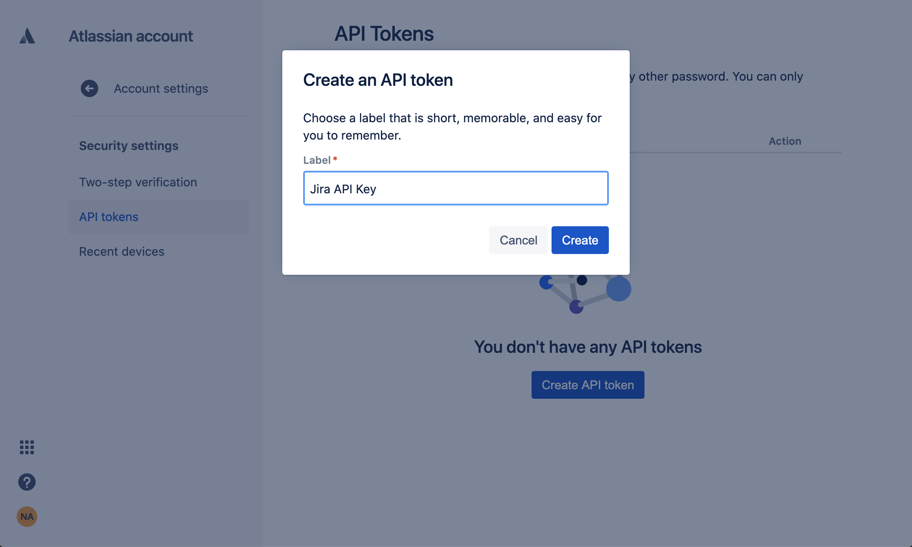

# Jira

## Overview

Destinations are integrations that receive alerts from rules, policies, system health notifications, and rule errors. Panther supports configuring Jira as the destination where you will receive alerts.

When an alert is forwarded to a Jira Destination, a bug, story, or task is created and assigned to the specified assignee in the specified project.

## How to set up Jira alert destinations in Panther

### Creating a Jira API key

1. Log in to your Atlassian account and navigate to the [API Token management page](https://id.atlassian.com/manage/api-tokens).&#x20;
2. Click **Create API Token**, add a descriptive label, and click **Create**:\
   
3. Click **Copy** and store the token in a secure location.
   * Note: The token is sensitive information and you will not be able to view the token again.

### Configuring the Jira alert destination in Panther

1. Log in to the Panther Console.
2. On the left sidebar, click **Integrations > Alert Destinations**.
3. Click **Create New**.
4. Click **Jira**.
5. Fill out the form:
   * **Display Name**: Enter a descriptive name.
   * **Organization Domain**: Enter your organization's Jira domain.&#x20;
     * For example: https://example.atlassian.net.
   * **Project Key**: Enter the project identifier within your organization. You can find this in Jira in your project settings page or by browsing [your organizations' Jira projects](https://example.atlassian.net/projects) and locating the `key` column.
   * **Email**: Enter the email address of the Jira user who has permissions to create the new issues with the corresponding Jira API Key.
   * **Jira API Key**: Enter the API token you generated in the earlier steps of this documentation.
   * **Issue Type**: Enter the Issue type from Jira. This can be Bug, Story, Task, or any custom type.
   * **Assignee ID**: Enter the unique ID of the user or group that the Issue will be assigned to.
     * To find the ID, go to a user or group's public Jira profile and locate the trailing string from the URL of their profile. Example: If a user's profile URL is `https://example.atlassian.net/jira/people/5f8f26dabd12345678910abcd`, their ID is `5f8f26dabd12345678910abcd`.
   * **Labels**: Enter the associated Jira labels.
   * **Severity**: Select the severity level of alerts to send to this Destination.
   * **Alert Types**: Select the alert types to send to this Destination.
6. Click **Add Destination**.
7. On the final page, optionally click **Send Test Alert** to test the integration using a test payload. When you are finished, click **Finish Setup**.

## Additional Information on Destinations

For more information on alert routing order, modifying or deleting destinations, and workflow automation, please see the Panther docs: [Destinations](https://docs.panther.com/destinations).
