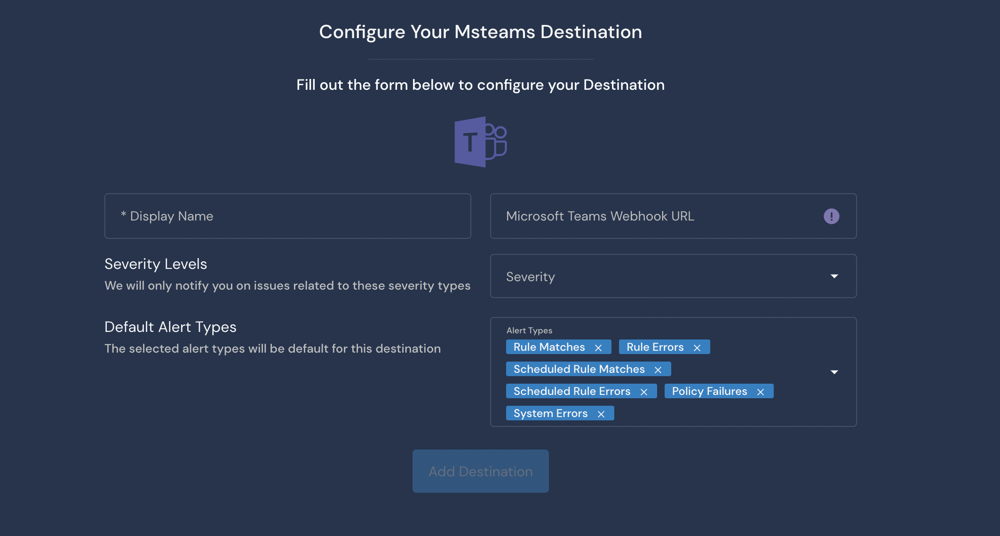

# Microsoft Teams Destination

## Overview

Destinations are integrations that receive alerts from rules, policies, system health notifications, and rule errors. Panther supports configuring Microsoft Teams as the destination where you will receive alerts.

The MS Teams Destination requires a `Microsoft Teams Webhook URL`. When an alert is forwarded to an MS Teams Destination, it sends a message to the specified Webhook URL.

## How to set up Microsoft Teams alert destinations in Panther

### Configure the Webhook URL in Microsoft Teams

The Microsoft Teams Destination is configured via a custom connector with a Webhook URL. First, ensure that your team has the option to add Incoming Webhooks as a connector.&#x20;

1. Log in to your Microsoft Teams application.
2. Navigate to **Apps**. Click **Connectors**, then click **Incoming Webhook**.\
    (7) (1) (1) (11) (1) (1) (15).png>)
3. Click **Add to a team**.&#x20;
4. Select a team to add the Incoming Webhook connector to, then click **Setup a connector**.\
    (7) (1) (1) (1) (11) (1) (1) (16).png>)
5. Click **Configure** next to Incoming Webhook. Configure the name, description, and settings.\
    (6) (1) (1) (11) (1) (1) (16).png>)
6. Enter a name for the Incoming Webhook integration, and optionally upload an image. Click **Create**.\
    (5) (1) (1) (11) (1) (1) (16).png>)
7. On the next page, a Webhook URL is displayed on the screen. Copy the URL and store it in a secure location, as you will need it in the next steps.
8. Click **Done**.

### Configure the Microsoft Teams alert destination in Panther

1. Log in to the Panther Console.
2. In the left sidebar, click **Integrations > Destinations**. Click **Create New** in the upper right.
3. Click **Microsoft Teams**.
4. Fill out the form to configure the Destination:
   * **Display Name**: Enter a descriptive name.
   * **Webhook URL**: Enter the Microsoft Teams Webhook URL that you generated in the previous steps of this documentation.
   * **Severity**: Select the severity level of alerts to send to this Destination.
   * **Alert Types**: Select the alert types to send to this Destination.\
     
5. Click **Add Destination**.
6. On the final page, optionally click **Send Test Alert** to test the integration. When you are finished, click **Finish Setup**.

## Additional Information on Destinations

For more information on alert routing order, modifying or deleting destinations, and workflow automation, please see the Panther docs: [Destinations](https://docs.panther.com/destinations).
