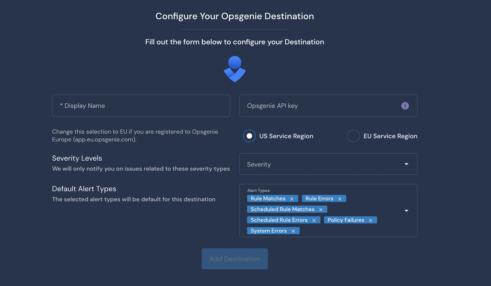

# OpsGenie Destination

## Overview

Destinations are integrations that receive alerts from rules, policies, system health notifications, and rule errors. Panther supports configuring OpsGenie as the destination where you will receive alerts.

The OpsGenie Destination requires an `Opsgenie API key`. When an alert is forwarded to an OpsGenie Destination, it creates an incident using the specified API key.

## How to set up OpsGenie alert destinations in Panther

### Configure the integration in OpsGenie

1. Log in to your OpsGenie dashboard. Navigate to the **Teams** tab and select the team to receive alerts.
2. Click Integrations on the left, then click **Add integration**.\
    (1) (1) (1) (11) (1) (1) (15).png>)
3. In the Integrations list, click **API**.\
    (1) (1) (1) (11) (1) (1) (16).png>)
4. Configure the name, settings, and permissions for the integration. Check the boxes next to the **Enabled** and **Create and Update Access** permissions.\
    (1) (1) (11) (1) (1) (13).png>)
5. Copy the API Key from the configuration settings and store it in a secure location. You will need this in the next steps.
6. Click **Save Integration**.

### Configure the OpsGenie alert destination in Panther

1. Log in to the Panther Console.
2. In the left sidebar, click **Integrations > Destinations**. Click **Create New** in the upper right.
3. Click **OpsGenie**.
4. Fill out the form to configure the Destination:
   * **Display Name**: Enter a descriptive name.
   * **API Key**: Enter the OpsGenie API Key you generated in previous steps of this documentation.
   * **Region**: Select your region based on where your OpsGenie account is registered.
   * **Severity**: Select the severity level of alerts to send to this Destination.
   * **Alert Types**: Select the alert types to send to this Destination.\
     
5. Click **Add Destination**.
6. On the final page, optionally click **Send Test Alert** to test the integration. When you are finished, click **Finish Setup**.

## Additional Information on Destinations

For more information on alert routing order, modifying or deleting destinations, and workflow automation, please see the Panther docs: [Destinations](https://docs.panther.com/destinations).
