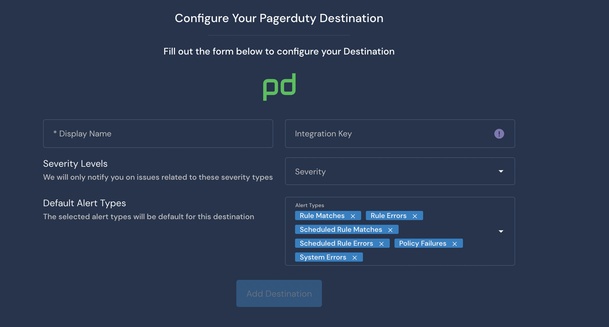

# PagerDuty Destination

Destinations are integrations that receive alerts from rules, policies, system health notifications, and rule errors. Panther supports configuring PagerDuty as the destination where you will receive alerts.

[PagerDuty](https://www.pagerduty.com/) is a service to manage on-call rotations for critical systems. You can use the PagerDuty alert destination to page an on-call team. We typically only recommend this Destination for `High` and `Critical` severity issues that need to be addressed immediately.

## How to set up PagerDuty alert destinations in Panther

### Configure the integration in PagerDuty

1. Log in to your PagerDuty account.
2. Navigate to the Service Directory configuration page then click **+New Service**.\
    (1) (1) (11) (1) (1) (1) (13).png>)
3. Fill out the form on the service configuration page.
   * For Integration Type, choose **Use our API directly**.\
      (1) (1) (11) (1) (1) (1) (13).png>)
4. You will be redirected to the Integrations page for that service. On this page, copy out the Integration Key and store it in a secure location. You will need this in the next steps.\
    (1) (1) (11) (1) (1) (1) (13).png>)

### Configure the PagerDuty alert destination in Panther

1. Log in to the Panther Console.
2. In the left sidebar, click **Integrations > Destinations**. Click **Create New** in the upper right.
3. Click **PagerDuty**.
4. Fill out the form to configure the Destination:
   * **Display Name**: Enter a descriptive name.
   * **Integration Key**: Enter the PagerDuty Integration Key you generated in the earlier steps of this documentation.
   * **Severity**: Select the severity level of alerts to send to this Destination.
   * **Alert Types**: Select the alert types to send to this Destination.\
     
5. Click **Add Destination**.
6. On the final page, optionally click **Send Test Alert** to test the integration. When you are finished, click **Finish Setup**.

## Additional Information on Destinations

For more information on alert routing order, modifying or deleting destinations, and workflow automation, please see the Panther docs: [Destinations](https://docs.panther.com/destinations).
