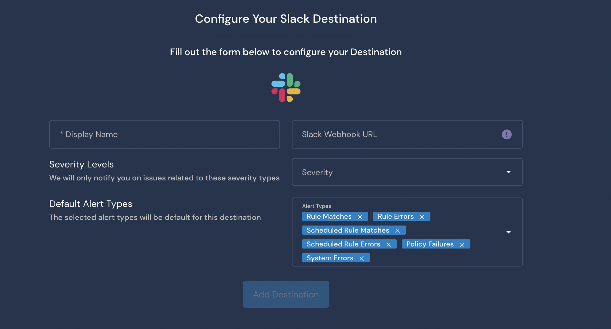

# Slack Destination

## Overview

Destinations are integrations that receive alerts from rules, policies, system health notifications, and rule errors. Panther supports configuring Slack as the destination where you will receive alerts.

## How to set up Slack alert destinations in Panther

### Configuring the integration in Slack

1. Log in to your [Slack Workspace](https://api.slack.com/) as an administrator.
2. Navigate to [Your Slack Apps](https://api.slack.com/apps), and click Create New App.
   * Enter an App Name and choose your Development Slack Workspace.\
      (7) (1) (1) (1) (11) (1) (1) (1) (10) (16).png>)
3. Click **Create App**.
4. Authorize access to your new app and enable it for the appropriate channel.\
    (7) (1) (1) (1) (11) (1) (1) (1) (10) (17).png>)
5. Click **Incoming Webhooks**. Next to **Activate Incoming Webhooks,** switch the toggle to **On.**\
   **** (6) (1) (1) (1) (11) (1) (1) (1) (10) (17).png>)****
6. Scroll down and click **Add New Webhook to Workspace**.
7. On the next page, a **Webhook URL** is displayed. Copy the Webhook URL and store it in a secure location, as you will need it in the next steps.

To verify that your integration was configured successfully, check for a message in the connected Slack channel indicating the integration was added.

### Configure the Slack alert destination in Panther

1. Log in to the Panther Console.
2. In the left sidebar, click **Integrations > Destinations**. Click **Create New** in the upper right.
3. Click **Slack**.
4. Fill out the form to configure the Destination:
   * **Display Name**: Enter a descriptive name.
   * **Webhook URL**: Enter the Webhook URL you generated in the previous steps of this documentation.
   * **Severity**: Select the severity level of alerts to send to this Destination.
   * **Alert Types**: Select the alert types to send to this Destination.\
     
5. Click **Add Destination**.
6. On the final page, optionally click **Send Test Alert** to test the integration. When you are finished, click **Finish Setup**.

## Additional Information on Destinations

For more information on alert routing order, modifying or deleting destinations, and workflow automation, please see the Panther docs: [Destinations](https://docs.panther.com/destinations).
