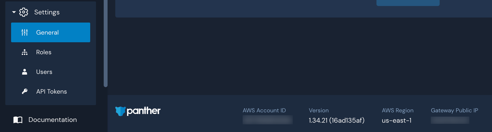

# Amazon SNS Destination

## Overview

Destinations are integrations that receive alerts from rules, policies, system health notifications, and rule errors. Panther supports configuring [Amazon Simple Notification Service (SNS)](https://aws.amazon.com/sns/) as the destination where you will receive alerts.

## How to set up Amazon SNS alert destinations in Panther

### SNS Prerequisites

The SNS Destination requires a `Topic ARN`. When an alert is forwarded to an SNS Destination, it publishes a JSON string to that topic.

1. In the AWS [SNS console](https://us-west-2.console.aws.amazon.com/sns/v3/home#/topics), create a new Topic or navigate to the topic you wish to add as a destination. We will be editing its permissions so Panther can publish messages to it:\
   &#x20; (1) (1) (1) (11) (1) (1) (10) (16).png>)
2. After selecting the SNS topic, click **Edit** then scroll down and expand the "Access policy" section: \
    (1) (1) (1) (11) (1) (1) (10) (15).png>)
3.  After expanding the "Access policy" section, add the following statement to the **Statement** block. Be sure to replace the `Resource` field with the ARN of your own SNS Topic, and the `Principal` field with the AWS account ID where Panther is deployed.

    ```
        {
          "Sid": "AllowPantherAlarming",
          "Effect": "Allow",
          "Principal": {
            "AWS": "arn:aws:iam::<YOUR-PANTHER-ACCOUNT-ID>:root"
          },
          "Action": "sns:Publish",
          "Resource": "arn:aws:sns:us-west-2:<YOUR-PANTHER-ACCOUNT-ID>:<YOUR-TOPIC-NAME>"
        }

    ```

    * To find your AWS account ID, go to **Settings > General** in the Panther Console. It is located in the footer:\
      &#x20;

### Configure the Destination in Panther

1. Log in to the Panther Console and navigate to **Integrations > Alert Destinations**.
2. Click **Create New** and select **AWS SNS**.
3. Fill out the required fields, including the `Topic ARN` from the SNS [Prerequisites](sns.md#sns-prerequisites) section.\
   &#x20;
4. Click **Add Destination.**&#x20;
5. On the next screen, click **Finish Setup** to complete your setup, or click **Send Test Alert** to test your setup.&#x20;
   * Your SNS Topic will now be able to receive Panther alerts. If your goal is to set up email notifications with this topic, continue below.

### Optional: Creating Email Notifications

1. In the AWS SNS console, click **Create Subscription** on the topic you just created. The topic ARN should match the topic you created.\
   &#x20; (1) (1) (1) (1).png>)
2. Select **Email** in the protocol dropdown menu and enter the email address you would like to receive alerts to.
3. Click **Create subscription**
4. Confirm the subscription sent to your email before receiving alerts from this topic.\


## Additional Information on Destinations

For more information on alert routing order, modifying or deleting destinations, and workflow automation, please see the Panther docs: [Destinations](https://docs.panther.com/destinations).
