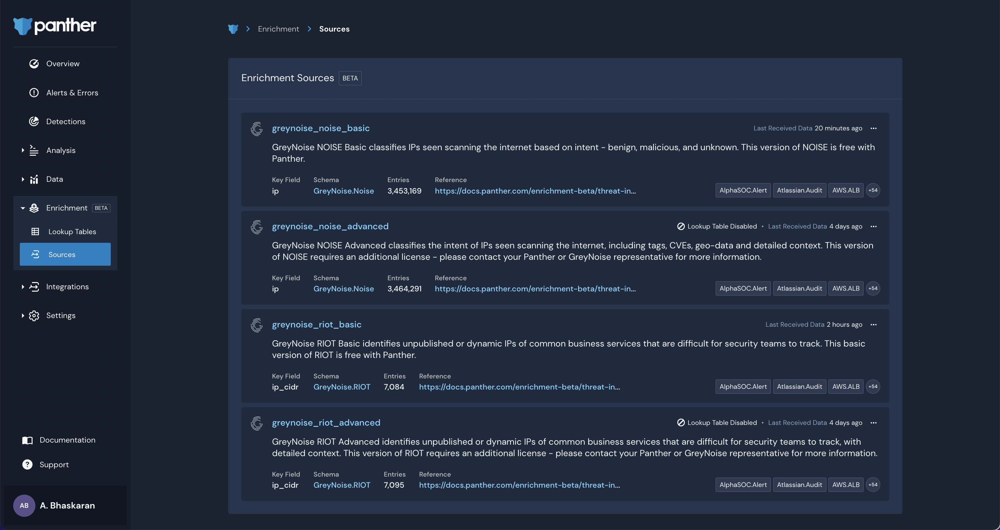
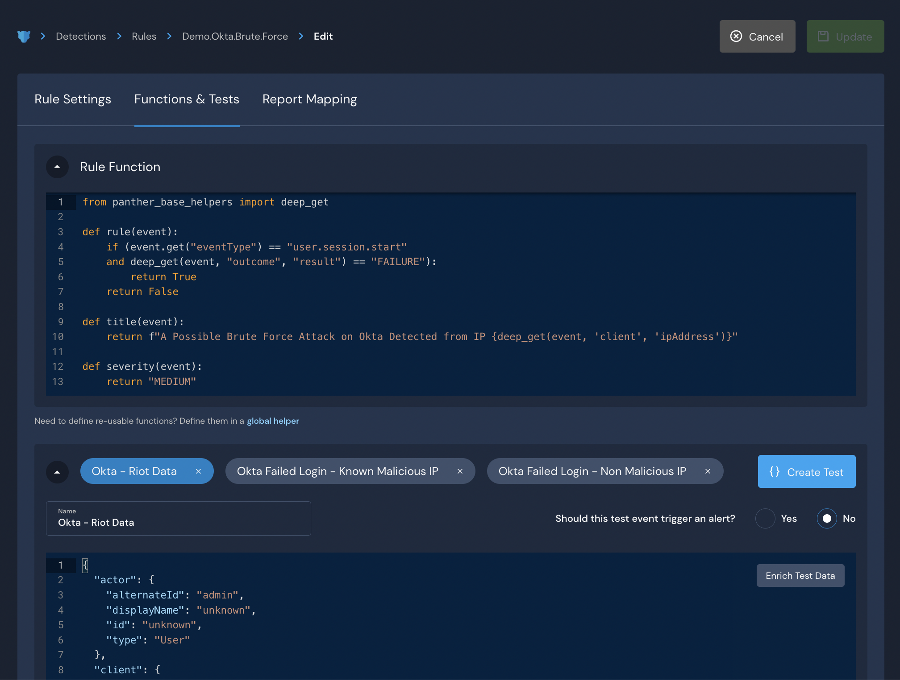

# How to Use GreyNoise to Enhance Detections

### Enable GreyNoise Data Sets

GreyNoise data sets are stored as Panther-managed Lookup Tables in bulk. The Basic GreyNoise data sets are available to all Panther accounts and are disabled by default.&#x20;

If you are using a CI/CD workflow, please see [the CI/CD Users section below](how-to-use-greynoise-to-enhance-detections.md#ci-cd-users) to learn about additional considerations.


To enable Analyst roles to view and manage GreyNoise packages in the Panther Console, they will need to be assigned the **View Lookups** and **Manage Lookups** permissions.


To enable GreyNoise data sets:

1. Log in to your Panther Console.
2. From the left sidebar menu, click **Analysis > Packs**.
   * On this page, you can see built-in packs available for both [GreyNoise Basic and GreyNoise Advanced](basic-vs.-advanced.md). Packs are disabled by default, so to use GreyNoise data you will need to enable them first.\
      (1).png>)
3. On the right side of the tile labeled `GreyNoise Basic`, click the toggle to enable the pack.&#x20;
4. Click **Continue** in the dialog that appears.\
    (1) (1) (1).png>)
   * If you'd like to make additional changes through CI/CD with the [panther\_analysis\_tool](../../writing-detections/panther-analysis-tool.md), please contact your Panther representative for more information.
5. To verify if the GreyNoise data sets are enabled, from the left sidebar menu, click **Enrichment > Sources.**
   * On this page, you can see Panther-managed enrichment sources (such as GreyNoise). You can also see whether the sources are currently enabled or disabled and when a source’s data was last refreshed.&#x20;
   * In the screen shot below, you can see the four source tables provided by GreyNoise and the time they were last refreshed. Disabled data sets will not be refreshed.\
     


GreyNoise data (both Basic and Advanced) is **not** available to view or query in the Data Explorer. The "View in Data Explorer" option is hidden for GreyNoise tables, but may be shown for other Panther managed lookup sources.


### CI/CD Users

Please note the following considerations:

* CI/CD users do not need to use Detection Packs to get GreyNoise Lookup Tables. You can pull in the latest release of `panther-analysis` and use the `panther_analysis_tool` (PAT) to upload the GreyNoise Lookup Tables.
* It is possible for CI/CD users to enable GreyNoise Lookup Tables via Detection Packs, as long as you do not customize the GreyNoise tables using PAT.
  * If you choose to manage GreyNoise through PAT after enabling it in the Panther Console, you must first disable the Detection Packs in the Panther Console. Simultaneous use of both the Panther Console and PAT to manage GreyNoise is not supported.
* For more information on how to manage GreyNoise Lookup Tables, please see the [GreyNoise files in Panther's Github repository](https://github.com/panther-labs/panther-analysis/tree/master/lookup\_tables/greynoise).&#x20;

### Example: Modify an Alert's severity based on GreyNoise classification

In this example, we will modify a pre-built rule in your Panther Console called `Brute Force By IP` to detect issues specifically in Okta and to incorporate GreyNoise.&#x20;

For this rule, we're going to modify the alert’s severity depending on whether GreyNoise reports that the IP is malicious or benign. We're also going to add a function to display the GreyNoise alert context in the alert destination, if the context is available.&#x20;

**Prerequisite**:\
In this example, the rule has already been modified to detect _Brute Force By IP_ specifically for Okta.

1. In the Panther Console, click **Detections** in the left sidebar menu.
2. Click the `Okta Brute Force By IP` detection.
3. Click **Edit Rule**, then click the **Functions & Tests** tab.\
   
4.  In the Rule Function section, add the following Python command to import Panther GreyNoise helpers:

    ```python
    from panther_greynoise_helpers import GetGreyNoiseObject
    ```
5.  Modify the Rule Function to retrieve the GreyNoise data and create a GreyNoise noise object:

    ```python
    def rule(event):
        global noise
        noise = GetGreyNoiseObject(event)
        if (event.get("eventType") == "user.session.start" and deep_get(event, "outcome", "result") == "FAILURE"):
            return True
        return False
    ```
6.  At the bottom of the field, replace the `severity(event)` function with the following code:&#x20;

    ```python
     def severity(event):   
        if noise.classification("client.ipAddress") == "malicious":
            return "CRITICAL"
        if noise.classification("client.ipAddress") == "benign":
            return "LOW"
        return "MEDIUM"
    ```

    * This modification will determine severity based on whether GreyNoise reports that the IP is malicious or benign. In this example, if GreyNoise indicates that the IP is malicious, the alert will be assigned critical severity. If GreyNoise indicates that the IP is benign, the alert will be assigned low severity. If the IP is not classified as malicious or benign, the alert will be assigned medium severity.
7.  Below that, add the following code to provide the contextual `noise.actor`, `noise.classification`, and `noise.ip_address` GreyNoise information in the delivered alert:

    ```python
      def alert_context(event): 
        context ={"message": "No GreyNoise Data Available"}
        if noise.classification:
            context = {
                "actor": noise.actor("client.ipAddress"),
                "classification": noise.classification("client.ipAddress"),
                "ip": noise.ip_address("client.ipAddress"),
                }
        return context
    ```
8. Optionally [run tests](https://docs.panther.com/writing-detections/testing) to ensure that your detection is working as expected, then click **Update** in the upper right side of the page.


#### Rule Function Before and After

Here is the starting content of the Rule Function:

```python
from panther_base_helpers import deep_get

def rule(event):
    if (event.get("eventType") == "user.session.start"
    and deep_get(event, "outcome", "result") == "FAILURE"):
        return True
    return False

def title(event):
    return f"A Possible Brute Force Attack on Okta Detected from IP {deep_get(event, 'client', 'ipAddress')}"

def severity(event):
    return "MEDIUM"
```

Here is the content of the Rule Function after modifying it to use GreyNoise data for enrichment:

```python
from panther_base_helpers import deep_get
from panther_greynoise_helpers import GetGreyNoiseObject

def rule(event):
    global noise
    noise = GetGreyNoiseObject(event)
    if (event.get("eventType") == "user.session.start" and deep_get(event, "outcome", "result") == "FAILURE"):
        return True
    return False

def title(event):
    return f"A Possible Brute Force Attack on Okta Detected from IP {deep_get(event, 'client', 'ipAddress')}"

def severity(event):
    if noise.classification("client.ipAddress") == "malicious":
        return "CRITICAL"
    if noise.classification("client.ipAddress") == "benign":
        return "LOW"
    return "MEDIUM"

def alert_context(event):
    context ={"message": "No GreyNoise Data Available"}
    if noise.classification:
        context = {
            "actor": noise.actor("client.ipAddress"),
            "classification": noise.classification("client.ipAddress"),
            "ip": noise.ip_address("client.ipAddress"),
        }
    return context
```

This example only uses information from the basic GreyNoise package. With the [advanced package](basic-vs.-advanced.md) enabled, you can also access GreyNoise Tag information, Geo IP Metadata, and flags for VPN and Tor indicators.

### Example: Suppress an alert if IP is in GreyNoise RIOT

This example uses the same detection from the previous section. We will modify it to not raise an alert at all if the IP detected is in GreyNoise’s RIOT data set.

1. In the Panther Console, click **Detections** in the left sidebar menu.
2. Click the `Okta Brute Force By IP` detection.
3. Click **Edit Rule**, then click the **Functions & Tests** tab.
4.  In the Rule Function section, add the following Python command to import Panther GreyNoise helpers and include GreyNoise RIOT objects:

    ```python
    from panther_greynoise_helpers import GetGreyNoiseObject, GetGreyNoiseRiotObject
    ```
5.  In the rule syntax, add the following code to pull from the GreyNoise RIOT data set and modify the alert based on that data:&#x20;

    ```
      def rule(event): 
        global noise
        noise = GetGreyNoiseObject(event)
        riot = GetGreyNoiseRiotObject(event)
        
        if riot.is_riot:
            return False
        if (event.get("eventType") == "user.session.start" 
        and deep_get(event, "outcome", "result") == "FAILURE"):
            return True
        return False
    ```

    * &#x20;Using this code, if GreyNoise indicates that the IP is in the RIOT data set and therefore used by a common business service that is unlikely to be an attack vector, then it will not deliver an alert at all.
6. Optionally [run tests](https://docs.panther.com/writing-detections/testing) to ensure that your detection is working as expected, then click **Update** in the upper right side of the page.

With the [advanced GreyNoise lookup tables](basic-vs.-advanced.md), you can also build these rules based on additional enrichment provided, such as the Trust Level of the IP.
