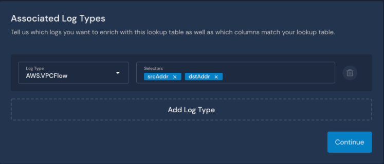

# Lookup Tables (Beta)


This feature is available in version 1.27 and newer.

Lookup Tables are currently in public Beta. Please share any bug reports and feature requests with your account team.


## Overview

Lookup Tables allow you to add important context to your detections and alerts for improved investigation workflows. Use Lookup Tables to enhance alerts with identity/asset information, vulnerability context, network maps, and more. You can associate one or more log types with your Lookup Table, and then all logs of those log types will contain enrichment data from your Lookup Table.

Consider using [Global helpers](https://docs.panther.com/writing-detections/globals) instead when extra information is only needed for a few specific detections and will not be frequently updated.

### How Lookup Tables work


Lookup Tables are associated with one or more log types, connected by foreign key fields called Selectors. Once you [configure a Lookup Table](./#configuring-a-lookup-table), the real-time detection engine will attempt to find a lookup match for incoming data of the associated log types. If there is a match, then the event associated with the alert will contain a `p_enrichment` field with:

* One or more Lookup Table name(s) that matched the incoming log event
* The name of the selector from the incoming log that matched the Lookup Table
* The data from the Lookup Table that matched via the Lookup Table's primary key

## How to configure a Lookup Table

### Prerequisites for configuring a Lookup Table

* A schema specifically for your Lookup Table data.&#x20;
  * This describes the shape of your Lookup Table data.
* Selector(s) from your incoming logs.&#x20;
  * The values from these selectors will be used to search for matches in your Lookup Table data.
* A primary key for your Lookup Table data.&#x20;
  * This primary key is one of the fields that you defined in your schema for your Lookup Table. The value of the primary key is what will be compared with the value of the selector(s) from your incoming logs.

You can populate your Lookup Table data using the following methods:

### Import via File Upload

This option is best for data that is relatively static, such as information about AWS accounts or corporate subnets.&#x20;

For instructions, please see the documentation: [Import via File Upload](file-upload.md).

### Sync Data from an S3 Source

This option is best for a larger amount of data that updates more frequently from an S3 bucket. Any changes in the S3 bucket will sync to Panther.

For instructions, please see the documentation: [Sync data from an S3 Source](s3-source.md).

## Using Data Explorer with Lookup Tables

### Query via Data Explorer

`p_enrichment` is not stored in the Data Lake, but you can join against the Lookup Table directly to any table in the Data Explorer with a query similar to the following:&#x20;

```
with logs as 
(select * from my_logs), 
lookup as (select * from my_lookup_table) 
select logs.fieldA, lookup.fieldB 
from logs join lookup on logs.selector_field = lookup.key_field
```

### View the Lookup Table data with Data Explorer

1. In your Panther Console, navigate to **Enrichment > Lookup Tables** to view your Lookup Tables list.
2. Click **...** in the upper right corner of the Lookup Table you wish to view, then click **View In Data Explorer**.\
   

For more information on using Data Explorer, please see the documentation: [Data Explorer](https://docs.runpanther.io/data-analytics/data-explorer).

## Write a detection using Lookup Table data

After you configure a Lookup Table, you can write detections based on the additional context from your Lookup Table.&#x20;

For example, if you configured a Lookup Table to distinguish between developer and production accounts in AWS CloudTrail logs, you might want receive an alert only if the following circumstances are **both** true:

* A user logged in who did not have MFA enabled.
* The AWS account is a production (not a developer) account.&#x20;

You can use the [deep\_get helper function](../../writing-detections/globals.md#deep\_get) to retrieve the looked up field from `p_enrichment` using the foreign key field in the log. The pattern looks like this:

```python
deep_get(event, 'p_enrichment', <Lookup Table name>, <foreign key in log>, <field in Lookup Table>)
```


The Lookup Table name, foreign key and field name are all optional parameters. If not specified, `deep_get` will return a hierarchical dictionary with all the enrichment data available. Specifying the parameters will ensure that only the data you care about is returned.


See an example of a Python rule to detect this:

```python
 from panther_base_helpers import deep_get
 def rule(event):
   is_production = deep_get(event, 'p_enrichment', 'account_metadata',
'recipientAccountId', 'isProduction')
   return not event.get('mfaEnabled') and is_production
```

The Panther rules engine will take the looked up matches and append that data to the event using the key `p_enrichment` in the following JSON structure:

```json
{ 
    'p_enrichment': {
        <name of lookup table>: { 
            <key in log that matched>: <matching row looked up>,
            ...
	    <key in log that matched>: <matching row looked up>,
	}    }
} 
```

Example:

```json
 {
  "p_enrichment": {
      "account_metadata": {
          "recipientAccountId": {
              "accountID": "90123456", 
              "isProduction": false, 
              "email": "dev.account@example.com"
              }
          }
      }
}

```

### Detection Testing

For rules that use `p_enrichment`, click **Enrich Test Data** in the upper right side of the JSON code editor to populate it with your Lookup Table data. This allows you to test a Python function with an event that contains `p_enrichment.`

.png>)

## Lookup Table Examples

### Example for translating 1Password UUIDs into human readable names

Please see our guide about using Lookup Tables to translate 1Password's Universally Unique Identifier (UUID) values into human readable names: [Using Lookup Tables: 1Password UUIDs](https://docs.runpanther.io/guides/using-lookup-tables-1password-uuids).

### Example using CIDR matching

**Example scenario:** Let's say you want to write detections that consider the traffic logs from company IP space (e.g. VPNs and hosted systems) differently from others logs originating from public IP space. You have a list of your company's allowed CIDR blocks listed in a `.csv` file (e.g. `4.5.0.0/16`):

.png>)

#### Set up a Lookup Table with the CIDR list

1. Follow the steps above under "Set up a Lookup Table" to add a new Lookup Table and configure its basic information.&#x20;
   * The name of the Lookup Table in this example is `Company CIDR Blocks`.
2. On the Associated Log Types page, choose the Log Type and Selectors.&#x20;
   * For this example, we used `AWS.VPCFlow` logs and associated the source IP (`srcAddr`) and destination (`dstAddr`) keys.\
     
3. &#x20;Associate a schema for your Lookup Table: Select an existing one from your list or [create a new schema](https://docs.runpanther.io/data-onboarding/custom-log-types#generating-a-schema-for-a-custom-log-type-from-sample-logs).
   *   **Note:** The primary key column which will hold the CIDR blocks needs to have a `CIDR` validation applied in the schema to indicate that this lookup table will do CIDR block matching on IP addresses. [See our log schema reference](https://docs.runpanther.io/data-onboarding/custom-log-types/reference#validation-by-string-type).

       ```
       # Will allow valid ip6 CIDR ranges
       # e.g. 2001:0db8:85a3:0000:0000:0000:0000:0000/64
       - name: address
         type: string
         validate:
           cidr: "ipv6" 
           
       # Will allow valid ipv4 IP addresses e.g. 100.100.100.100/00
       - name: address
         type: string
         validate:
           cidr: "ipv4"  
       ```
4. Drag & drop a file or click **Select File** to choose the file of your CIDR block list to import. The file must be in `.csv` or `.jsonl` format. The maximum file size supported is 5MB.&#x20;
5. After you successfully import a file, click **View in Data Explorer** to **** query that table data or click **Finish Setup** to go back to a list of your custom Lookup Tables.


#### Write a detection

You might like to receive an alert if any VPC traffic comes from a source IP address that is not part of your company's allowed CIDR blocks. Here is an example of Python rule that will send an alert in this case:

```python
def rule(event):
  if event.get('flowDirection') == 'egress': # we care about inbound
        return False
  if event.get('action') == 'REJECT': # we don't care about these either
        return False
  if deep_get(event, 'p_enrichment','Company CIDR Blocks','srcAddr'): # these are ok
        return False 
  return True # alert if NOT from an approved network range
```

**Note**: The CIDR [validation](./#set-up-a-lookup-table-with-the-cidr-list) applied in the Lookup Table schema in this example will enable the system to match IP addresses in VPC flow log to CIDR blocks in the lookup.
