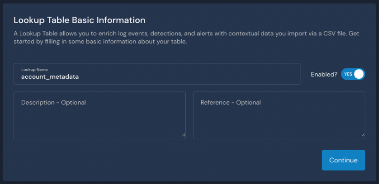
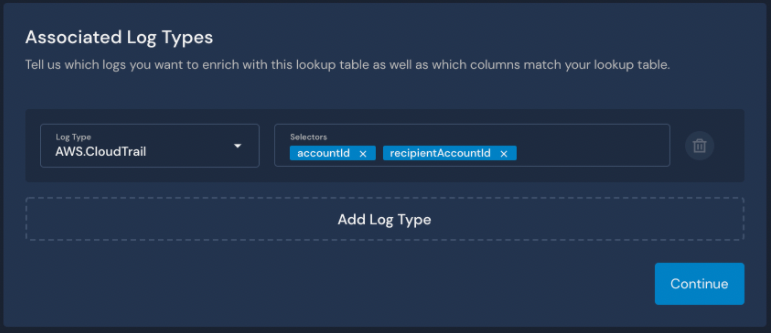
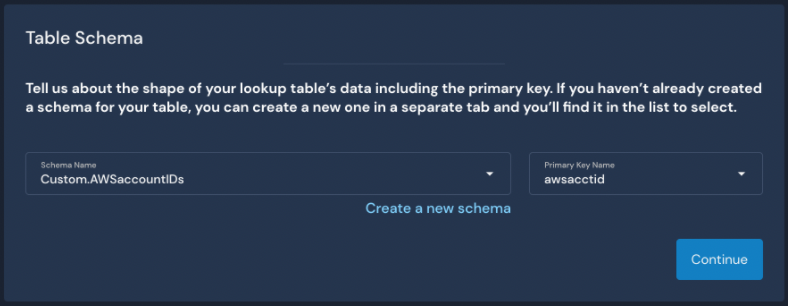
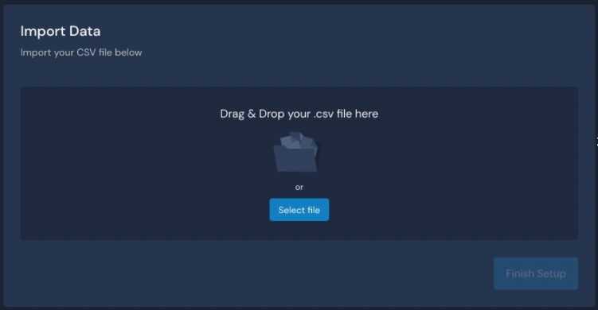

# Import via File Upload


This feature is available in version 1.27 and newer.


### Set up a Lookup Table

**Example scenario:** Let's say you want to add metadata to distinguish developer accounts from production accounts in your AWS CloudTrail logs. Here's an example where `isProduction` has been added:


To configure a Lookup Table, follow these steps in your Panther Console:

1. From the left sidebar, click **Enrichment > Lookups.**
2. In the upper right side of the page, click **+** to add a new Lookup Table.\
   
3. Configure the Lookup Table Basic Information:
   1. &#x20;Enter a descriptive Lookup Name.&#x20;
      * For this example, we will use `account_metadata`.
   2. Enter a Description (optional) and a Reference (optional). Description is meant for content about the table, while Reference can be used to hyperlink to an internal resource.
   3. Next to **Enabled?** toggle the setting to **Yes**. Note: This is required to import your data later in this process.&#x20;
   4. Click **Continue**.\
      
4. Configure the Associated Log Types:
   * Select the **Log Type** from the dropdown.&#x20;
   * Type in the name of the **Selectors**, the foreign key fields from the log type you want enriched with your Lookup Table. (In the example screen shot below, we selected **AWS.CloudTrail** logs and typed in `accountID` and `recipientAccountID` to represent keys in the CloudTrail logs.&#x20;
     * You also can reference attributes in nested objects using [JSON path syntax](https://goessner.net/articles/JsonPath/). For example, if you wanted to reference a field in a map you could do `$.field.subfield`.
   * Click **Add Log Type** to add another if needed.\
     
5. Click **Continue**.
6. Configure the Table Schema. \
   _Note: If you have not already created a new schema, please see_ [_our documentation on creating schemas_](https://docs.runpanther.io/data-onboarding/custom-log-types/example-csv)_. You can also use your Lookup Table data to infer a schema. Once you have created a schema, you will be able to choose it from the dropdown on the Table Schema page while configuring a Lookup Table._\
   _Note: **CSV schemas require column headers to work with Lookup Tables**_.
   1. Select a **Schema Name** from the dropdown.
   2. Select a **Primary Key Name** from the dropdown. This should be a unique column on the table, such as `accountID`.\
      
7. Click **Continue**.
8. Drag and drop a file or click **Select File** to choose the file of your Lookup Table data to import. The file must be in `.csv` or `.jsonl` format. \
   
9. After you successfully import a file, click **View in Data Explorer** to **** query that table data or click **Finish Setup** to go back to a list of your custom Lookup Tables.


### Write a detection using Lookup Table data

Next, you can write detections based on the additional context from your Lookup Table.&#x20;

Continuing the example mentioned above where you configure a Lookup Table to distinguish between developer and production accounts in AWS CloudTrail logs, you might want receive an alert only if the following circumstances are **both** true:

* A user logged in who did not have MFA enabled.
* The AWS account is a production (not a developer) account.&#x20;

You can use the [deep\_get helper function](../../writing-detections/globals.md#deep\_get) to retrieve the looked up field from `p_enrichment` using the foreign key field in the log. The pattern looks like this:

```python
deep_get(event, 'p_enrichment', <Lookup Table name>, <foreign key in log>, <field in Lookup Table>)
```


The Lookup Table name, foreign key and field name are all optional parameters. If not specified, `deep_get` will return a hierarchical dictionary with all the enrichment data available. Specifying the parameters will ensure that only the data you care about is returned.


See an example of a Python rule to detect this:

```python
 from panther_base_helpers import deep_get
 def rule(event):
   is_production = deep_get(event, 'p_enrichment', 'account_metadata',
'recipientAccountId', 'isProduction')
   return not event.get('mfaEnabled') and is_production
```

The Panther rules engine will take the looked up matches and append that data to the event using the key `p_enrichment` in the following JSON structure:

```json
{ 
    'p_enrichment': {
        <name of lookup table>: { 
            <key in log that matched>: <matching row looked up>,
            ...
	    <key in log that matched>: <matching row looked up>,
	}    }
} 
```

Example:

```json
{
    'p_enrichment': {
        'account_metadata': {
            'recipientAccountId': {
                'accountID': '90123456', 
                'isProduction': 'False', 
                'email': 'dev.account@example.com', 
                }
            }
        }
}
```

#### Detection Testing

For rules that use `p_enrichment`, click **Enrich Test Data** in the upper right side of the JSON code editor to populate it with your Lookup Table data. This allows you to test a Python function with an event that contains `p_enrichment.`

.png>)

### Additional Examples

#### Example for translating 1Password UUIDs into human readable names

Please see our guide about using Lookup Tables to translate 1Password's Universally Unique Identifier (UUID) values into human readable names: [Using Lookup Tables: 1Password UUIDs](https://docs.runpanther.io/guides/using-lookup-tables-1password-uuids).

#### Example using CIDR matching

**Example scenario:** Let's say you want to write detections that consider the traffic logs from company IP space (e.g. VPNs and hosted systems) differently from others logs originating from public IP space. You have a list of your company's allowed CIDR blocks listed in a `.csv` file (e.g. `4.5.0.0/16`):

.png>)

#### Set up a Lookup Table with the CIDR list

1. Follow the steps above under "Set up a Lookup Table" to add a new Lookup Table and configure its basic information.&#x20;
   * The name of the Lookup Table in this example is `Company CIDR Blocks`.
2. On the Associated Log Types page, choose the Log Type and Selectors.&#x20;
   * For this example, we used `AWS.VPCFlow` logs and associated the source IP (`srcAddr`) and destination (`dstAddr`) keys.\
     
3. &#x20;Associate a schema for your Lookup Table: Select an existing one from your list or [create a new schema](https://docs.runpanther.io/data-onboarding/custom-log-types#generating-a-schema-for-a-custom-log-type-from-sample-logs).
   *   **Note:** The primary key column which will hold the CIDR blocks needs to have a `CIDR` validation applied in the schema to indicate that this lookup table will do CIDR block matching on IP addresses. [See our log schema reference](https://docs.runpanther.io/data-onboarding/custom-log-types/reference#validation-by-string-type).

       ```
       # Will allow valid ip6 CIDR ranges
       # e.g. 2001:0db8:85a3:0000:0000:0000:0000:0000/64
       - name: address
         type: string
         validate:
           cidr: "ipv6" 
           
       # Will allow valid ipv4 IP addresses e.g. 100.100.100.100/00
       - name: address
         type: string
         validate:
           cidr: "ipv4"  
       ```
4. Drag & drop a file or click **Select File** to choose the file of your CIDR block list to import. The file must be in `.csv` or `.jsonl` format. The maximum file size supported is 5MB.&#x20;
5. After you successfully import a file, click **View in Data Explorer** to **** query that table data or click **Finish Setup** to go back to a list of your custom Lookup Tables.


#### Write a detection

You might like to receive an alert if any VPC traffic comes from a source IP address that is not part of your company's allowed CIDR blocks. Here is an example of Python rule that will send an alert in this case:

```python
def rule(event):
  if event.get('flowDirection') == 'egress': # we care about inbound
        return False
  if event.get('action') == 'REJECT': # we don't care about these either
        return False
  if deep_get(event, 'p_enrichment','Company CIDR Blocks','srcAddr'): # these are ok
        return False 
  return True # alert if NOT from an approved network range
```

**Note**: The CIDR [validation](file-upload.md#set-up-a-lookup-table-with-the-cidr-list) applied in the Lookup Table schema in this example will enable the system to match IP addresses in VPC flow log to CIDR blocks in the lookup.
