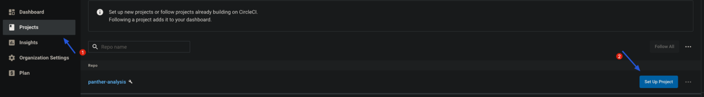
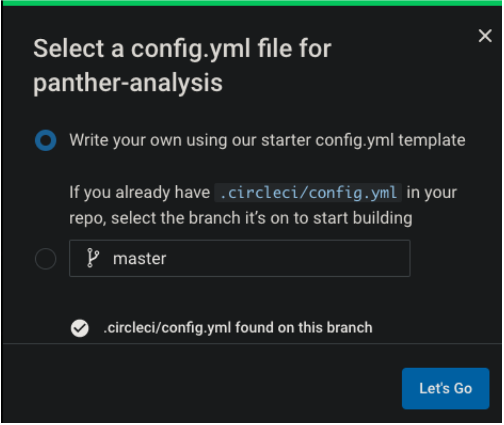
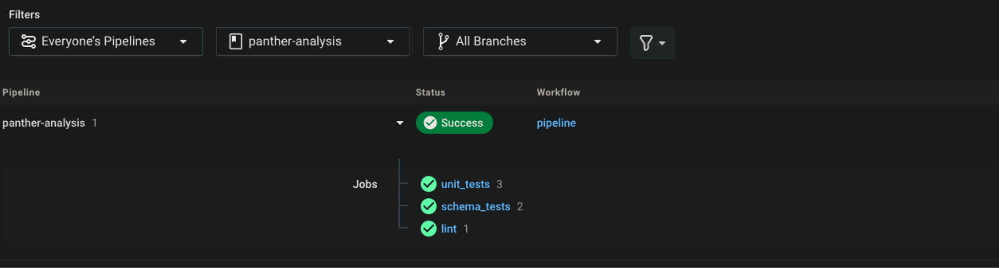
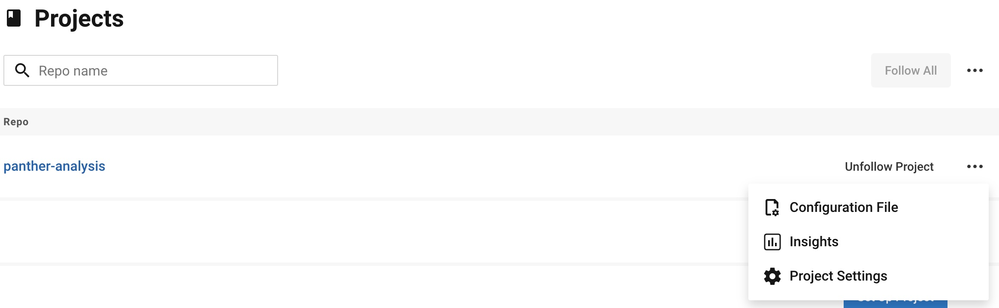

# CI / CD Onboarding Guide

## Overview

This guide will teach you how to manage Panther's built-in detections and your custom detections with a CI/CD workflow.

The process outlined in this guide will use Github, Github Actions, and CircleCI, but can be adapted to your desired toolset. Broadly we will:

* Create a CI workflow that runs the Python Black linter on your codebase and executes all unit tests defined for rules.
* Maintain a fork of the [Panther-Analysis](https://github.com/panther-labs/panther-analysis) repository, where all of Panther’s built-in detections are stored, maintained, and updated.

## Setting up CircleCI

### Creating Account and Repository

If you haven’t done so already, create a repository to contain the detections that have been created “in house”. We will be using CircleCI

If you do not currently use CircleCI for other projects, you can [create a free account](https://circleci.com/signup) by “Signing up with Github” which will authorize CircleCI to your Github account.&#x20;


Once signed in click “Projects” on the left side, find the project containing the repository and click “Set Up Project”&#x20;




NOTE: In this screenshot we’re using a fork of panther-analysis, you’ll want to select the project containing your in-house detections. If you are using this guide only to enable CI/CD for a fork of panther-analysis (discussed in more detail in the following section) select that project.&#x20;


### Configuring CircleCI Job

After clicking “Set Up Project” for the desired project, you will be presented with two options. &#x20;



Configuration for CircleCI jobs is found in the root directory of the repository under .circleci/config.yaml. If one exists already, select the second option. If not then you can select the first option and be taken to an in-browser editor to create one. If you would prefer to create your own job from scratch the documentation from CircleCI can be found [here](https://circleci.com/docs/).  A great example of a CI job for Panther rules can be found in our public panther-analysis repository [here](https://github.com/panther-labs/panther-analysis/blob/master/.circleci/config.yml). This can be edited to fit your organization's needs.

Once the configuration is in place, the CI job should run automatically.  You can return to the dashboard and see the status of your job.



Going forward this job will run every time a new pull request is created, or a new commit pushed to a branch.   You will see the status of the CI job at the bottom of your pull request with it’s status and a “details” link that can be clicked to see detailed output from the job.


### Uploading Detections to Panther

After changes have been merged to your detections repo the recommended way to upload new detections is with panther-analysis-tool. If this functionality is required please file a support request to be granted permissions to upload directly. Support will optionally create an IAM user and provide credentials or create a role that your user can assume to perform these actions.

Specifically it is recommended to run `panther_analysis_tool` test to ensure your unit tests are passing, followed by `panther_analysis_tool upload` to upload new detections to your Panther instance.  Setting environment variables `AWS_ACCESS_KEY_ID, AWS_SECRET_ACCESS_KEY_ID` and `AWS_DEFAULT_REGION` (obtained from support if an IAM user is created, yours if a Panther role was created) is necessary for these commands to execute successfully.

It is also possible to add this step to your CircleCI workflow to automate the upload of new rules when merging into master.   Ensure that the environment variables `AWS_ACCESS_KEY_ID`, `AWS_SECRET_ACCESS_KEY_ID` and `AWS_DEFAULT_REGION` are passed into the job to allow for correct authentication. These will be provided by support in the case they created an IAM user  and can be stored encrypted as repository secrets. The process of adding repository secrets is covered more in-depth in the next section.

Full documentation on panther-analysis-tool can be found [here](https://docs.runpanther.io/writing-detections/panther-analysis-tool#uploading-to-panther).

### Configuring CircleCI to Upload to Panther

First you will need to create environment variables within the Project Settings in CircleCI for your forked version of `panther-analysis`. The CircleCI documentation for environment variables can be found [here](https://circleci.com/docs/2.0/env-vars/). The environment variables that need to be created are are `$INTERNAL_ACCESS_KEY_ID` (AWS Access Key), `$INTERNAL_SECRET_ACCESS_KEY` (AWS Secret Access Key), and`$INTERNAL_DEFAULT_REGION` (AWS Default Region). These are obtained from support if an IAM user is created, yours if a Panther role was created.



 (1).png>)

&#x20;After the environment variables have been created, you'll need to add the lines below to your CircleCI configuration in the `panther-analysis` repo.

```
  deploy:
    docker:
      - image: 'circleci/python:3.7'
    steps:
      - checkout
      - run:
          name: Copy in aws config
          command: |
            mkdir -p ~/.aws
            cp .circleci/aws_config ~/.aws/config
      - run:
          name: Setup the Virtual Environment and install dependencies
          command: make venv
      - run:
          name: upload to internal security
          command:  |
            AWS_ACCESS_KEY_ID=$INTERNAL_ACCESS_KEY_ID \
            AWS_SECRET_ACCESS_KEY=$INTERNAL_SECRET_ACCESS_KEY \
            AWS_DEFAULT_REGION=$INTERNAL_DEFAULT_REGION \
            pipenv run -- panther_analysis_tool upload --filter Tags=internal --aws-profile internal
```

You will need to create `.circleci/aws_config` within your forked version of `panther-analysis`. In the below example, you will need to update the `role_arn` which will be provided to you by Panther and `region` where your Panther instance has been deployed.

```
[default]
region = us-east-1
output = json

[profile production]
role_arn = arn:aws:iam::xxxxx:role/PantherAnalysis
credential_source = Environment
```

## Keeping up to date with Panther Built-in Detections

This section of the guide is optional, but will assist you in the creation of a fork of the Panther Analysis repo for the purpose of keeping the built-in detections in Panther up to date.  The process for adding this fork to your instance of Panther can be found [here](https://docs.runpanther.io/writing-detections/detection-packs). The rest of this section is devoted to creating the fork and keeping it up to date.

### Creating a Fork

Log into Github and visit [panther-labs/panther-analysis](https://github.com/panther-labs/panther-analysis).  \


In the upper right corner of the repository’s main page click “Fork”. This will create a fork of the panther-analysis repo in your organization. This will serve as your working copy of panther-analysis, and any changes required by your organization can be made here and will undergo any configured CI checks that you define. Note that as mentioned in the previous section a CircleCI config file is already present in this repository and can be used if desired, you will need to enable this new forked project in your instance of CircleCI.

### Keeping the Fork Up to Date

There are two methods for keeping your fork up to date with Panther Analysis that we will detail here.


NOTE: It is important to upload or create new branches from a release branch rather than “Master” if you wish to make changes to the Panther Analysis repo . Master may contain detections that rely on not-yet-implemented features


#### Method 1: “Manual” Updates

Github has created a document detailing the process of manually updating the fork from its source, in this case panther-labs/panther-analysis.  The documentation can be found [here](https://docs.github.com/en/github/collaborating-with-pull-requests/working-with-forks/syncing-a-fork). We would suggest always using the “compare” option detailed in these documents to ensure you are pulling in changes that make sense for your organization.  This will display the updates as a pull request, and changes and comments can be made.

#### Method 2: Automated Updates

Using Github Actions the process for pulling in changes and creating pull requests can be automated.  For this example we will use the action [Fork Sync](https://github.com/marketplace/actions/fork-sync).  Configuration options for this action are detailed in the link above but there are a couple pre-steps omitted that I will detail here.  \


Before enabling this action you must create a GitHub personal access token as a repository secret. Start by clicking on your avatar in the upper right hand corner and selecting “Settings”.  From the settings menu select “Developer Settings”. From the Developer Settings menu select “Personal Access Token”


\
Give the token a meaningful name and the scopes “repo” and “workflow”.  In my screenshot I have the token expiring after 30 days, at which time it will need to be regenerated. This setting is completely up to you, but remember that this personal access token needs to be treated as a password, and as such you should adhere to any password policies your organization has defined.  When finished click “Generate Token” at the bottom of the page and you will be presented with a token. Copy this to your clipboard in preparation for the next step. You will only see this token once, so make sure you have it copied before navigating away from this page or you will have to delete and create a new one.&#x20;

Next navigate to the fork of panther-analysis in your GitHub org and click on “Settings”,  “Secrets”,  then “New Repository Secret”&#x20;

You will be presented with a page to give your new secret a name and paste the token. If you are following along with the Fork Sync examples, name the secret PERSONAL\_TOKEN to match the example.


Click “Add Secret” after pasting the token.

From here create the file .github/workflows/fork-sync.yml and configure the action as desired. Examples and options can be found on the [Fork Sync homepage](https://github.com/marketplace/actions/fork-sync) and more in-depth options for GitHub Actions can be [found in the docs](https://docs.github.com/en/actions/reference).  This will allow for automated fork updates and pull request creation, although the pull request should still be reviewed and merged by a human to ensure the changes being made are acceptable for your use cases.

Congrats! You did it! \
