# Redacting Sensitive Fields With Cribl

## Overview

The process outlined in this guide outlines how to redact sensitive log data using Cribl Cloud or Cribl Self-Hosted, working specifically within Amazon Web Services (AWS) S3 buckets and Panther. Broadly we will:

* Authenticate an S3 Bucket in Cribl, with examples of the manual method and Event Breakers.
* Configure an AWS S3 source and destination using a JSON data format.
* Provide examples of JSON events, using pre and post-Cribl masks.

## How to redact sensitive fields with Cribl

### Step 1: Configuring the AWS S3 Source in Cribl

1. Log into Cribl. On the left-hand side, navigate to **Groups**. Then at the top of the page click the **Routing** drop down and select **Quick Connect.**\
   ****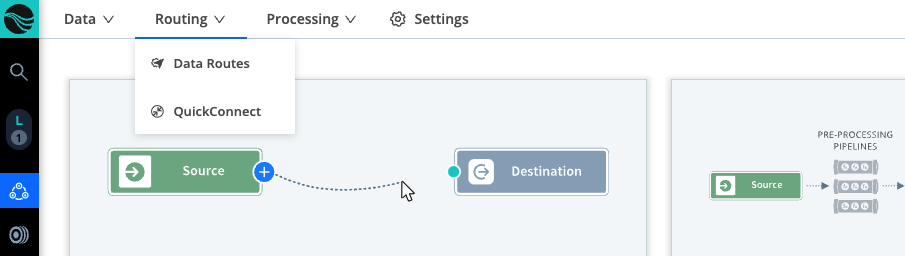****
2. Click **Add Source**, then select Amazon S3 from the list of sources.\
   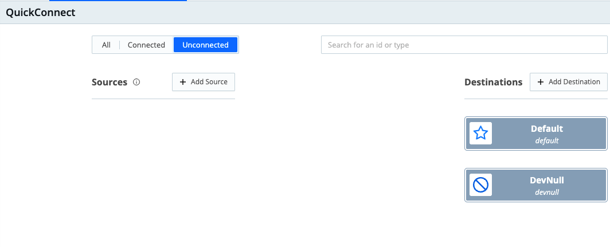
3. Under **Configure > General Settings**, enter a unique Input ID, the ARN of the SQS Queue, and optionally, additional filters.\
   &#x20;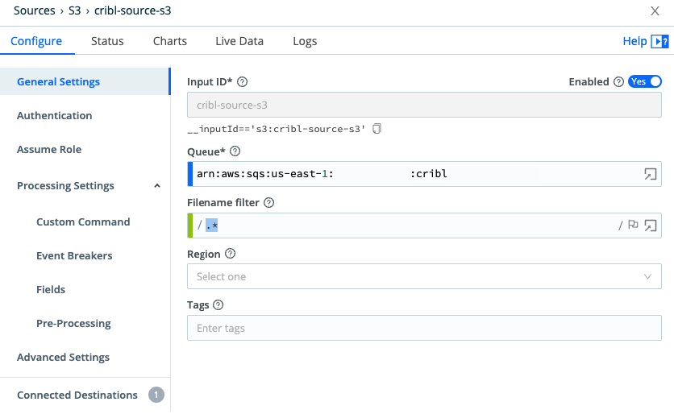
4. Click **Authentication** on the left. Click to choose one of the following authentication methods:
   * **Manual** - Requires Access and Secret Keys (You will need to generate the Access and Secret keys in AWS)
   * **Secret** - Secret key pair (You will need to generate this key pair in AWS)
   * **Auto** - Requires AWS Account ID and an ARN to be configured in the Assume Role section. This role should have access to S3 and/or SQS.\
     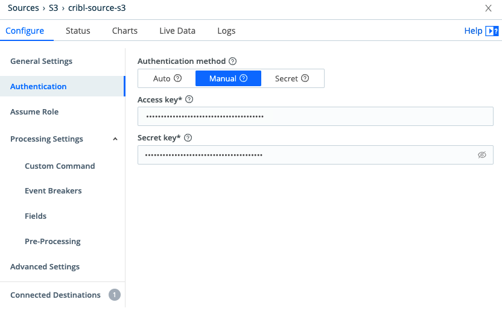\
     In the example screen shot above, "Manual" is selected.
5. Click **Event Breakers** on the left. Choose the Cribl event breaker.
   * Note: This step allows Cribl to parse the incoming JSON data.

### Step 2: Configuring the AWS S3 Destination in Cribl

1. Navigate back to the QuickConnect page. Click **Add Destination** and choose Amazon S3. \
   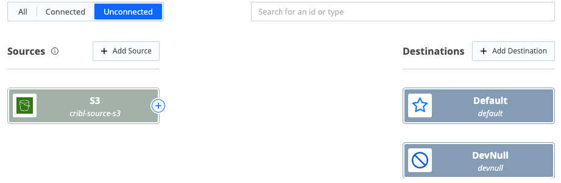
2. In the General Settings page, enter the following:
   * **S3 Bucket name.** In AWS, these S3 buckets can be the same. Objects within the bucket can be differentiated by the prefix filter if needed.
   * **Bucket region**
   * **Prefix** for the outputted JSON files
   * **File Name Prefix Expression**\
     ****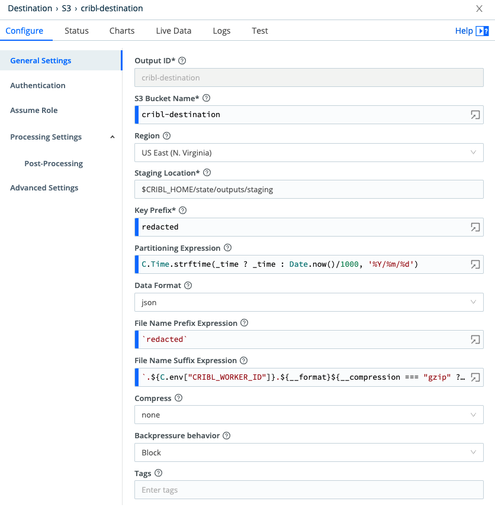****\
     ****
3. Click **Authentication** on the left. Click to choose one of the following authentication methods:
   * **Manual** - Requires Access and Secret Keys (You will need to generate the Access and Secret keys in AWS)
   * **Secret** - Secret key pair (You will need to generate this key pair in AWS)
   * **Auto** - Requires AWS Account ID and an ARN to be configured in the Assume Role section. This role should have access to S3 and/or SQS.\
     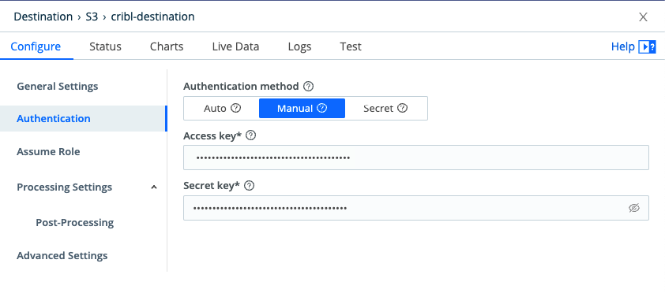\
     In the example screen shot above, "Manual" is selected.

### Step 3: Configuring the Pipeline in Cribl

1. Click the dotted line that connects the source and destination:\
   &#x20;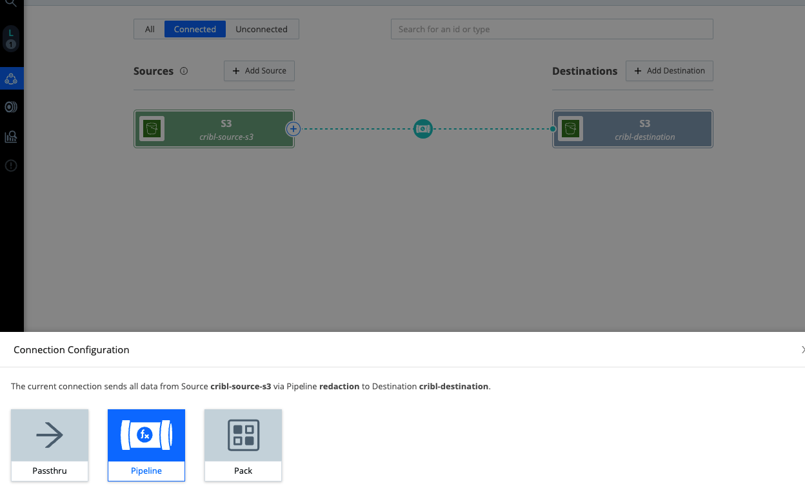
   * You will be redirected to the Connection Configuration dashboard.
2. In the upper right side of the Connection Configuration dashboard, click  **+ Pipeline.** In the drop-down menu that appears, click **Create Pipeline**.\
   &#x20;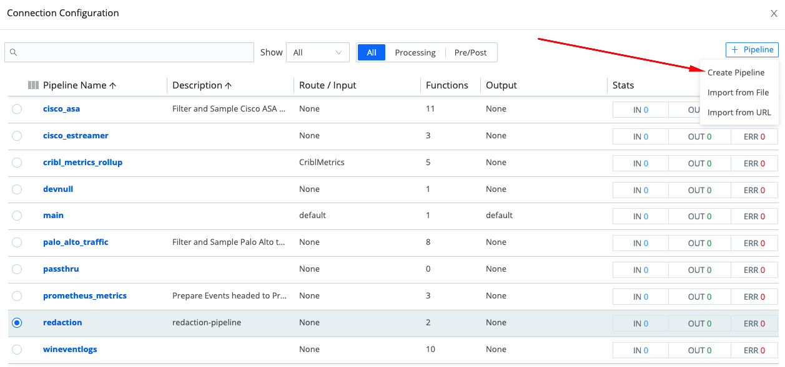
3. In the "Create New Pipeline" popup dialog that appears, enter the name `redacted` into the **ID** field. Optionally enter an Async Function Timeout and a Description, then click **Save**.\
   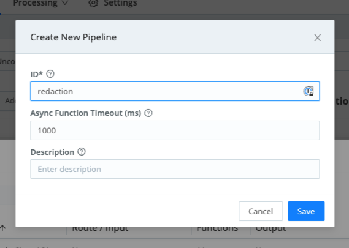
4. On the Processing / Pipelines page, click the blue gear icon. \
   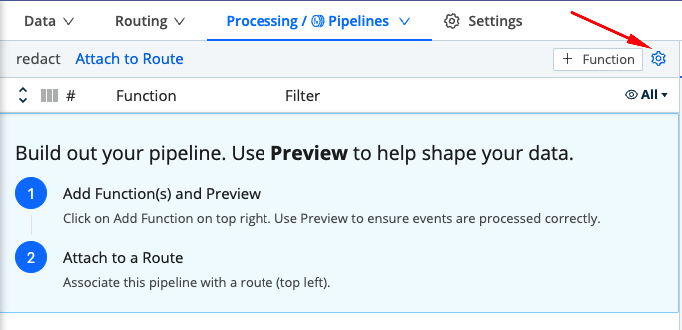
5. In the upper right corner, click **Edit as JSON**.\
   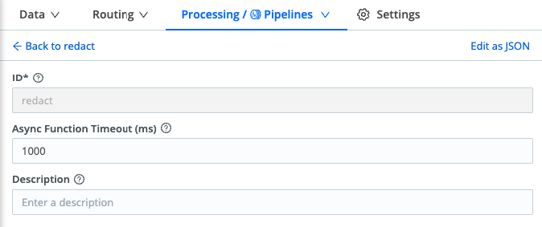
6.  Paste in the block of JSON below. Note that the block of JSON below has two filters:

    * **Mask:** Replaces everything in the `name` field with `REDACTED`
    * **Eval:** Removes the fields `_raw` `cribl_breaker` `crible_pipe` `_time`\
      ``

    ```
    {
      "id": "redaction",
      "conf": {
        "asyncFuncTimeout": 1000,
        "functions": [
          {
            "filter": "true",
            "conf": {
              "rules": [
                {
                  "matchRegex": "/(.*)/i",
                  "replaceExpr": "`REDACTED`"
                }
              ],
              "fields": [
                "name"
              ],
              "depth": 5,
              "flags": []
            },
            "id": "mask",
            "description": "Masking Filter",
            "final": false
          },
          {
            "filter": "true",
            "conf": {
              "remove": [
                "_raw",
                "cribl_breaker",
                "cribl_pipe",
                "_time"
              ]
            },
            "id": "eval",
            "final": true
          }
        ],
        "description": "redaction-pipeline",
        "groups": {}
      }
    }
    ```
7. Save the JSON.

Once the JSON has been saved, the UI will reflect your Masking Rules similar to the screenshot below:

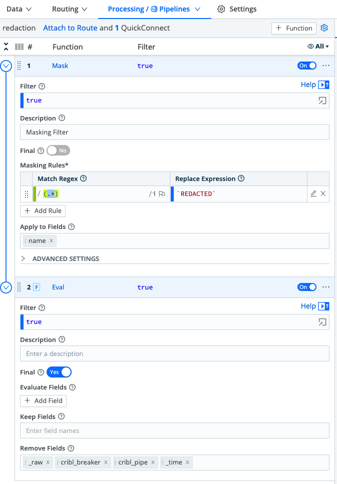

The completed Data Route will look similar to the screen shot below:

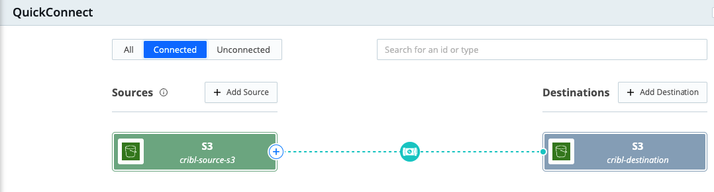

## JSON Example Pre and Post Cribl

The following example shows a JSON event, using the `mask` filter mentioned in the previous steps of this guide. After using the mask filter, the name field `Bella` is replaced with `REDACTED.`

**Pre-Cribl mask:**

```json
{ ... "name": "Bella", ...} 
```

**Post-Cribl mask:**

```json
{ ... "name":"REDACTED", ...}
```

***
