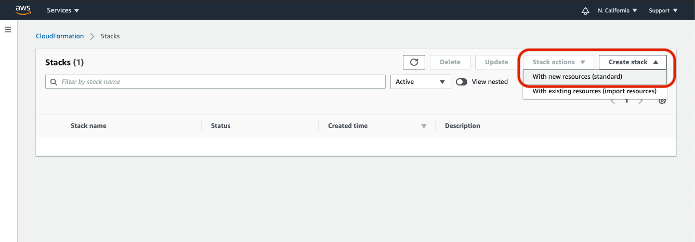

# Quick Start


Before installing Panther, make sure to have an AWS account and the proper permissions to setup the various components.

We recommend deploying Panther into its own dedicated AWS account.


## Deployment IAM Role

To ensure least privilege \(and extra security!\) you can use the deployment IAM Roles provided below:

* [AWS CloudFormation](https://github.com/panther-labs/panther/blob/master/deployments/auxiliary/cloudformation/panther-deployment-role.yml)
* [Terraform](https://github.com/panther-labs/panther/tree/master/deployments/auxiliary/terraform/panther_deployment_role)

This role can be passed to the CloudFormation stack prior to continuing the installation process.

## Launching the Stack

Navigate to [AWS CloudFormation](https://console.aws.amazon.com/cloudformation/) and create a new stack:



When specifying the template, use the following URL to install the latest community edition in the `us-east-1` region:

```text
https://panther-community-us-east-1.s3.amazonaws.com/v1.17.0-RC/panther.yml
```

The template URL is of the following form:

```text
https://panther-<EDITION>-<REGION>.s3.amazonaws.com/<VERSION>/panther.yml
```

* EDITION is `community` or `enterprise`
* REGION is any of the [supported regions](quick-start.md#supported-aws-regions)
* VERSION is the latest [tagged release](https://github.com/panther-labs/panther/releases)


Be sure the template region matches your deployment region



On the next page, choose a stack name \(e.g. "panther"\) and configure the name and email for the first Panther admin user:


You can invite additional users after the deployment is complete.



Acknowledge the Capabilities and deploy the stack:


You may also deploy Panther using CICD workflows such as nested CloudFormation stacks, Terraform templates, or by building and deploying from [source](development/#deploying).

### Using a Nested CloudFormation Stack

To add Panther to your internal CloudFormation pipeline, use the nested stack template below:

```yaml
AWSTemplateFormatVersion: 2010-09-09
Description: My Panther deployment

Resources:
  Panther:
    Type: AWS::CloudFormation::Stack
    Properties:
      TemplateURL: !Sub https://panther-community-${AWS::Region}.s3.amazonaws.com/v1.17.0-RC/panther.yml
      Parameters:
        CompanyDisplayName: AwesomeCo
        FirstUserEmail: user@example.com
        FirstUserGivenName: Alice
        FirstUserFamilyName: Jones
```

When deploying this template, you will need to include all capabilities:

```text
aws cloudformation deploy \
  --template-file template.yml \
  --stack-name panther \
  --capabilities CAPABILITY_IAM CAPABILITY_NAMED_IAM CAPABILITY_AUTO_EXPAND
```

### Using Terraform

To add Panther to your internal Terraform pipeline, use the template below:

```text
resource "aws_cloudformation_stack" "panther" {
  name = "panther"
  template_url = "https://panther-community-<REGION>.s3.amazonaws.com/v1.17.0-RC/panther.yml"

  capabilities = [
    "CAPABILITY_IAM",
    "CAPABILITY_NAMED_IAM",
    "CAPABILITY_AUTO_EXPAND"
  ]

  parameters = {
    CompanyDisplayName = "AwesomeCo"
    FirstUserEmail = "user@example.com"
    FirstUserGivenName = "Alice"
    FirstUserFamilyName = "Jones"
  }
}
```

## First Login

Once the deployment has finished, you will get an invitation email from `no-reply@verificationemail.com` with your temporary login credentials. If you don't see it, be sure to check your spam folder.

You can use these temporary credentials to login and setup MFA:


### Certificate Warning


By default, Panther generates a self-signed certificate for the web UI, which will cause most browsers to present a warning page:


Your connection _is_ encrypted, and it's generally safe to continue. However, the warning exists because self-signed certificates do not protect you from man-in-the-middle attacks; for this reason production deployments should provide their own `CertificateArn` parameter value.


## Data Onboarding

Congratulations! You are now ready to use Panther. Follow the steps below to start analyzing data:

1. Invite your team in `Settings` &gt; `Users` &gt; `Invite User`
2. Configure [destinations](destinations/) to receive generated alerts
3. Onboard data for real-time log analysis from [S3](data-onboarding/data-transports/s3.md) or [SQS](data-onboarding/data-transports/sqs.md)
4. Write custom [rules](writing-detections/rules.md) based on internal business logic
5. Onboard AWS accounts for [cloud security scans](data-onboarding/setup-cloud-accounts.md)
6. Write custom [policies](writing-detections/policies.md) for supported [AWS resources](resources/)
7. Enterprise Only: Query collected logs with [data explorer](data-analytics/)

## Supported AWS Regions

Panther can be deployed to any of the following regions:

* `ap-northeast-1` \(Tokyo\)
* `ap-northeast-2` \(Seoul\)
* `ap-south-1` \(Mumbai\)
* `ap-southeast-1` \(Singapore\)
* `ap-southeast-2` \(Sydney\)
* `ca-central-1` \(Canada\)
* `eu-central-1` \(Frankfurt\)
* `eu-north-1` \(Stockholm\)
* `eu-west-1` \(Ireland\)
* `eu-west-2` \(London\)
* `eu-west-3` \(Paris\)
* `sa-east-1` \(São Paulo\)
* `us-east-1` \(N. Virginia\)
* `us-east-2` \(Ohio\)
* `us-west-1` \(N. California\)
* `us-west-2` \(Oregon\)

Panther also has limited support for AWS China:

* `cn-north-1` \(Beijing\)
* `cn-northwest-1` \(Ningxia\)

At this time, only the backend processing can be deployed to China \(no web app\). See our [China docs](help/china.md) for more details.

## Upgrading Panther

To upgrade Panther, simply update the CloudFormation stack with the latest template version. Check out the [specific release notes](https://github.com/panther-labs/panther/releases) for detailed upgrade or migration instructions.

## Removing Panther

To uninstall Panther, simply delete the main "panther" stack \(substituting whatever stack name you chose during deployment\). This will automatically remove everything except S3 buckets and the data they contain.

You can easily find and delete these manually, or you can run `mage teardown` \(see [development](development/#teardown)\).

