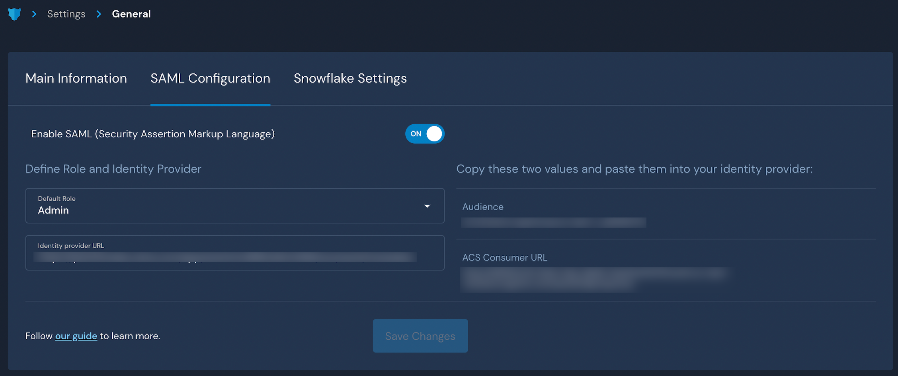

# Generic SSO

## Overview

Panther supports integrating with any SAML Identity Provider (IdP) to enable logging in to the Panther Console via SSO.

For more information on features, terminology, and limitations of SSO integrations with the Panther Console, please see the Panther documentation: [SAML/SSO Integration](https://docs.panther.com/system-configuration/saml).

## How to configure SAML SSO to the Panther Console with the generic integration

Integrate any SAML Identity Provider (IdP) with Panther in three easy steps:

### Obtain the SSO parameters from Panther

1. Log in to the Panther Console.
2. In the left sidebar, click **Settings > General**.
3. Click the SAML Configuration tab.

Keep this browser window open, as you will need the **Audience** and **ACS URL** values in the next steps.

### Create the application in your IdP

1. Log in to the administrative console of your IdP.&#x20;
2. Create a SAML application in your IdP with the following settings:
   * **Audience**: Enter the **Audience** you copied from the Panther Console in earlier steps of this documentation.
   * **ACS Consumer URL**: Enter the **ACS URL** you copied from the Panther Console in earlier steps of this documentation.
   * **SAML Attribute Mapping**:
     * **PantherEmail**: Map this field to user email.
     * **PantherFirstName**: Map this field to first name.
     * **PantherLastName**: Map this field to last name.
   * Grant access to the appropriate users
3. Copy the **Issuer ID** from your IdP and store it in a secure location. You will need this in the next steps.
   * This URL should be a publicly accessible XML document.
   * If your IdP lets you download the metadata XML file directly but does not provide a URL, you will need to publish that file somewhere public (it should not contain sensitive information). For example, you can upload to a public S3 bucket and then give Panther the S3 URL.

### Configure the generic SAML application in Panther

1. Navigate back to the [SAML configuration](generic.md#obtain-the-sso-parameters-from-panther) you started earlier in this documentation.
2. Next to "Enable SAML", set the toggle to **ON**.&#x20;
3. In the "Default Role" field, choose the Panther role that your new users will be assigned by default when they first log in via SSO.
4. In the **Identity Provider URL** field, paste the **Issuer URL** from OneLogin that you obtained in the previous steps of this documentation.
5. Click **Save Changes**.

To test your setup, go to your Panther sign-in page and click **Login with SSO**.

 (1) (1) (1) (11) (1) (21).png>)

For examples, see the [OneLogin SSO](onelogin.md) and [Okta SSO ](okta.md)integration guides.
