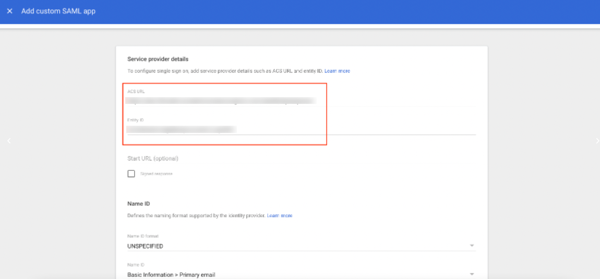
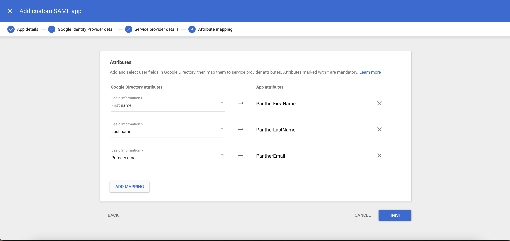

# G Suite SSO

## Overview

Panther supports integrating with G Suite (now named Google Workspace) as a SAML provider to enable logging in to the Panther Console via SSO.&#x20;

For more information on features, terminology, and limitations of SSO integrations with the Panther Console, please see the Panther documentation: [SAML/SSO Integration](https://docs.panther.com/system-configuration/saml).

## How to configure SAML SSO to the Panther Console with G Suite

### Obtain the G Suite SSO parameters from Panther

1. Log in to the Panther Console.
2. In the left sidebar, click **Settings > General**.
3. Click the SAML Configuration tab.

Keep this browser window open, as you will need the **Audience** and **ACS URL** values in the next steps.


### Create the G Suite App

Follow the [GSuite guide for SAML-based SSO](https://support.google.com/a/answer/6087519) to add a custom SAML app.&#x20;


Note that it may take up to 24 hours for your changes to propagate in Google Workspace.


Make the following modifications to create the SAML app for Panther:

* In the **Service Provider Details** window, enter the ACS URL and Entity ID values you obtained from the Panther Console earlier in this documentation. \
  
* On the **Attribute mapping** page, configure the following attribute mappings:
  * **First Name**: `PantherFirstName`
  * **Last Name**: `PantherLastName`
  * **Primary email**: `PantherEmail`\
    ````

### Enable the SAML app in Google Workspace

Follow [Google's documentation to turn on the SAML app](https://support.google.com/a/answer/6087519).

### Publish the Metadata File

Panther does not yet support direct uploads of SAML metadata files (we're working on it!)

In the meantime, you will need to publish that metadata file (which shouldn't contain sensitive information, but double-check to be sure) to a public S3 bucket or any other public location so you can generate a URL for it.

The URL must be HTTPS, and it must point to the public XML metadata document.

### Configure SAML in Panther

1. Navigate back to the [SAML configuration](gsuite.md#obtain-the-g-suite-sso-parameters-from-panther) you started earlier in this documentation.
2. Next to "Enable SAML", set the toggle to **ON**.&#x20;
3. In the "Default Role" field, choose the Panther role that your new users will be assigned by default when they first log in via SSO.
4. In the "Identity Provider URL" field, paste the URL that points to the metadata file you published.
5. Click **Save Changes**.

To test your setup, go to your Panther sign-in page and click **Login with SSO**.

 (1) (1) (1) (11) (1) (1) (1) (1) (23).png>)


Amazon Cognito (which powers Panther's user management) does not yet support IdP-initiated login, meaning you cannot login to Panther from G Suite. The login must be initiated from Panther, the service provider.

For this reason, the "Test SAML Login" button in the G Suite admin console may not work, but as long as you can login from Panther you have configured it correctly.

