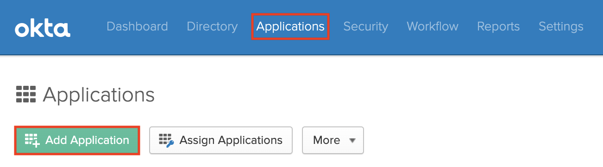
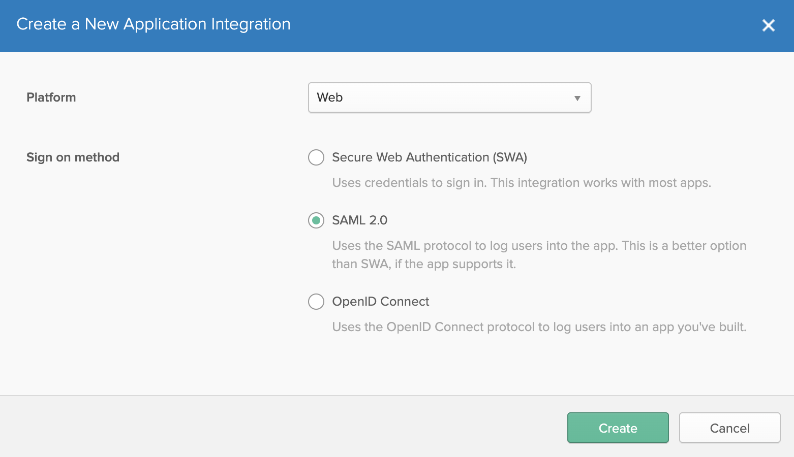
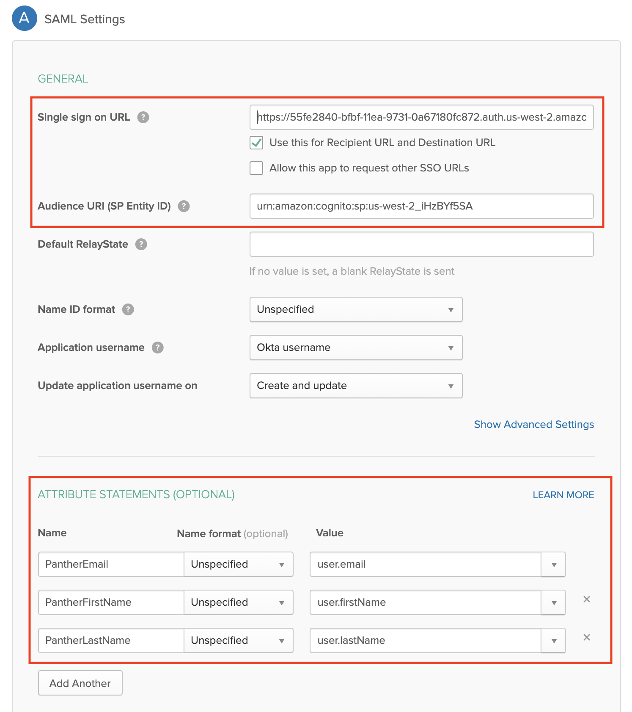
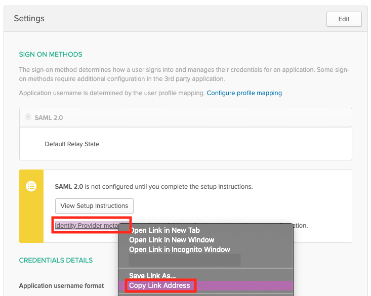

# Okta SSO

## Overview

Panther supports integrating with Okta as a SAML provider to enable logging in to the Panther Console via SSO.

For more information on features, terminology, and limitations of SSO integrations with the Panther Console, please see the Panther documentation: [SAML/SSO Integration](https://docs.panther.com/system-configuration/saml).

## How to configure SAML SSO to the Panther Console with Okta

### Obtain the Okta SSO parameters from Panther

1. Log in to the Panther Console.
2. In the left sidebar, click **Settings > General**.
3. Click the SAML Configuration tab.

Keep this browser window open, as you will need the **Audience** and **ACS URL** values in the next steps.


### Create the Okta App

1. Log in to your Okta administrative console.
2. &#x20;Click the **Applications** tab, then click **Add Application**.\
   
3. On the "Add Application" page, click **Create New App**.
4. Fill in the form to configure the new app:
   * **Platform**: Web
   * **Sign on Method**: SAML 2.0\
     
5. Click **Create**.
6. Configure the general settings.
   * **App name**: Add a descriptive name such as "Panther Console."&#x20;
   * **App logo**: Upload a Panther logo to help users quickly identify this app.
   * **App visibility**: Configure the visibility of this application for your users.
7. Click **Next**.&#x20;
8. In the SAML Settings section, configure the following under GENERAL:
   * **Single sign on URL**: Enter the **ACS URL** you copied from the Panther Console in earlier steps of this documentation.
   * **Audience**: Enter the **Audience** you copied from the Panther Console in earlier steps of this documentation.
9. Configure the following under ATTRIBUTE STATEMENTS:
   * **Name**: `PantherEmail`, **Value**: `user.email`
   * **Name**: `PantherFirstName`, **Value**: `user.firstName`
   * **Name**: `PantherLastName`, **Value**: `user.lastName`\
     ````
10. The Group Attribute statements can be left blank. Click **Next**.
11. Click **Finish**.
12. On the next screen, navigate to the Settings and locate the "Sign On Methods" section. Copy the **Identity Provider Metadata** link and store it in a secure location. You will need this in the next steps.\
    

After you're done, make sure to grant access to the appropriate users and groups in the "Assignments" tab.

### Create an Okta Bookmark app

Amazon Cognito, which powers Panther's user management, does not support IdP-initiated logins. However, you can simulate an IdP-initiated flow with an Okta Bookmark app, which will allow users to click a tile in Okta to sign in to Panther. To configure a Bookmark app for Panther, follow the instructions in the Okta Help Center: [Simulate an IdP-initiated flow using the Bookmark App](https://help.okta.com/en/prod/Content/Topics/Apps/Apps\_Bookmark\_App.htm).

### Configure Okta SAML in Panther

1. Navigate back to the [SAML configuration](okta.md#obtain-the-g-suite-sso-parameters-from-panther) you started earlier in this documentation.
2. Next to "Enable SAML", set the toggle to **ON**.&#x20;
3. In the "Default Role" field, choose the Panther role that your new users will be assigned by default when they first log in via SSO.
4. In the **Identity Provider URL** field, paste the metadata URL from Okta that you obtained in the previous steps of this documentation.
5. Click **Save Changes**.

To test your setup, go to your Panther sign-in page and click **Login with SSO**.

 (1) (1) (1) (11) (1) (1) (23).png>)
